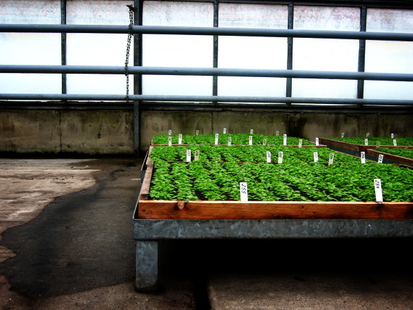
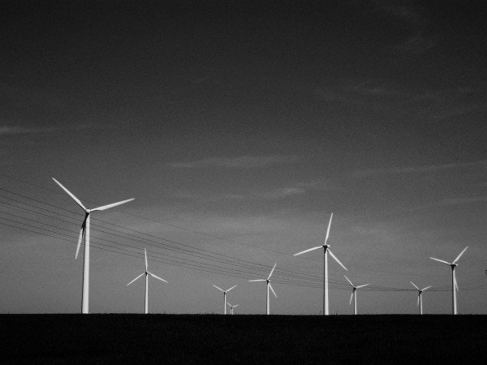

# 20080606

<figure><figcaption></figcaption></figure>

I am boored. Can't keep focusing on much. Add to the list of textbook symptoms. Already questioning the site switch. The old name was pretty bad, but white facade sounds really, really myspace-band-like. Or emo, if you prefer. I nearly went with elym.us, because .us domains that actually spell something is so web 2.0. That, and elymus is obscurely used as a metaphor for the temporal nature of things. Mostly because it's grass, and it dies quickly. Basically just looking for something blatantly sappy-depressive. I'm good at that.

I have my piano again. Taking it back to Chicago with me next semester.

Oh, speaking of which, I'm on academic probation. Which is not unexpected, but highly atypical. My grades currently spell WIDBD, which doesn't actually mean anything. That last D was something of a surprise, I completely expected to fail. And that I is going to turn into either a B or an A next week, which will make the final lineup slightly more interesting.

I love mountain dew.

***

I had forgotten how freaking cool Assemblage 23 is.

Back at an internet cafe in town again, waiting for an auction to end. I'm always a little paranoid when using my headphones for musick; sometimes audio comes out both the headphone jack and the physical speakers, and I have no idea because I'm listening to the headphones. The upshot of which is that my music comes blaring out for everyone to hear, and I don't find out until I either get kicked out or the vibration hits my hands through the keyboard.

***

<figure><figcaption></figcaption></figure>

Please sleep, my darling, sleep\
Your cry for inspiration / Never reaches ears on distant stars\
And every night, our lonely planet / Slides across the universe\
And I won’t pretend I understand

Please sleep, my darling, sleep\
Your death by information / Won’t disturb the peace on distant stars\
And even when you lock the doors / And slide behind the unlit shades\
None of us are strangers anymore

Fall asleep with the windows open\
Come to me with the worst you’ve said and done\
You’ll close your eyes and see me\
A little death makes life more meaningful\
I stand no chance at all

Please, sleep my darling, sleep\
Your car crash in slow motion / Won’t upset the pace on distant stars\
And one by one the years of our lives / Stumble as the moments pass\
So please hold on, please hold on

Fall asleep with the windows open\
Come to me with the worst you’ve said and done\
You’ll close your eyes and see me\
A little death makes life more meaningful\
I stand no chance at all

_+44_
