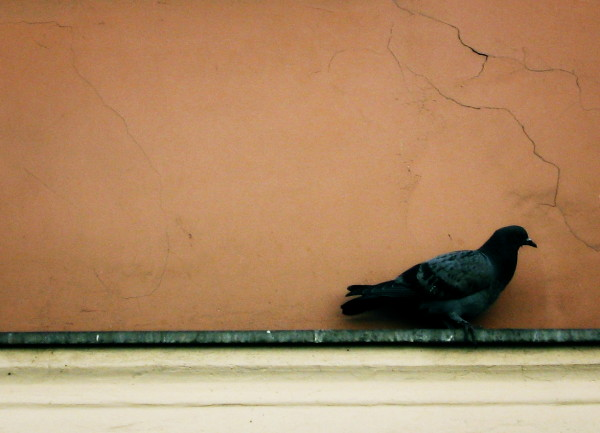

# 20080611

<figure><figcaption></figcaption></figure>

Cause jersey just got colder and\
I'll have you know I'm scared to death\
That everything that you had said to me was just\
A lie until you left\
Now I'm hoping just a little bit stronger\
Hold me up just a little bit longer\
I'll be fine, I swear\
I'm just gone beyond repair

Let's write a song that we can dance to\
Cause they all wanna listen\
Just to know how it sounds when\
I do that thing you know that I do\
When I find inspiration\
This is me breaking down when...

Let's write a song that we can sing to\
And you can lead the choir\
And put the hook where it hurts most\
And you threw a spark that lit the candle\
That set us all on fire\
And sent a flame down the east coast

_And I should have been your everything_\
_I'm now at the end of my eternity_\
_And I will sleep to have the darkest dreams_\
_This just won't seem right to me_\
_I close my eyes and beg for peace_

Jersey just got colder and\
I'll have you know I'm scared to death\
That everything that you had said to me was just\
A lie until you left\
Now I'm hoping just a little bit stronger\
Hold me up just a little bit longer\
I'll be fine, I swear\
I'm just gone beyond repair

_Mayday Parade_
