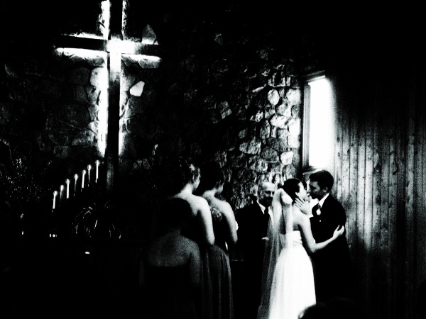

# 20080615

<figure><figcaption></figcaption></figure>

The actual ceremony went well. Very well. My phone decided to suddenly become fifteen minutes slow, but I did actually make it to the church on time for the prelude. Musick for the bride.

And they were beautiful. And I was happy for them. Genuinely and completely happy, which was something of a surprise.

Reception was more on target. The dance, specifically. Or thereabouts. I'm not sure. Watching the dances, the bride/groom and the father/daughter and the mother/son. Little more of the familiar reaction there.

I don't dance anymore.

Spent most of the day at a friend's house; he happens to live directly across the highway from the church, at present. Played cards with him, his gf, gf's sister. And suchwhat. I do enjoy hanging out with them.

But the drive back tonight...

I hold back most of my emotions. Keep them hidden, unless I'm with a select few. This typically works well enough. But every so often, every few months, everything comes out at once. I should have seen it coming, really. I can't spend the day watching various people be happy together and come off feeling alright. I can't. And driving back tonight on a dark highway, the musick pounding and I'm screaming the words.. yeah.

I've been doing that a lot, actually. On the way to and back from work and such. My voice has been pretty much shot, probably will be for the rest of the summer.

But when I'm like that... alone and falling to pieces on the highway.. bleh. It typically goes in stages. First few minutes are loud. Quite loud, actually. Over-agitated. The music selection reflects that, doesn't help to fix it much, but then, that's not why I have it. Then, suddenly, still. I catch myself not breathing, more often than not. It's not consciously holding my breath. The whole inhale/exhale thing just stops being important for a while. This generally coincides with the car slowing waay down, and the cars behind me getting irritated and passing.

I'm not suicidal. Been there, and I may be again. But at times like tonight, I frankly just want to slam the gas pedal and throw the car straight off the road. Not because I want to die, not at all. It'd be like punching a wall. Only, more like punching a tree. With a sedan.

However, walls are more easily repaired than bodies and cars. And my family doesn't need to deal with me being hospitalized. As much fun as that sounds.
