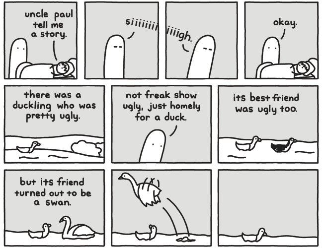
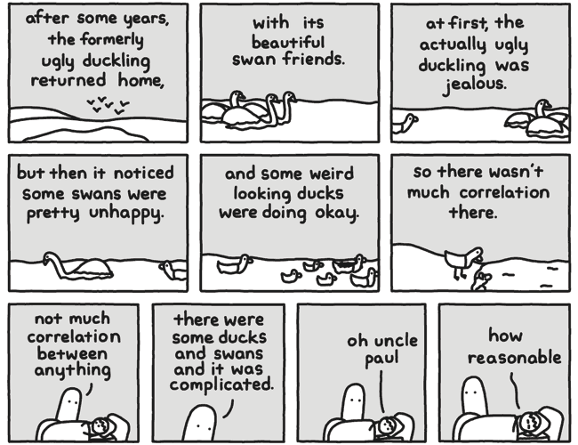

# 20080617

<figure><figcaption></figcaption></figure>

This song is called "I'd Hate To Be You When People Find Out What This Song Is About". You may listen to it [here](https://music.youtube.com/watch?v=Aynbq2n4mf4), but don't tell the RIAA. It also is from A Lesson in Romantics (Mayday Parade), which appears to be nearly tied with Hybrid Theory at the moment for times-the-album-has-been-played-through-this-month.

It is nearly accurate. Not entirely.

_but I let go_

***

I seem to alternate between overly verbose and completely silent.

***

<figure><figcaption>
http://picturesforsadchildren.com/index.php?comicID=149
</figcaption></figure>

<figure><figcaption>
http://picturesforsadchildren.com/index.php?comicID=151
</figcaption></figure>

Coat check.

Facebook tells me that, if we view only the most-voted-upon characteristics, I am a powerful, punctual and studious fellow who is, despite this, unattractive. And it would more or less suck to be stuck on a desert island with him.

Now. Tell me. What's unattractive about punctuality?

I'm getting better at knowing when my brain is doing stuff of its own accord. Mood changes and such. ... At least, I think I am.

[This](http://www.topatoco.com/merchant.mvc?Screen=PROD\&Store_Code=TO\&Product_Code=PFSC-DIFFICULT), [this](http://www.topatoco.com/merchant.mvc?Screen=PROD\&Store_Code=TO\&Product_Code=3PS-SMILE) and [this](http://www.topatoco.com/merchant.mvc?Screen=PROD\&Store_Code=TO\&Product_Code=DC-SCIENCE) merit a $7 discount. For a grand total of $48.50, which is I think something like $120 more than I have available right now.

I feel like I have something to say. I suppose I'll let you know when I figure out what it is.

\--

I figured it out. The comic at right does not fall under wf's blanket copyright statement. Mostly because it is not mine (see linkage).

Thank you.
