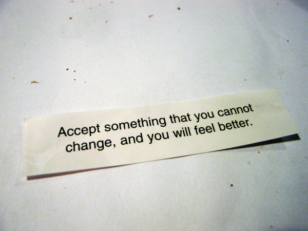

# 20080703

<figure><figcaption></figcaption></figure>

So I guess I can write this year. Here. Not 'year'. (taps forehead) Still not working properly.

Which might invalidate the rest of this entry, but what have you.

Going to go see fireworks tonight with \[name] and his gf. Looking forward to it quite a lot; photos from the last round turned out well.

I tagged along on last year's show as well, if I remember right. A lot can change in a year.

_(but) I might crumble and I might take a fall again_

Someone asked if that sort of situation was/is awkward, the whole third-wheel thing. And to a degree, it is. Though without question it helps that I approve of and get along with this year's girlfriend. Not to imply that there are yearly models, which there aren't... heh. Hopefully she'll stick around a while. They're good together.

A couple days ago I let go of the last little thread of hope that a particular relationship was going to work out. Interestingly, it felt good. Resolve is good. I'm not certain yet what implications this has. I've been trying to decide for some time that I'm okay with being.. well, single. Alone, in that regard. Hasn't been working, given that half of me was still holding out for what-could-have-might-have-been. But, with that out of the way, I think I'm getting there.

I'm hesitant to rule out love, as it were. And the ones likely to be reading this are likely to say that it's probably not a good thing to rule out completely. But to be completely honest with you, my dear or my good sir, I can't picture myself with anyone. Not thinking of names or going through any list of potentials, just.. in general. I don't know that I've been cut out with the intent of fitting another piece. On the romantic side, at any rate. I think the other sides are taken care of.

So - is it weird to be the figurative third wheel? .. To a degree, yeah. Working on ruling that out. It's difficult. Movies and nights and fireworks feel like they should be shared in multiples of two. One concern is that the established pair (speaking generally, not only for this situation) may feel somewhat uncomfortable themselves, given that if they get distracted with each other, there's this guy on the sidelines with no distraction of his own. And they're missing the mackin boat. \</inside-joke>

_And that, kids, is why I selected Windows Mobile 6 as my companion of choice._

Anyway. Still progress to be made. I'm not moving in the typical direction that people progress in, from what I can see and what I'm told.

_maybe a short-term (not years) dose of the meds to help your head, and then friggen find you a nice girl._

And, you know, maybe. But I can't help but wonder, if.. hm. Words. Wonder if, as long as I continue to wait/look/hope for the aforementioned nice girl, I'll continue to be screwed with the loneliness thing. Among other such things. If I can kill that part of me, would things be better?
