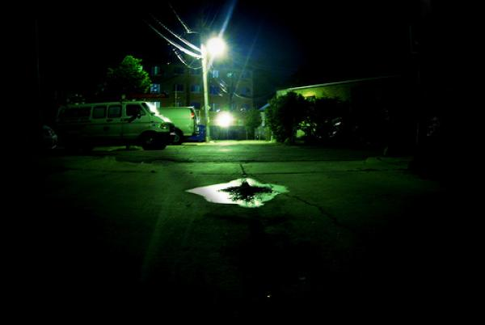

# 20080721

<figure><figcaption></figcaption></figure>

The thought mostly goes like this:

People believe they are capable of feeling emotion of incredible depth. Falling in love or losing the object of such love to death or something. What have you. Weddings, for example. Happening all over the place. People wildly happy about, possibly, embarking on the archetypal journey of the rest of their lives with this particular Someone.

And to the individual, emotion can be all-consuming. Often is. But really, when it's such a common thing, how deep can it really be? How _profound_ can a feeling possibly be when you're a tiny, almost completely insignificant part of a whole unit that, ultimately, has little significance of its own? Lots of little people running around feeling stuff. How much can that really mean?

If they were all united in simultaneous and unidirectional emotion, then perhaps it might have some value. But it's not unique, it's not special. You think it's special, that it means something. But your tears and your laughter, why should anyone care?

.. Which goes into another thought about networking, and how people in your immediate vicinity do end up caring, which is probably for the best, else the fabric of society wouldn't hold together.

Not that it really is anyway, but anyway.

That's all.

***

It's raining again.

Memory: at the gas station by \[location], \[name]'s filling up the Suburban (a painful ordeal), \[name]'s talking to a biker who randomly showed up, and I'm out in the rain, sandals in hand.

(I normally edit out names in these things, but I think this is harmless.)

(No, went back and took them out again. Sorry.)
