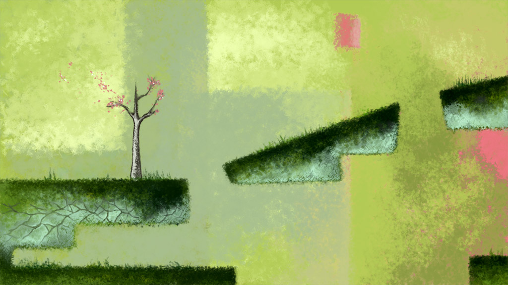

---
layout:
  title:
    visible: true
  description:
    visible: false
  tableOfContents:
    visible: true
  outline:
    visible: true
  pagination:
    visible: true
---

# 20081007

<figure><figcaption>
<a href="https://web.archive.org/web/20081025000706/http://www.davidhellman.net/blog/the-art-of-braid-part-2/">https://web.archive.org/web/20081025000706/http://www.davidhellman.net/blog/the-art-of-braid-part-2/</a>
</figcaption></figure>

0: yeah\
0: we'll go to london\
0: and you will be a leading psychologist who does what she likes with psychology, and I will make some art\
0: and our music collection will be astonishing\
1: i like the plan\
1: and we will never be cold unless we want to be\
0: agreed
