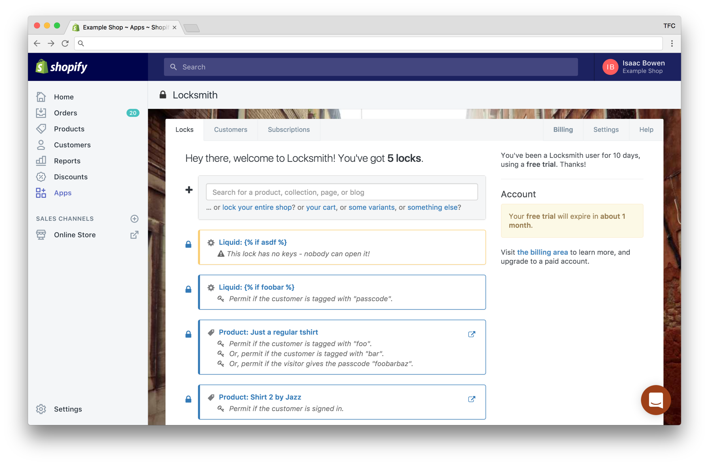
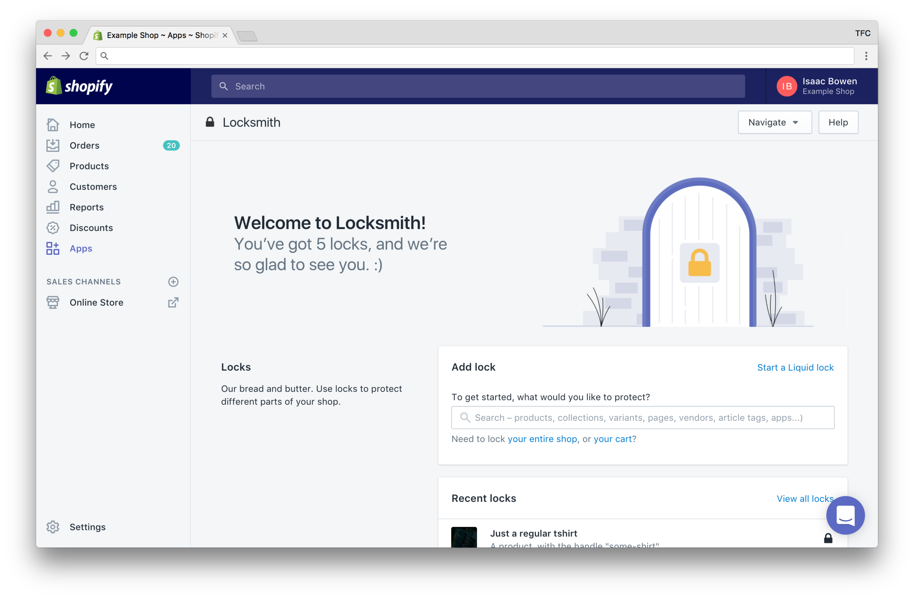
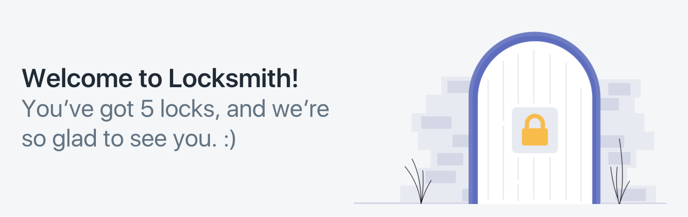

# Your product has character. Let it speak.

<figure><figcaption></figcaption></figure>

This is empathy week, turns out. I planned on that for [Tuesday](empathy-empathy-empathy-customer-support-empathy.md) and [Wednesday](the-internet-is-terrible-at-empathy-and-we-will-make-it-better.md), but today was supposed to be about the upcoming Locksmith redesign launch. It's still good subject matter, and I'm keeping it, but I keep on promising substance, and I want to give you something _substantive_. So:

Just as empathy informs the next word you speak to a friend, _so too_ can empathy inform the product experience you give your customers. Locksmith has always been designed for that conversation, and it _works_.

***

<figure><figcaption>
2014.
</figcaption></figure> <figure><figcaption>
2015.
</figcaption></figure> <figure><figcaption>
2017.
</figcaption></figure>

Your customers (_and_ you, in fairness) have been wired from the womb for modeling the world, for building an understanding of every entity they encounter, to the point that you can predict with pretty impressive accuracy how your best friend will react to [this gif](https://i.imgur.com/FxaIBXG.gif). (Wait for it.)

Let's reverse that, though: for any given reaction you'd _like_ your friend to have, you can select a gif. (And you probably have.) This is possible for two reasons:

1. People act and feel in ways that can be understood and predicted. Put together, these patterns of behavior form someone's _character_.
2. People can understand and predict the actions and feelings of _other characters_. This is that much-vaunted (lately) ability: _empathy_.

Cool.

It's obvious that your customers qualify as people, as _characters_ for the sake of analysis and prediction. But (and this is important): **Your product is a character unto itself. And if its character is understandable and predictable, your customers can empathize with what you've built, understanding and respecting the needs of your product. The result:&#x20;**_**speed**_**.**

Locksmith has always been built for the two-way conversation that empathy demands. Locksmith seeks to understand you without judgment, and its success in that frees you to take a breath, understand the product by what it shows you, and move forward more efficiently for it. It does this in these ways:

### It is _accurately_ welcoming.

<figure><figcaption></figcaption></figure>

"To get started, what would you like to protect?" This statement opens the door, invitingly, _and_ ensures that the user knows what lies beyond. In the invitation itself, it gives the user enough information to decide if they want to enter, or choose another door. Informed freedom gives the user a sense of stability – they can choose their own fate, knowing what will happen next, and this leaves them ever more ready to understand the patterns that I'm showing them.

### Its language is familiar.

It's English. Like, it's mostly just English. It's not diagrams, it's not arrows, it's literal English words. Check this out:

<figure><figcaption></figcaption></figure>

It's just _words_. Friendly, approachable, words, built into natural sentences – _exactly_ the same speech I would use if I were talking you through a concept in person. Nothing new.

Your users have grown up learning and leveraging language, trading needs with their world. If you're building for an audience, you _already_ have a massive spectrum of language in common – use this! Take advantage of the common ground in play, and _use_ those words in a way that is understandable and predictable. Establish the product's character. Build the relationship.

But (!) it can get better than one-way delivery:

<figure><figcaption></figcaption></figure>

Locksmith does some pretty nuanced stuff. Doing this in a widget- or icon-heavy way would be difficult to present, because the concepts are _very specific_, and the relationships between them are _also_ very specific.

Instead, Locksmith literally lets its users _fill in the blanks_. It asks, _what story do you want to tell?_ It says, _let's tell it together._

### It has character.

<figure><figcaption></figcaption></figure> <figure><figcaption></figcaption></figure>

Locksmith has never had much in the way of illustrations or pictures (really, it's only been the one photo of a guy with a backpack wandering down an alley in Venice, and now it's just a _door_), but it has _always_ been characterful.

And the point has never been the character itself: the point has been to establish a consistently predictable and approachable character that the customer can get to know. When you discuss new things with your friends, the conversation can still be familiar, the reactions anticipated. When _Locksmith_ brings something new to the table, my customers find the new interaction familiar and approachable, Locksmith's actions anticipated, because its _character_ has always been the same.

***

I have a three-year-old child, and it's a security app for Shopify. (Life is strange. ❤️) Next week, we're launching the next major design update, concomitant with Shopify's release of their design system, [Polaris](https://polaris.shopify.com/). It's the best incarnation yet of the principles I hold dear, in both personal relationships and product design both, because they're honestly the same thing. Onward!

❤️ 🆙
