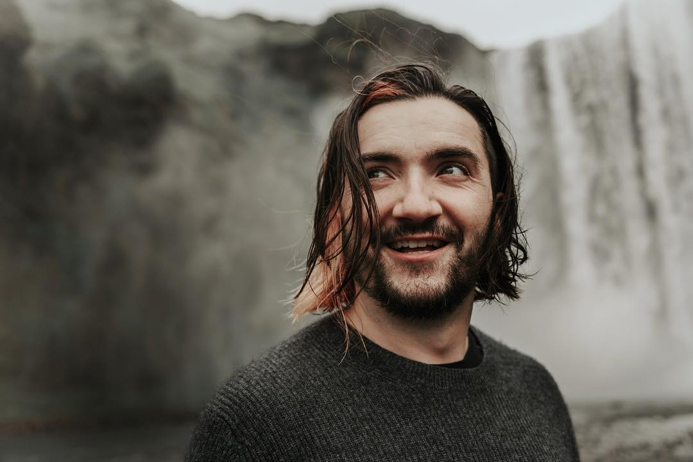

# I FOUND A PEER

<figure><figcaption>
The most accurate picture of me right now. By <a href="https://thefortco.com/">Abe Lopez</a>.
</figcaption></figure>

I've been appreciating [Aesop's work](https://www.aesop.com/us/r/philosophy-to-design) as of late (no, not that one), and (among other things) the way they speak with the words of those who have spoken well, as if Mrs Who were a chemist. In the same fashion, the much less vaunted cans of tomatoes in our cupboard quote John Muir on their label:

_When we try to pick out anything by itself, we find it hitched to everything else in the Universe._

It's hard for me to write about anything, because everything I want to tell you seems self-evident in context. Whatever I have to tell you is something inferable from its surroundings — if I never told you, if I never filled in that gap in your awareness, you might still fill it in by looking at the things that surround it.

Having said that, you do not know what you do not know, and awareness knows nothing of gaps. Awareness is always seamless, with no perception of what isn't perceived.

So.

I'm not driven to seek out new information. I am driven to make sense of the information I have. I am very, very good at synthesis, and there's no shortage of material already in my sphere.

Which is why I'm grateful for the incursion of fire that is my husband.

Before meeting him, my soul color was a kind of grey blue. It was a color born of synthesizing everything I had in that period: sober and cerebral friends, sober and cerebral work, sober and cerebral play. I read books and played games and had conversations and created things that were interesting, but burned cool.

Someone's color does not change all in a moment. I met Abe in 2014, and 2018 was the year that I found the fire. The [Sixty seconds of light](https://www.youtube.com/channel/UCba1OBRp8oRX75jCMostsaw) series was from the very start of this period.

And really, the only thing that did it was that Abe gave me a book to read.

I [talked](sixty-seconds-of-light.md) about the specific book before; right now I want to talk about the fact that the book showed me things about myself that weren't in my awareness already. You don't know what you don't know; you never know who you are all at once, and the best thing I received this year was an introduction to more of who I might be.

My soul color is now a bright orange-red.

:)

This post is _really_ about the fact that I just read a (I think he has several?) Richard Branson autobiography. I didn't have a role model until I read this book. I never felt like I lacked one, and "role model" isn't really right either: I don't want to model myself after this person, but Branson _is_ a stellar example of someone whose ideology and way of modeling the world is suuuuuuuper close to mine. I've never run into that before, and it's incredible and enlightening and _encouraging_ to read an account of what someone might do with 50 years of that toolset.

The principle thing that Branson and I both know:

Everything we create must either exist all at once (a event to be attended, a musical recording), or live a full life of its own. And if you are aiming for the latter, you must start with how the thing will feed and grow and how it will relate to the world around it. Branson has a lifetime of doing this with businesses, and I do this in a way that I'm exploring. ;) We both create things that want to live, and do so with a care for the fitness of this new organism, and the way that it keeps itself fit. The metaphor almost _has_ to be organic: if you are creating a living meta-thing (for all life is recursively meta) (and to be clear, I'm talking about a kind of living thing that exists between people, like a business or some other network), you're going to be making sure that its airways are clear and that its heart can support its organs and that it has the instincts for self-preservation. If you do not, your creation will either be stillborn or sputter into life and then expire, more or less violently for the energy you gave it at the start. This is not what I do: I create things that live their lives well and in good health, and that give life to the things around them. And hot damn is it good to read the life story of someone else who does this too.

And I think that is actually all that I want to say about this book. I don't come away from things with bullet points of things to remember. I come away having expanded my personhood. I think everyone does, but it's hard to talk about without having to condense the change into bullets. But that's not how I work and it's not how I think, and I'm learning (bullet point) to lean, further, into how I was made to be.

❤️❤️
