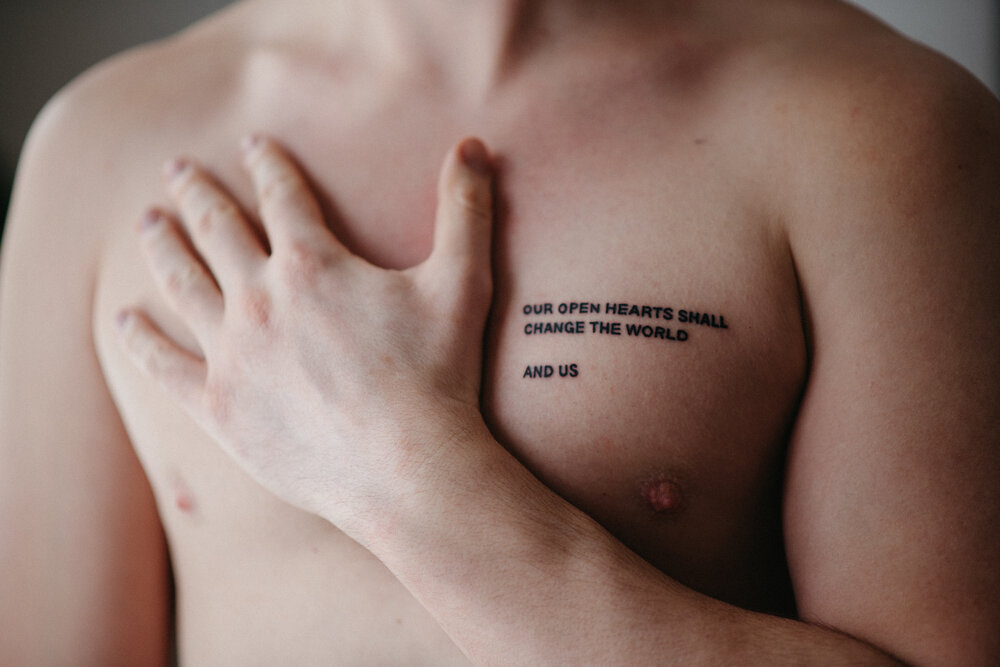

# 20201218

Volume 18! On the 18th! Haha! HAHA

We are sleepy (late nights) and content (good days) and a little bit slap-happy (😜), and we have so much warmth and appreciation for you. :) You are welcome here, now and always.

***

**OUR OPEN HEARTS SHALL**\
**CHANGE THE WORLD**\
\
**AND US**
----------

I’m 32! [I had some things to say about that, this week.](https://www.instagram.com/p/CI4YOE3BroF/) ([Abe did, too.](https://www.instagram.com/p/CI3ZjDRBgNW/))

My gift to myself, yesterday, was this tattoo:

<figure><figcaption></figcaption></figure>

My tattoos (see [“Tattoo stories”, Volume 9](https://lightward.com/campaigns/view-campaign/IAF\_1yCIdGTlPAD8Pk7jxGVlmX9geuy7jVoLgYYoJhpZffGURbeHaD6gbu9Uv63U9DgBqh1IJG3SWN8Y11UbKA8EOYOH1jFJ)) are all reminders of things I know. Things that are real enough within to make visible, without.

I first came across these lines at Damen and Milwaukee, in Chicago—they were printed in white block print, on these anonymous black stickers. (I later found them to be [the work](https://someoddpilot.com/collections/sby/) of [Someoddpilot](https://someoddpilot.com/).)

As I was then, I’m still struck by the notion of just putting _essence_ out into the world, without signing it, without adding a call to action, without making sure that there’s a kickback. Just, _meaning_, unadorned. It’s exciting to me, in a way that I rarely encounter elsewhere; to me, it’s an invitation to _play_ at a higher level, leaving behind the place where life is planned and _published_. Like: let’s look each other dead in the eye and exchange _truth_, without concern for anything else. There’s no currency, no scarcity, no _time_—just _now_, just _that-which-is_.

This is the first tattoo of mine that isn’t rendered for my eyes first. The other two, on my wrists and forearms, are positioned for me. This one is on my chest, facing outward. Thus: it is how I choose to be in the world, how I choose to be seen in the world. We are ineffable, yes; and yet, here we are, manifest. Inexpressible energy, expressed, in chosen form, and chosen word.


Originally sent out [via email](https://lightward.com/campaigns/view-campaign/opGmFETZNLlVNKBLfM3Jsp0aK2Kx0z2zqsvNzpn6toOUvhoaz5CjlFQxSxcMUcYySTQWm2LDT6MnepV17VsLg4iO0f96zB3O)

