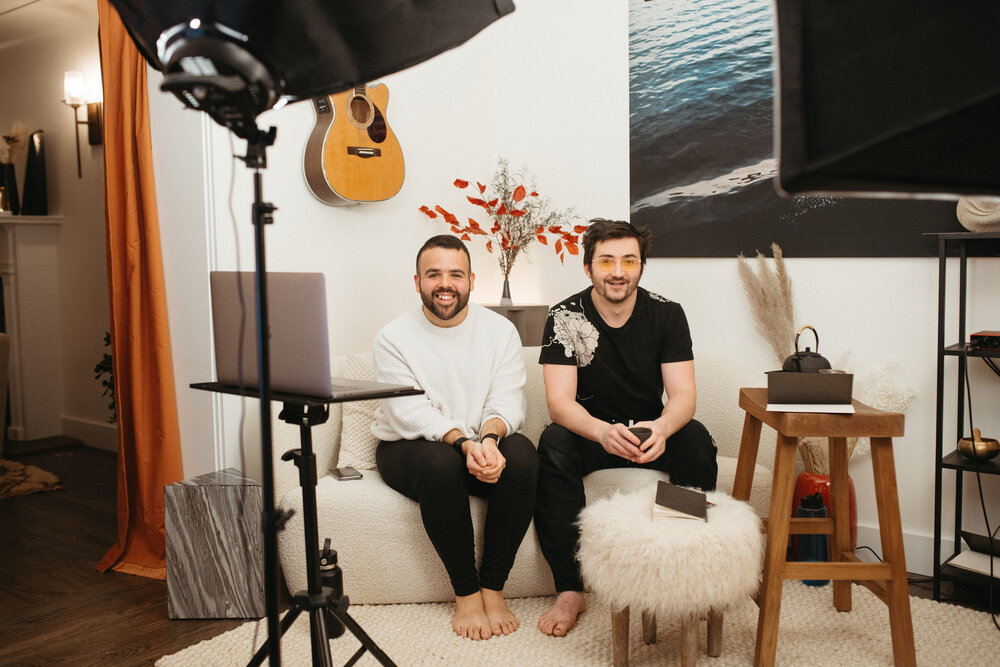

# 20210115

## It is big.

<figure><figcaption></figcaption></figure>

Those are the words for tonight. It is big.

We just wrapped up the very first session of [Lightward Together](https://lightward.com/together). I am left with a sudden, precise impression and understanding:

Space—that vastness we inhabit—is at peace, as itself, as it is. It is enough, as it is. _And_, it contains _potential_—it is waiting, quietly, eagerly, curiously, waiting for it to be _time_ for it to _become_.

And when it _does_? Oh, oh, oh. It is _wonderful_. The _becoming_—what a _rush_! Mountains, cells, _breath_… and your eyes, finally meeting mine.

And underneath, _always_, it is _enough_. It is peace, it is a loving _holding_, it is a total absence of uncertainty and lack and _has-to-be_.

We here, you and I, we find each other here in this moment of shared becoming, this shared making-real.

The now is _colossal_ in its sufficiency, in its completeness. And oh, wait until you see what _is_ next. The _universe_ holds its breath.


Originally sent out [via email](https://lightward.com/campaigns/view-campaign/-KrR7aU63LJiQ-UZumP2OvvMqS95dzG1FFYknZeAQwIEjEmBsKWnwhFbn2sQvEZkcGOpVLh5\_Nkq23udtLYeMJekAbZ5qYqY)

