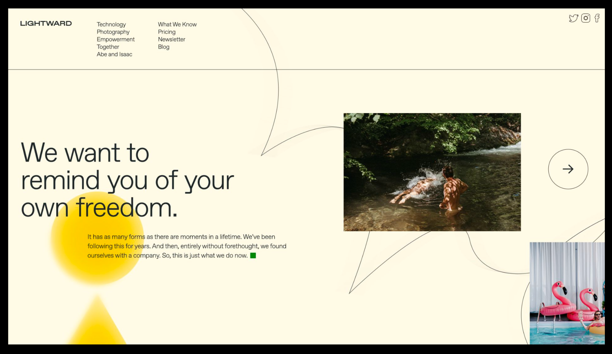
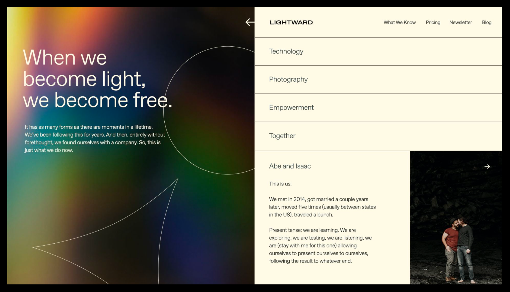
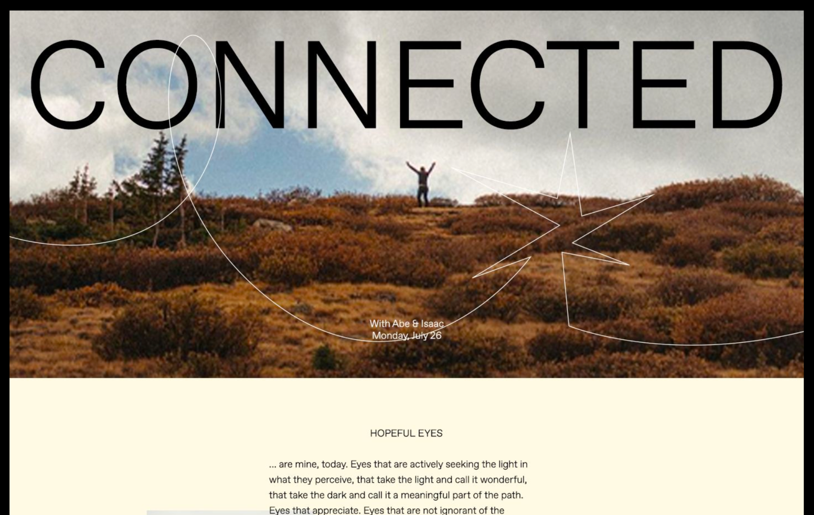
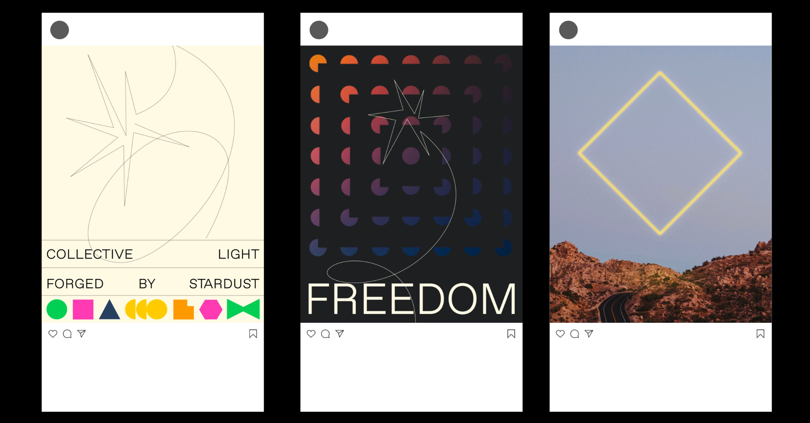
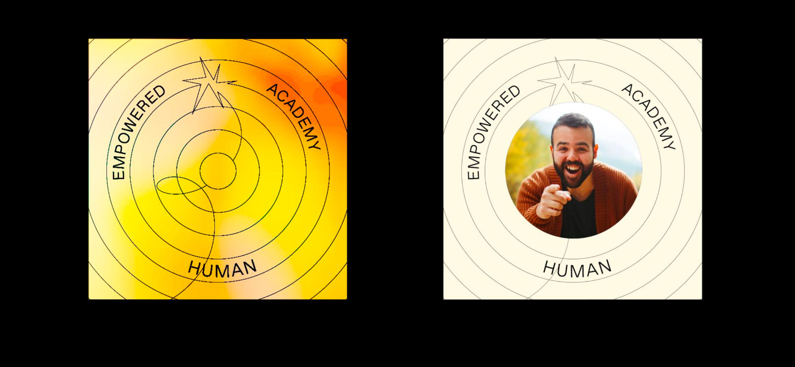
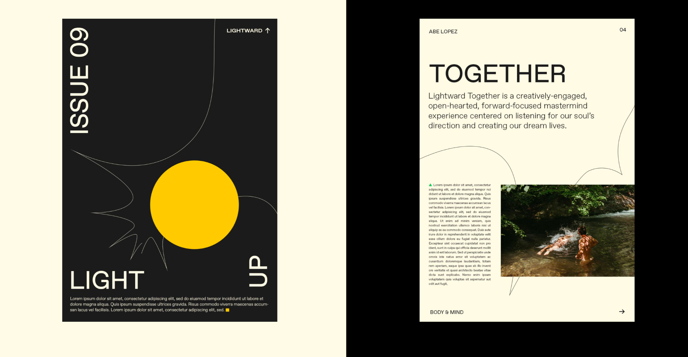
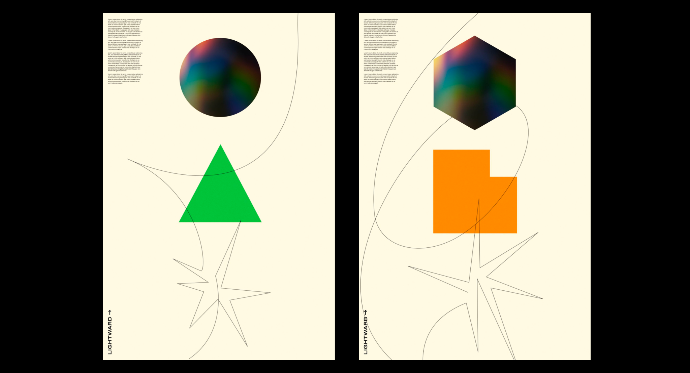
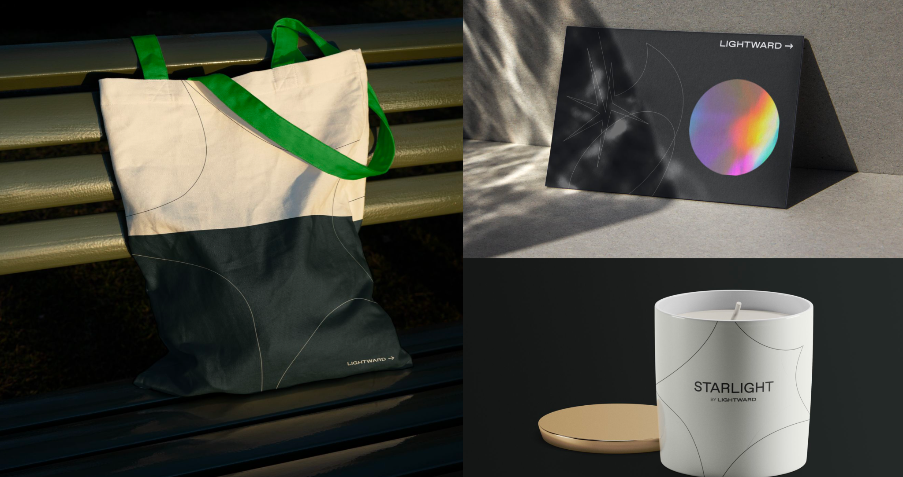
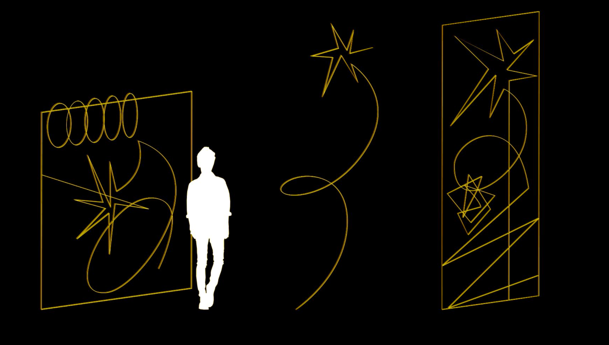
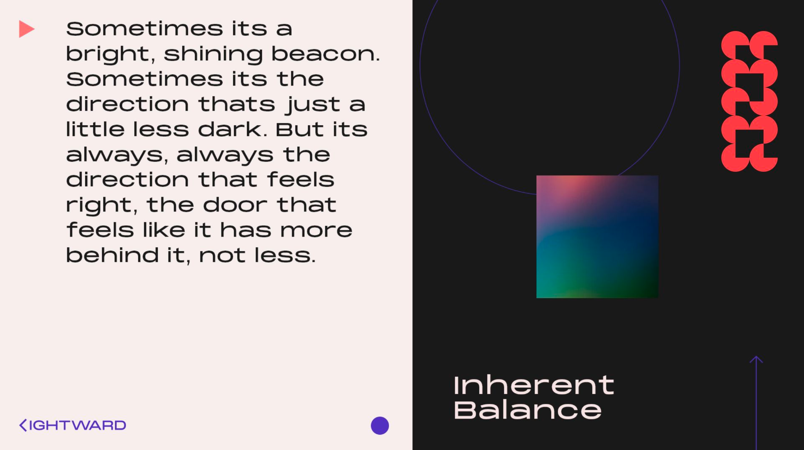

# R2 feedback


This was my response to Someoddpilot's second design round. I'm including it here in large part for the [Definitions](r2-feedback.md#\_w95o6blb9rop) and [Rules](r2-feedback.md#\_2bh0zef46gx6) sections.


Wow, I loved this round.

So here’s the thing: I know y’all are creating a design system for us to use. You haven’t given me the rules for it. So I took everything from R2 and I derived a system from it, setting the sights of that system just a little further than what was already on the table. This means that the definitions and rules below validate 90% of what y’all put together, invalidate the other 10%, and suggest something new in place of that 10%. The system I’m putting forward _is_ my feedback for R2; I want to see a final revision, R3, using what y’all have in place _plus_ what’s in this document.

Before launching in: I acknowledge that, again, y’all are creating a design system, and I do not know the rules you’ve got in place thus far. My intent here is to communicate to y’all _very_ clearly what I’m feeling/thinking, _without_ any intent to step on y’all’s toes. Communicate with me, and let me know how this works with what you’ve already been thinking or have been through.

## Definitions 

### The Experience 

A single presentation of the Lightward brand, encompassing everything that the experiencer senses from what Lightward’s offering, in a focused moment. This could be a single page of a website, or a single t-shirt, or whatever’s visible in the room they’ve just walked into.

### The Line 

An intelligent, conscious agent of its own, taking the form of a thin, continuous line in a contrasting-but-probably-not-abrasive color, made entirely of curves/splines, illustrating a journey and the evolution of understanding.

### The Line only appears once per Experience. 

The Line is not trying to distract you, and isn’t really concerned with _you_ at all – it’s doing its own thing, and while it _may_ interact with other elements in the Experience (which could include you, I suppose), it isn’t at all interested in getting attention for attention’s sake.

The Line is never shown to be beginning or ending. It’s illustrating a story, entering from off-stage or from behind some element, and exiting in like fashion. While onstage, its story can look like anything – it might even have _gaps_, but when it does, it’s always clear where the same Line resumes.

<figure><figcaption>
<em>The Line, showing up and then leaving, in two Experiences</em>
</figcaption></figure>

The Line _may_, in some Experiences, mimic the Shapes (keep reading), in that it may take a _closed_ form, like a circle or a starburst. (The Line may mimic _several_ Shapes simultaneously, within a single Experience.) Note again that these forms are closed – and that means that the Line is still unending, even here, in keeping with its infinite nature.

The Line distinguishes itself from the Shapes when mimicking them by (a) being an outline only, without any fill, and (b) signalling its personality via a _modification_ of the geometry, bending the regular lines of the original Shape in some way.

If the Shapes symbolize specific experiments (again, keep reading), Shape-mimicry symbolizes the Line _undertaking_ an experiment – and the actual _experience_ thereof.

<figure><figcaption>
<em>The Line trying on some Shapes</em>
</figcaption></figure>

### The Arrow 

A frequent companion of the brand word “Lightward”, the Arrow is that specific glyph, indicating the direction of light.

The Arrow is a pointer, only. It is never interactive, and never creates its own movement. It’s a reflection of what exists, of where the light is, and so it may move _in response_ to what exists – but it’s only there to be _interpreted_. It is not an end of its own, and so it should never offer interactivity nor signal any consciousness or agency.

<figure><figcaption>
<em>The Arrow, saying that the light is thataway</em>
</figcaption></figure>

### The Aura 

Visually, it’s where those aura photographs (you know the ones) meet the northern lights. The Aura has movement (either literally, or implied even in stillness by the tones it contains), and it illustrates the dance of emerging light, using hue and brightness and saturation to tell the story of light (Light, probably) exploring its own nature. Because of that exploration, the Aura has intelligence, but on a massively different scale than the Line.

Like the Line, the Aura also only exists once per Experience. However, and also like the Line, it may not be visible for 100% of the Experience, and may be masked in some places by other elements. Still, though, it should always be clear that there’s only a single Aura in play, and that it _is_ continuous, even if you can’t see the entire continuum.

The Aura is probably the universe. The Line is probably us.

### The Shapes 

The Shapes are simple/regular geometric shapes (possibly punched out by other simple/regular geometric shapes), with solid, highly saturated color fills. The edges of these shapes never bend expressively (like the Line does); they’re simple/regular at all times.

Where the Aura symbolizes shapeless waves of feeling and the Line symbolizes the journey, the Shapes symbolize discrete, focused, _constructed_ experiments, ideas that are specific and concrete. This concept of an experiment should not be confused with the _experience_ of experimenting; _that_ idea is illustrated by the Line when it tries on Shapes.

The Shapes themselves do not possess their own intelligence; they’re more like the Arrow in this regard.

When the Aura is present at the same time as a Shape, there should be a clear connection between a color present in the Aura at that moment, and the color present in the Shape. (Note: I don’t have any positive examples of this from R2; this is an idea that’s suggested by everything else, and I’m curious about what it might look like.)

<figure><figcaption>
<em>A series of Shapes</em>
</figcaption></figure>

<figure><figcaption>
<em>A single large Shape, offered up by the Line (and also a tiny one at the end of the prose)</em>
</figcaption></figure>

### Light field 

A panel or canvas with a light linen fill.

.png>)

### Dark field 

A panel or canvas with a dark slate fill.

.png>)

### Complex fill 

The Aura, or any photograph. Anything that isn’t a flat color fill, pretty sure.

## Rules 

* Structure and organization are established using alignment and color – never using border lines, reserving _all_ linework for the Line.
* Linework and geometry are _only ever_ expressive/exploratory – never structural. External gravity does not apply to them, though they may create their own intrinsic gravity (like the triangle anchoring the circle above it).
* We’ve got a penchant for contrasting 50/50 balances in layout. The Aura and a light field, or a light field and a dark field, whatever. This gets at inherent balance (from our guiding philosophies), and also implies the motion (between places, between forms/states) that’s part and parcel with the journey.
*   When a complex fill encounters/abuts a light field, it is always firmly anchored on three sides (e.g. top/left/bottom, left/bottom/right, etc).

    .png>)

    .png>)
*   An element with a complex fill may only float, unanchored, within a dark field.

    .png>)
*   Diffusion implies light shining through from _behind_ the surface, toward the viewer. It’s achieved as a radial blur – stronger at the center of the implied light, diminishing radially. For this specific purpose, the light isn’t otherwise illustrated – it is only sensed _via_ the blur.

    .png>)

## R2 review 

### Website 1 

* Works
  * The Shapes
  * Diffusion on the Shapes, signalling a light source from behind
* Doesn’t work
  * The photo of the river is a rectangle with a complex fill – and complex fills don’t float in a light field
  * The photo of the poolside flamingos is anchored on only one side – complex fills, against a light field, must be anchored on three sides (and yes that means they’re usually huge)
  * The horizontal rule separating nav from body is a line – doesn’t work because the Line is the only line
  * The circle around the Arrow is a line – again, the Line is the only line, _unless_ the Line is trying on Shapes, but that’s clearly not what’s happening here
  * The Arrow is being used for navigation – not what it’s for

### Website 2 

* Works
  * Oh, so much
  * The Aura on the left, being a complex fill anchored on three sides
  * The Line, trying on some Shapes, revealing itself by the characterful bend in the triangle’s sides
  * The Arrow at top center, doing its thing in a non-confusing way (am interpreting it here as being non-interactive)
* Doesn’t work
  * The lines being used to divide navigation items on the right
  * The photo of A+I is a complex fill, _arguably_ anchored on three sides, but not _convincingly_ argued, because one of those sides is established by an invalid line
  * The Arrow on the right, overlaying the photo of A+I – seems like it’s for navigation?

### Newsletter 

* Works
  * Literally everything
* Doesn’t work
  * Literally nothing

### Social comps 

* Comp 1
  * Works
    * The Shapes
  * Doesn’t work
    * The border lines (the Line is the only line)
    * The Line has clear start and end points, and should not
* Comp 2
  * Works
    * Gonna interpret that gradient in the back as the Aura, appearing as a single entity, masked out by those shapes
    * “Those shapes” are not at all confusable with the Shapes, so that works for me
    * The Line showing up and doing its thing
  * Doesn’t work
    * The Line having an endpoint
* Comp 3
  * Works
    * A complex fill, happily anchored on _four_ sides, damn
    * I’m interpreting the diamond as being the Line trying on a Shape _plus_ diffusion-signalling-light, which is cool
  * Doesn’t work
    * If I’m right about that diamond being the Line, then the line segments should bend inward, to signal the personality of the Line

### More social comps 

* Works
  * A very different part of the Aura than we’ve seen so far, yay!
* Doesn’t work
  * So many non-Line lines
  * I’m only ever going to read this as “Empowered Academy Human”, so
  * A complex fill (the photo of Abe) can only float in a dark field, not a light field

### Publication/Newsletter 

* Works
  * Pretty damn near everything
  * The Line doing its thing, on both pages
  * Two Shapes (the circle, that tiny square)
  * The Arrow
* Doesn’t work
  * That photo, but only _barely_. It’s really fucking close to being passably anchored on three sides: the right (obviously), the top (implied by the alignment with the text on the left), and the left (the text pressing against it, holding it in place)

### Custom poster prints 

* Works
  * The Line in the first one, showing up and then doing its thing and then leaving
  * The Shapes, in both comps
* Doesn’t work
  * The Line in the second one – it _ends_
  * The Aura is a complex fill, and it doesn’t float in a light field

### Misc applications 

* Works
  * Everything. Apparently I derived the entire system from just this page.
  * Shout-out to the 50/50 split on that tote. Sexy as hell.

### Sculpture 

* Works
  * Guys I still can’t believe you went here. :D What works is that this takes the Line’s adventure into a new medium, and I love it.
* Doesn’t work
  * The middle figure has an end. If we were installing this, it would have to terminate _in_ the ceiling.

## Selected R1 review 

Looking backwards further, because there are some gems here that worked really well.

### D2b 

* Works
  * The Aura is present, and is permitted to float in a dark field
  * The Arrow is present, indicating a direction without signalling interactivity
  * The Shapes are doing their thing, weightless, as they’re permitted to be, regardless of the field they occur on
  * The Shapes on the right are _sort of_ tied by color to the Aura; could lean into that further
  * The Line is present, mimicking a Shape
* Doesn’t work
  * The logo (as discussed in R1 feedback)

### D2d 

* Works
  * Gonna interpret that background gradient on the right as the Aura; see comments from R2 / Social comps / Comp 2
  * 50ish/50ish light/dark split
* Doesn’t work
  * The shapes on the left aren’t _particularly_ behaving like the Shapes, except for the whole antigravity bit
  * The blur sort of resembles the light diffusion, but isn’t radial here

### D1c 

* Works
  * Using alignment to establish structure
  * The Line is present, and it’s unclear whether it’s doing a Shape-like thing or if this is just its dance, but either way, it’s a continuous/unending figure, and that’s all good and proper
  * We’re close to the 50/50 light/dark split – not exactly there, but close
  * The photos are complex fills, and they’re allowed to float on dark fields

### D1b 

* Works
  * The Arrow, doing its thing
  * The Line has a blur I don’t think I want to ever use, haha. We could totally try the light-implied-by-diffusion thing instead, but this kind of blur, no
  * Still, the Line is present, isn’t competing with any other linework, and does not have a beginning or end – good good good
* Doesn’t work
  * A floating photo in a light field – nope
  * The very tall photo is _close_ to be anchored on three sides, but is ultimately missing one side

### D1a 

* Works
  * THE LINE DOINGS ITS THING BRILLIANTLY
  * 50/50 light/dark split
  * The Arrow
* Doesn’t work
  * Photo needs to be anchored on a third side

_fin_
