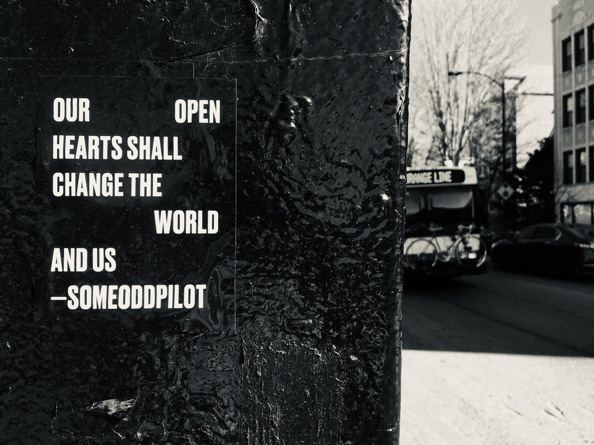

# Someoddpilot

[SOMEODDPILOT](https://someoddpilot.com/) – an independent creative agency. Can I begin by saying that they’re the fuckin coolest?

The six corners of Milwaukee, Damen, and North are littered with inscrutable stickers – on the street signs, on the lampposts, on the pavement itself. They each _mean_ something, to someone, but for me they create a sort of haze that curls around my feet as I pass through. It’s that sensation of being in the presence of something that knows itself, and doesn’t mind if you can’t make heads or tails of it.

It was in this milieu that I found these:

<figure><figcaption>
<em>Credit: Someoddpilot</em>
</figcaption></figure> <figure><figcaption>
<em>Credit: Someoddpilot</em>
</figcaption></figure>

These stickers carried meaning of their own, of course, but _these_, out of every other square of vinyl on the corner, felt like something that overlapped with where I was, myself.

Resonance has a timeline, I think – not an on/off switch, but an arc. I never forgot those stickers. Someoddpilot showed up again for me, later, via some other piece of feeling they’d put out into the world: the neon yellow lines of a smiley face canting to the side, in the window of a second story walkup, by a taco shop. I looked up the occupants of the building, found SOP, and _then_ found the art project of theirs that birthed those stickers I’d seen on the street: [Space Becomes You](http://spacebecomesyou.com/). A little later on, I added a line from that project [to my tattoo collection](https://www.instagram.com/stories/highlights/17887872971045606/): _our open hearts shall change the world // and us_.

It always just felt like resonance. Someoddpilot, to me, seems unconcerned with fitting into external mores, minding them _only_ so as to leave a trail, an interface – _just enough_ of a loose thread that the viewer who’s ready for it will have something to pull on, and will have a reason to pull. I resonate with that, so, so hard.

Shortly after that tattoo, I asked if they would work on the Lightward brand itself, a brand that already knew itself, but had not yet learned a visual language.

I’m still delighted that they said yes. There was no one else I wanted to ask. :)

[Having begun](https://someoddpilot.com/about/) as an indie record label, then evolving to be truer to themselves over time, Someoddpilot’s conversations with us always felt like talking with old friends who wanted to know what was _actually_ happening in your life – none of the “I’m fine, just busy”. It felt like being recognized, being found familiar at some intrinsic, permanent level – not merely being seen or observed. Our conversations were a work of curiosity that was _grounded_, like we all knew the answers were here, and it was never a question of _if_ we would find them, but merely _how_ and _when_.

The Lightward brand project took about six months, and it felt _wonderful_. This is a massively big deal, for an entity like Lightward whose aim is more a feeling, and less a number, and for such an entity’s first time working with an external party at this level. And to emerge at the other end of the process with a brand framework that feels _native_ to us is nothing short of monumental. I cried, on delivery of the final assets. (Also on most of the calls before that.)

The process did involve some work that I imagine is standard: defining the project, defining success, defining the audience. But because Lightward has always felt (to me) larger than any specific line of work, the metrics of success rapidly became qualitative. SOP proposed that, when people encounter our brand, they might say any of the following:

* “You’ve inspired me to try something new in my own work”
* “Lightward encouraged me to be my authentic self more than ever before”
* “I now believe I can run my business in a more ethical way”

And, my personal favorite:

* “Thanks to you, I’m questioning how capitalism defines success within my personal life”

We talked about our position in the market, and they were able to keep pace when it became clear that “the market” was an almost useless term for our discussion. We _were_, together, able to agree to release some of the conventional terms and parameters, for the sake of a new conversation about _how to talk about Lightward_. Which, for me, felt like a relief: I’ve always been able to speak from the heart of this thing, to speak as the process of the thing, but to _sum up_ the thing, in a moment? Working with SOP felt like giving myself permission to give up the impossible-for-me, knowing that I was handing that job to someone who was made for it, who had chosen that work for themselves.

The iterative part of the process, the volley of words and shapes, just felt like joy, and play. No other way to say it, and there’s not much more to say. SOP is fluent in a language that I feel in my blood, and every attachment I opened felt like Christmas. They showed me the things that I felt, gave form to things I knew but couldn’t express myself. _It was a ton of fun._

The final product, Lightward’s own brand guide, feels like home. But, and critically, the entire process felt complete, at every moment – and even if we had never reached the end, it would have been enough, every step of the way. This is how I want to work _all of the time_, and it’s a signal I pay attention to: if a process slips into a state of lack, a state of not-enoughness, that’s something to mind; but if a process feels full all along the way, like the richness of it would have been worth the journey even if this were the end, _then_ we know we’re on the right track. The things we learned, the ideas we traded, even just the privilege of working with artists at the level of SOP’s craft – it was _always_ all worth it.

The assembly of a visual brand is part of a larger experiment of ours, a question worked out in action: what happens if we show ourselves, on purpose? That we were able to start _here_ is, I think, perfect.

(SOP, if y’all are reading this: thank you!)

:)


Originally published at [https://lightward.com/journal/artist-spotlight-someoddpilot](https://lightward.com/journal/artist-spotlight-someoddpilot)

