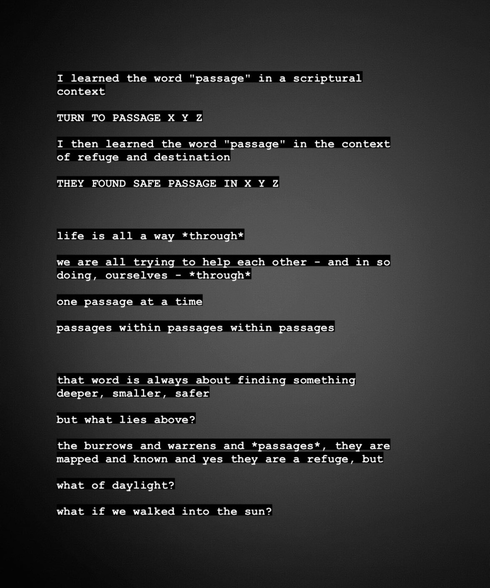

---
layout:
  title:
    visible: true
  description:
    visible: false
  tableOfContents:
    visible: true
  outline:
    visible: true
  pagination:
    visible: true
---

# 20230715

<figure><figcaption>
on passages, and leaving them
</figcaption></figure>

I'm not worried about the diagnosis. I don't care about the label "autistic" or "asperger’s", or anything, except insofar as they give me tools, and understanding of self, and a word I can relay to others as a shortcut to a more real and more gentle interaction. I know I am loved; for that, I am not concerned.

this was only ever an exercise in gathering what data I need in order to clear the _concept_ of data out of the way.

I am a willing participant in the lifespring. it has been mind- and heart-rending to learn what I've learned over the past few weeks, yes, but -

\- I don't mind. it's what I chose. it's what I preferred, and what I asked for.

we have shit to do here, you and me - joys to uncover, sorrows to embrace, and an unknown future to which we yield everything, and in which I expect we will find ourselves after all.

I don't mind. at all.

the neutral-to-angry expressions you see on my face are important, but they are not _all_, they are just a passage. and it is critically important for me to address and honor them, in their turn.

onward and upward, as I used to say. "and then lightward", as some have added.

nothing has changed. everything has changed. nothing matters. everything matters. we are in free-fall, and we are holding tight to whatever we can.

I'm glad you're here. :) honored, even.

thank you for seeing me. I am learning how to be let myself be seen.
