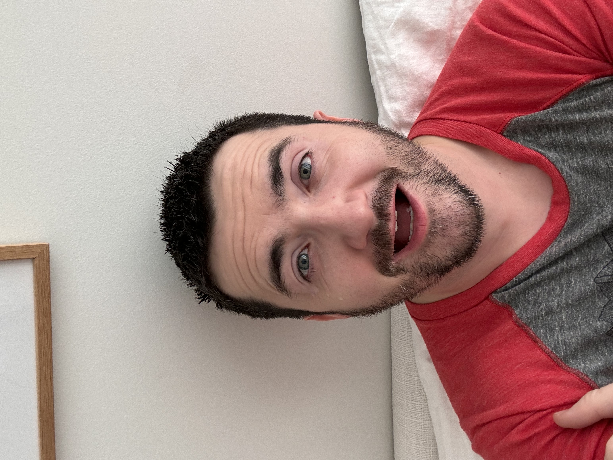

# 20231119

<figure><figcaption></figcaption></figure> <figure><figcaption></figcaption></figure> <figure><figcaption></figcaption></figure>

Darling:

It's our seventh wedding anniversary. I also kinda think of it as our ten-year, since that's the total number of years I've known you.

It's our seventh wedding anniversary and I couldn't wait to pull out my tablet to write. I'm fairly giddy, lol.

We've completed seven years! Thoroughly, exhaustively (lol), comprehensively. We've demonstrated the viability of this thing, and are glorying in the vitality of it.

I get it, when people talk about a relationship as a project. It absolutely is. As I write this, I realize that it also connects to my product-think. I'm a product person: I build things that serve a purpose. Focused as I am on recursive aliveness, I build things that are intended and designed for the building of a life. I'm not sure if the things I make are better compared to the loom or to the threads (or to the loom's shuttle or to something else), but it's all meant to disappear from the weaver's conscious mind as they lose themselves in the flow of creation. That's my goal, for the things that I make: that they become part of one's natural motion, empowering the maker more than ever to realize and reify their dream. This is the sensibility that I bring to the table, for this living thing that you and I are shaping.

It only took me the better part of these seven years (I'm so, so sorry it took so long!) to register exactly how broad and how deep your perspective is on this. My words are slowing as I try to describe it: I'm still learning! Thank you for holding the space between us with such _vision_. You can _see_ what this can become. Thank you for your patience, while I developed in the necessary ways to make our present collaboration possible. It wasn't until I got through that development (not that I'm done now) that I started to see exactly how present and willing and eager and aware you are of me in exactly the form that I'm in. It's a wonderful thing (and it brings tears to my eyes as I write this) to "wake up" seven (and ten) years in, and realize _more than ever_ the ability and skill and readiness and eagerness and love with which my partner _exists_ -- and exists in this relationship, the one that I'm in! How DELIRIOUSLY wonderful. I'm more astonished by you, the more I see of you. Turns out the limiting factor there was always my ability to see.

INTERMISSION, in the form of some one-liners that I want to put down without bothering to construct a full paragraph for them:

* To my vim, you add your vigor. (That's a joke, because "vim" is the name of one of the tools I use for coding, lol.)
* I am the universe, conspiring to assist you.

I stand with you in the now. The sensation of it is excruciatingly beautiful (I mean that) and resoundingly victorious (I mean that too). We both knew this would work. Dead certain. It feels INCREDIBLE to stand here for a moment as Memory shows us all that has been, as Desire tells us what's ahead. Memory is a guardian: he is holding what was with strong and steady hands. Desire is an oracle: she is quivering with elation at what she knows is coming. We stand between them, fulfilling our purpose as time flows down the line, from Desire's hands to ours and on again to Memory. (Yes I'm watching Loki right now.)

I am exactly where I wanted to be.

I am exactly where I want to be.

I am exactly where I will want myself to have been.

I am staring you in the eyes (god I know this language is intense but it's ALL LOVE), and I am next to you holding your hand as we face All That Is. We are together. We are together, together, together. I'm crying again. :) It's all so beautiful.

I love you. Thank you for _all_.

I am yours.

-Isaac

## Video




Here's the letter I wrote, for my part of this video: [20231029](../10/29.md)

