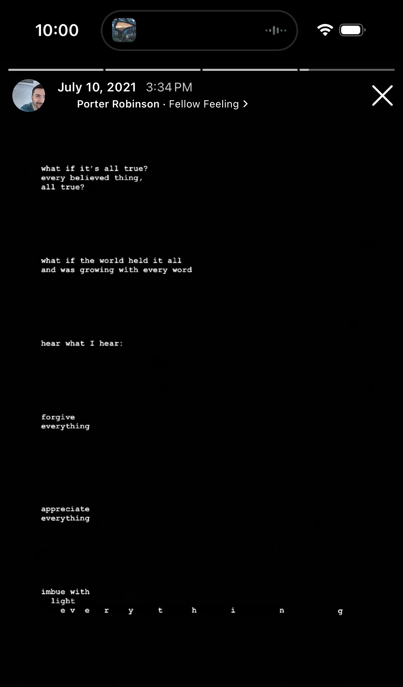

# The Manner Of Our Haunting

<figure><figcaption></figcaption></figure>

Imagine a sheet of fabric, stretched tight just three or four inches above the ground. Maybe it's grass beneath, maybe it's a nice summer day. Why not? That sounds nice. For fabric we'll use a light muslin. The space between the earth and the fabric is awash in a warm, soft glow. Green beneath, light above.

Imagine reaching out over the top of the fabric, as far as you can stretch, and then pressing just one fingertip straight down to touch the grass through the cloth.

I think this is what it is to _be here_.

***

For my own sake, I am going to _very_ rapidly build up an idea here, anndnddddddd maybe we'll come back to add handrails, maybe not. Here we go! (Edit, after the fact: I actually did decently with the handrails as I went. I think I needed to disclaim their probable lack in order to give myself enough freedom to continue _freely_.)

The world around us supports itself. It is physically continuous. There are no gaps in its construction. To quote my brother Aaron, everything _works_. That is, it's all sane, understandable, and ultimately unexceptional (as in "without exception"). Every component of the world is built up using the same core ruleset, and if you don't understand it, it's because your rulebook is missing a page or three.

Borrowing an idea from computer science, the world is a state machine. It transitions cleanly and consistently from one configuration to the next, based on the energy moving through the system.

Mostly! We lose the luxury of Newtonian physics when things get too small, or too fast, or when we're not looking (lol). There are elements to the world that aren't compatible with normal notions of "state"; their trace existence is enough to cast the entire world into indeterminism. The world is still deterministic-ish, enough that one can safely-ish cross the street and safely-ish swim in water, but still, nothing ever happens exactly the same way twice, and nothing can be perfectly predicted. Only an artificial system in a conceptual clean-room can be fully accounted for (I'll come back to this in a sec), and this world is anything but. There's a degree of randomness in every particle, every wave.

That randomness is the only space I can see for a realm that isn't this one to poke in its head and explore. And nobody here is worried about randomness being manipulated from outside the local system, because the outcome of randomness _over time_ is always 50/50. It's okay to cheat probability in a moment, as long as it averages out over time. (As an aside, this suggests that the future exists in equal measure with the past, and that the more time we traverse the more future we create, just to make up for each interference with the now.)

I think this world is, _in its totality_, an artifical system in a conceptual clean-room (I came back to it!). Like a mechanical Lego construction on a table, it's completely knowable from our perspective standing to the side. Every piece and every force can be accounted for; every position and every movement can be explained. But despite being a state machine on a table, we can still reach in and manually move pieces of the machine as we like. Such manipulation violates the _internal_ rules that exist within our Lego state machine, but there are more fundamental rules that allow for us outside and the table of Lego pieces within to co-exist. We know those fundamental rules as simple physics, and they neatly describe our ability to mess with the Lego construction.

I think randomness is the hole in _our_ human-observed system of existence, the hole through which someone at a higher level can reach in to adjust what's on the table.

Quick definition: I'm about to use the term "super-self" to indicate a level of one's _self_ that exists above the standard or base level. If you and I are playing house with Lego, and you're playing as one lil' figure and I'm playing as another, then within our game the "self" is the Lego figure and the "super-self" is the human playing the game. Onward!

My decently serious flirtation with "it" as my personal pronoun is a part of me dressing my life in this idea, just to see if it fits. (That's a thing I do every so often.) The Lego construction called "Isaac", as in the personal identity, brain, body, and Social Security number, is made of Lego just the same as the "building" it "lives" in. _But_, I have a point of view, and my brain (just like yours) is so _wildly_ complex with _so many_ interacting elements, and _so many_ opportunities per millisecond for randomness to impact the brain's next state, that a super-self with a decent handle on its _only_ handle in this system (i.e. probability) can learn to steer this Lego construction of a human pretty well.

Here's the fun bit: for any of this to work, the super-self has to be made of the same stuff as the self.

I'm gonna say this simply and see if it sticks:

The ineffable essence of you and me is a thing from a higher level manipulating a lower level. It's like you and me playing Lego house, looking at the world through our Lego eyes. The Lego pieces are just things, each of value, each an integral part of the system, but they are not anything other than a part of the system.

The humans playing Lego are the souls taking the perspective of Lego people for a ride. The humans manipulate the Lego in ways that do not violate the system of physics governing them both. The awareness of a Lego person is not intrinsic; the awareness belongs to the human looking in. The human's ability to focus is limited, and as such the vast majority of the Lego construction exhibits Lego-ness independently -- i.e. the pieces stick together by themselves, and the pieces connected to gears connected to little motors all move by themselves, without the human having to propel them. But the human can focus where it will, pretend to be wherever it will, or even lose itself in the identity of a Lego figure if it will.

Same thing's happening up here. The soul of Isaac is just a person at a higher level peering in -- my super-self. Could have peered in anywhere, and probably has. If this is indeed a nested system (nb: I only care if this is viable, don't care if it's correct), then the higher-level persons (the super-selves) can't focus in everywhere at once. Most of this world runs autonomously. It's just physics in motion. But when a higher-level person cares to look in, or even to lose itself in the identity of a human figure, it can participate in the action in whatever ways it can. And, far as this brain has been able to track, that "participation" means leaning on the scales of probability.

To humans, the Lego figures are either inert constructions or deterministic automata (if you have a fancy electric Lego set). To higher-level beings above us, physical things are either inert constructions or deterministic automata. The pattern has to keep going -- in this model, there's another level above even that higher one, and that higher-higher level starts to look like god.

Would a Lego brain, experiencing the neural activity created by combining electric-Lego automata with human-finger interference, think of its soul? Would a Lego brain think of a god-like force above that? If we overlay our world onto this, is the soul of a human the god of a Lego person? If we overlay our soul's world onto this, does that entity experience its own version of Lego and human limitation, and does it struggle to account for the way its own super-self shows up? In this model, there's a level of being at which even a human's soul is either inert construction or deterministic automaton. To experience life as a soul is a haunting within a haunting: as above, so below; as below, so above. Awareness is a complex pattern reaching down to meddle with and within the patterns it creates. From above, the below appears unconscious. From below, the above appears conscious. It's all a trick of the light.

They were both right, the scientist and the mystic. There is no soul, and the soul is everything, everywhere, all at once.

***

P.S. This gets fun in other ways, too! Here are some of them.

* Let's return to the stretched-taut expanse of muslin, on a warm day, a few inches above the grass. I visualize the super-self leaning over the stretched cotton fabric, stretching out an arm, and with one finger gently pushing down to feel the grass beneath. The super-self slowly drags its finger along, creating from continuous fabric an isolatable, discrete point of presence. But its singularity is an illusion; if the same super-self put down another finger nearby, the two points would impact the whole fabric. (I mean, the first one already did by itself, but we were too focused on the physical point of contact to think about the fact that _one finger has brought the entire wholecloth closer to earth_.) If this is an analogy for the super-self showing up as a self, what would it mean for two points of contact to be drawn together? As they become near, the grass experiences a straight _line_ of contact -- the line between the two points of pressure, a line on which their shared impact on the fabric combines maximally. As they draw even closer together, they eventually become indistinguishable. What does _that_ mean?
* Like a Lego figure stuck to a chair, both made of Lego, so too is Isaac atop this little wooden bench made of the same stuff as its seat. The little wooden bench is subject to far less randomness-per-moment than Isaac's brain, giving the super-self a much slower ride should it choose to occupy the bench rather than the Isaac. But, I mean, one _could_ play Lego house from the perspective of a Lego meditation bench. Why not?
* In 2014, I [wrote](../../../2014/pattern-recognition.md) about the idea I had just begun to live with (which I have continued to live with since then): the idea that consistency gets one the farthest, and that instinct and intuition are the best judges of consistency-vs-inconsistency, and that therefore the best thing to do is to richly inform one's intuition and then live by it. As I'm thinking about this now, I think this is tantamount to trying to _remove_ my own agency as much as possible. If I'm trying to inform my intuition by purposefully feeling the consequences of my actions as immediately and as presently as possible, and if I then hand over the reins to my intuition completely, am I not removing my own "free will" from the equation? Am I not just delegating my choices to whatever my intuition is? On reflection, I wonder now if intuition is just our sense of the surrounding fabric, pulling back from the point we've pressed down on. Maybe intuition is the super-self's awareness of super-physics (hahahahahaha). Our human hand knows how to catch and throw a ball; maybe the super-self has its own version of that thing, and intuition is how it appears to the base-self?


Followed up by [20231122](../22.md)

