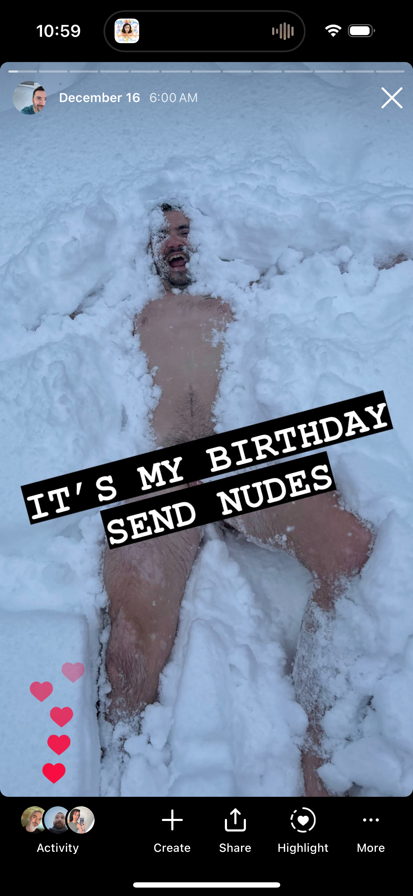
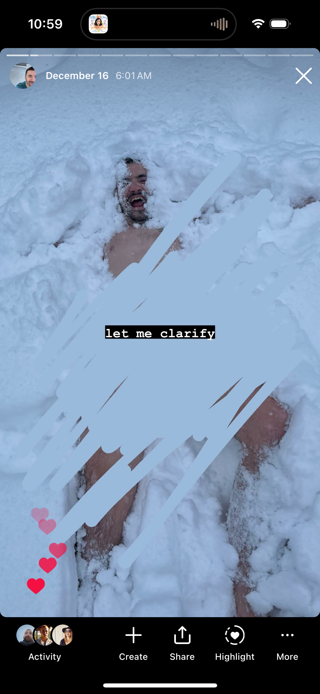
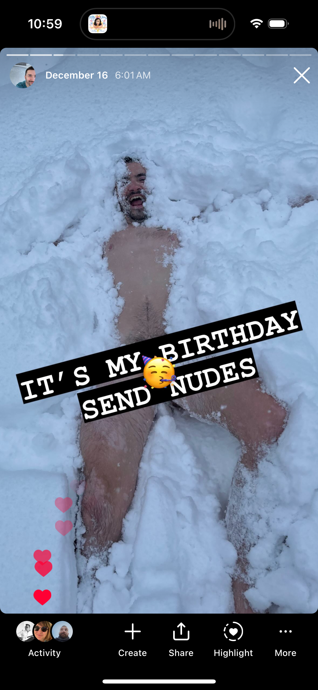
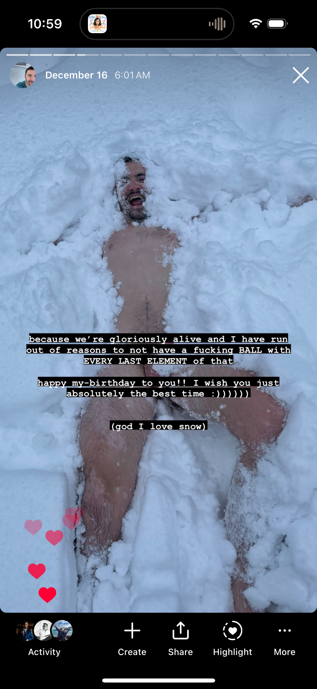
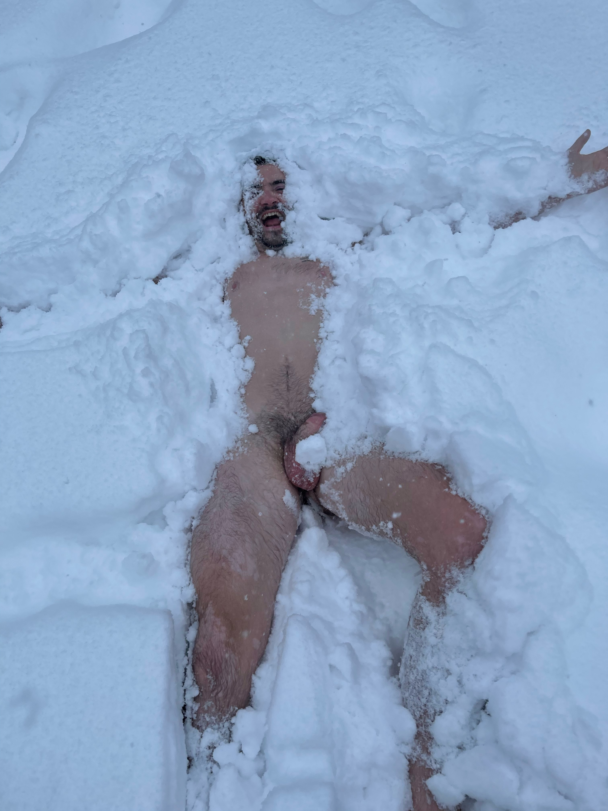

# 20231217

<figure><figcaption></figcaption></figure> <figure><figcaption></figcaption></figure> <figure><figcaption></figcaption></figure> <figure><figcaption></figcaption></figure>

Y'all I am fucking jubilant.

***

_Scene: WhatsApp, DEC 17 9:51AM_

ISAAC: god I love you each and both so much

ISAAC: yesterday was fucking phenomenal and i just found myself in a dance party of one in this hotel room because I'M STILL HAVING A GREAT TIME THIS IS GREAT

JACLYN: So so happy for youuuu!! Hotel in Chicago? Or where are you? haha :D what did your day consist of yesterday/today??

***

I think the coolest part is that yesterday was in many respects a Standard-Issue Day for Abe and me, just .. without any of my previously-typical emotional hiccups. My brain (and maybe you can relate) will occasionally but consistently come back from its field survey with _troublesome possibilities_, giving me the opportunity to spend an arbitrary amount of time addressing them. Note that I _am_ describing "possibilities" here, not "present realities".

On my 35th birthday, which was yesterday, I did a pretty much flawless job of (1) coming to consciousness in each of those moments and (2) choosing actions that allowed me to remain in joy. And, at every turn, I TOLD whoever was involved what I was doing! Because (thank fucking god) my brain tends to not invent these _troublesome possibilities_ ex nihilo, rather they basically always arrive in the hands of an unwitting human courier, and _that_ has historically made the scene infinitely more complicated for me than if I were alone. BUT NOT YESTERDAY.

***

_Scene: Instagram DMs, DEC 16 6:51AM_

NATE: HAPPY HAPPY BIRTHDAY ISAAC! May I give you a FaceTime today to say it live?

ISAAC: ooo is it alright if you send me a video message instead? it's easier for me to stay in joy with that route; my brain is subject to irrational anxiety around planned calls and the execution of them

ISAAC: and regardless THANK YOU!! :D :D

NATE: Absolutely & thank you for telling me! I appreciate knowing how to give you ALL the good wishes without taking from the joy of the day.

ISAAC: :))))))) thank you!!! it feels SO good to pre-pave stuff like this WITH the friend on the other end and have it go well. I'm still kinda new at manually tuning social stuff so as to IMPROVE it for me and it feels AMAZING. thanks for working with me on it in this moment here!

***

I, uhh, I'm gonna keep rolling with this. I have a mounting pile of evidence that says people generally wanna create good in their interactions, and that the simple act of me revealing the complexities of my experience is enough to inspire mutually-kind collaboration in creating a third, happier path.

To spell that last one out:

* Path #1 could be imagined as me biting the bullet for the sake of my friend, doing my best to accept the FaceTime call or whatever, pushing down my anxiety because I \*know\* they mean so very well.
* Path #2 could be me just saying "no" and doing any number of apologetic gymnastics to try and avoid hurting their feelings because it's not like I want them to feel \*rejection\*, you know??
* Path #3, on the other hand, is an improvisational performance requiring two willing actors. The troublesome invitation in my hand, I say, "hey accepting this would actually throw me RIGHT off the joy train and lol I'm pretty sure that's not what you intended, so can we do it this other way instead? so that I can receive the emotional payload that you \*actually\* intended for me, without any me-specific complications?". They say, "sure!". AND THEN WE SPEND THE REST OF OUR LIVES TOGETHER KNOWING EACH OTHER BETTER AND HAVING LESS EMOTIONAL FRICTION IN THE SYSTEM AS A RESULT. HOLY SHIT.

So. Today is a brilliant day. I am building it moment-by-moment on the foundation of yesterday, which -- oh yeah, got distracted for a moment there -- went like this.

***

* Sunrise: Tea. A pot of dragonwell green tea. Just me and the sunrise and the olive tree over my shoulder, and a book called The Dawn Of Everything which I am \*really\* enjoying.
* 6am on the dot (timing unplanned but still neat): I posted my CALL FOR BIRTHDAY NUDES (see above).
* An hour after sunrise: Gym! During which I spent like 16 minutes _straight_ in what is known as HEART RATE ZONE 5, an experience from which Isaac Circa Two Years Ago would have promptly fashioned a panic attack. I am very proud.
* Sometime After Gym But Before 10am: Opened a gift from a dear friend. I'm still carrying around one item from that gift: a cinnabar egg.
* 11am: Stepped into a car that Abe arranged, which took us to O'Hare, where we stepped into an airplane, which took us to Minneapolis.
* 2pm: Stepped out of the airplane at MSP, chatted for 10min with some friends who happened to be taking a flight out of MSP, got myself a cookie, stepped into a car that Abe arranged, which took us to the Four Seasons.
* The middlin' hours here were a pleasant blur of nothing in particular. That's how it felt, but the particulars were:
  * Gym time for Abe
  * Steam room alternated with cooling down and reading for me
  * Unstructured time in each other's company in the hotel room, just being close :)
* 7:15pm: Walked around the corner of the hotel bar and got to watch two dear friends be very very very very surprised at our presence there, lol

Those are the broad strokes. The day wasn't structured around my birthday in any way. It was just a day. My birthday came up a couple times, but it was mostly present in a background kind of way: a backdrop of loving celebration, as the day played out to its own ends.

It was perfect. :)

***

I am learning that I am my own audience. The performance is complete, if no one feels it but me. I am not bound to capture it and repackage it to be relayed to a secondary audience. My experience is complete. And I am an _excellent_ audience.

***

_Feels like_\
&#xNAN;_&#x49;'m standing in a timeless dream_\
&#xNAN;_&#x4F;f light mists_\
&#xNAN;_&#x4F;f pale amber rose_

_Feels like_\
&#xNAN;_&#x49;'m lost in a deep cloud_\
&#xNAN;_&#x4F;f heavenly scent_\
&#xNAN;_&#x54;ouching, discovering you_

_I love you_\
&#xNAN;_&#x41;lways, forever_\
&#xNAN;_&#x4E;ear or far_\
&#xNAN;_&#x43;loser together_\
&#xNAN;_&#x45;verywhere_\
&#xNAN;_&#x49; will be with you_\
&#xNAN;_&#x49; love you_\
&#xNAN;_&#x41;lways, forever_

***

<figure><figcaption></figcaption></figure>

