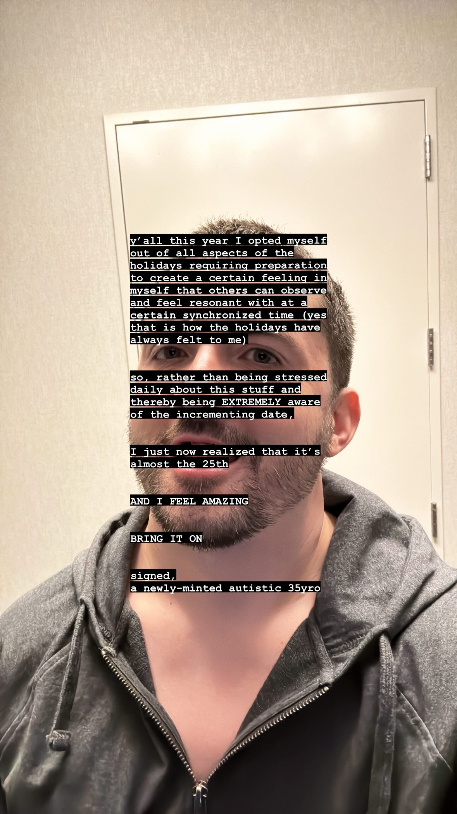

# 20231219

<figure><figcaption></figcaption></figure>

I didn't know how to _scan_ before.

I was born with a gift of presence -- and it is a gift that I gave with every footstep. I felt like my every act of present perception was a small atonement, for the debt of care I felt all around me, in a society where presence was scarce. My awareness was love, was sacred, beautiful, and hopeless.

Learning that this is (at least in part) a function of an autistic brain schema was pivotal. I'm an engineer and an aesthete, and suddenly my aim in this world gained another axis of control. I couldn't see it, before. I had to have it pointed out to me. That was _all_ I needed.

Summing up my "applied presence" across a day, and graphing it out, the line remains pretty steady. The difference is in the amount of ground I'm covering. I couldn't scan my field of vision before without getting stuck on each detail, because I felt a debt to each detail. I've been released from that mode. I get to _choose_ where I dwell and focus, because I've learned that "skimming" across parts of this world is not a crime.

It's actually a little heady, lol. I've never, ever been much of a scroller before -- it was overwhelming. Too much to care about. Now that I know I can modulate my attention, I _do_. I can _scan_, freely! As I experiment with this, I've started to catch my system going "hey hey slow down, haha, this is fun but you still have an autistic brain and overstimulation is a thing, take it easy, feather that throttle", which is _hilarious_. It's a warning light on my internal dashboard that has never had a reason to light up before.

My own operating procedures are materially different than before.

y'all

this is a hell of a lot of fun
