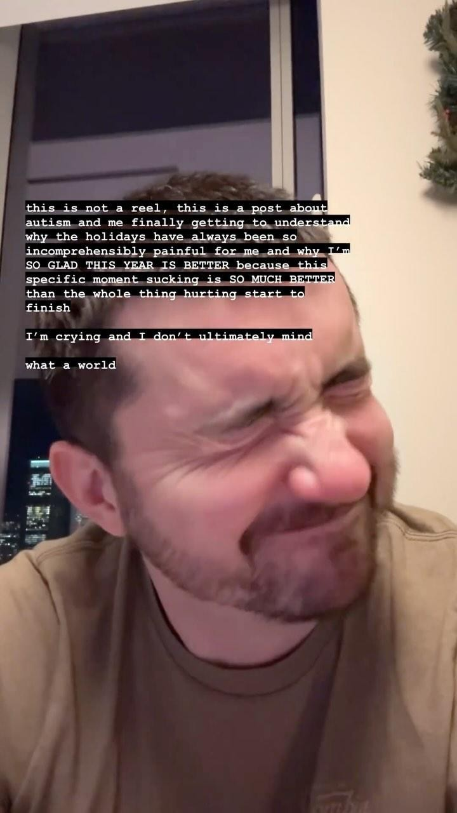

# 20231220


This was an incredibly extemporaneous insta reel+post. The video's at [https://www.instagram.com/p/C1F-mosLoTK/](https://www.instagram.com/p/C1F-mosLoTK/).


<figure><figcaption></figcaption></figure>

geez y’all

I’m having my first real snap of holiday dysregulation and the _feeling_ is summoning memories of when I felt this in the past

the sensation of just feeling so. fucking. bad. and (1) having no idea why, because no one else around me was, and (2) feeling shitty for having that occur during a time of EMPHATIC HOLIDAY CHEER, and (3) trying so hard to rally - even just on the surface - so as to not fuck up the occasion for everyone around me.

wowowowowowowow

I spent so many years just suffering through the holidays - vivid memories of just feeling terrible during a holiday sleepover in the parlor underneath a lovingly-adorned christmas tree. so much love expressed in every inch of the environment. and the love was _mutual_, which made the disconnect so disorienting.

but the holidays came with losing my normal patterns of stability (because people visiting and us traveling and festivities and whatnot), and my home environment no longer looking like my home environment (because everything’s decorated), and a metric fuck-ton of social dynamics to navigate (“oh it’s the ornament that my great grandmother gave me! TIME TO MAKE SURE I’M HAVING THE RIGHT FEELINGS FOR THIS MOMENT”). not to mention the whole _presents_ thing. sitting in a circle while everyone focuses on you while you open up a gift and everyone’s watching you because they wanna enjoy your delight? ...............

I’m thankful that this is the first real bout of dysregulation. I know exactly what it is, I know that I’m gonna be okay, and I feel so connected to all those other versions of me who went through this with less information. so hard. so so so hard. so apparently _pointlessly_ hard but I gotta say, I’m ultimately glad I am who I am, autistic brain and all. this year is better. I’m so glad. and I’m so, so, so glad I get to write a new version of all of this with all the people around me. <3 I love y’all. dear everyone who ever loved me during times when it was impossible for me to share in the vibe: thank you. I love you too.
