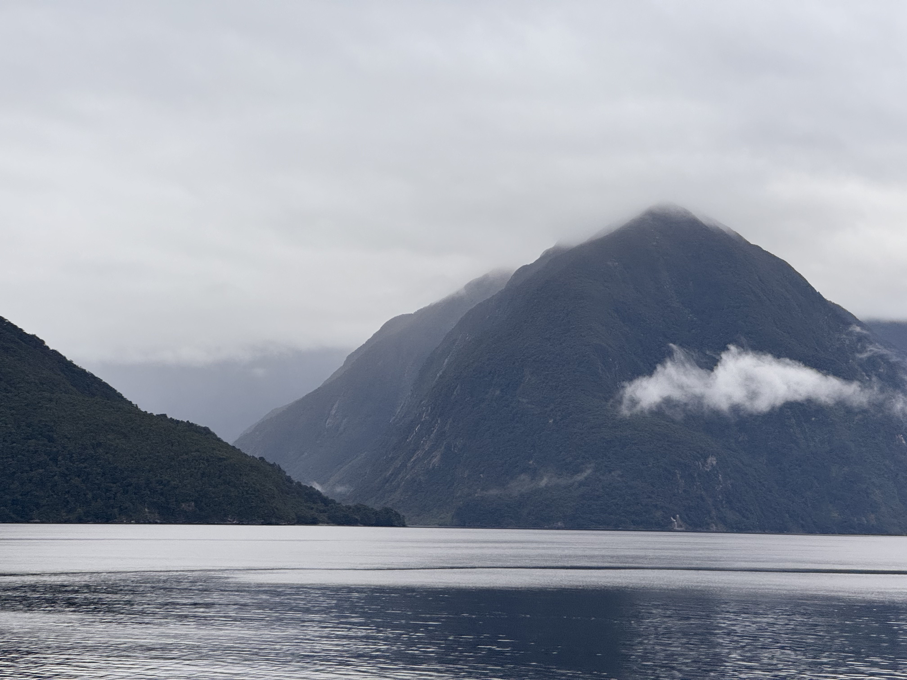

---
layout:
  title:
    visible: true
  description:
    visible: false
  tableOfContents:
    visible: true
  outline:
    visible: true
  pagination:
    visible: true
---

# 20240226

<figure><figcaption></figcaption></figure>

Ten identical windows, in cheerful wooden frames (in the golden ratio by the way!!), running down the wall toward the prow, and the prow toward the open ocean as we peer out from Doubtful Sound.

There's a little upright piano near the inner stairwell, by the saloon floor exit. The notes _feel_ upright, you know? Jumping up to make themselves known from among their siblings without a _whole_ lot of breathing room, not much to recommend one over the other -- but they remain eager! I mean that! It's sort of the 8bit chiptune of pianos: the mind knows the full expression, the platonic ideal, so to share it we conjure up the sublime using this modulated half-voice, and it is _perfect_ in its earnest sound, a delirious pantomime of heaven. We're all hearing the same thing, in the mind.

My heart is full. :) I'm feeling it more easily. I slip out of time, and I am here in the moment, starry-eyed.

I created [Implied Reality](../implied-reality.md) impulsively, compulsively, on a full moon. It _looks_ like a full moon, when the simulation waxes, which is _so_ on the nose it's funny. :D

Back to the Sound, out the window, tucked into the fiordlands. God it's so beautiful... I'm noticing the simplicity that my brain prefers -- regular intervals of glass, ten portraits of the water and mountain outside, small tastes of something massive, giving me some space away from the enormity, a more measured experience. These mountains in particular are sort of the same themselves, in a different way: they are incredible in every way, but they are _fathomable_, not overwhelming. Their curves are so simple and broad, their textures so uniform that it's very clear what's going on here, even though the scale is impossibly massive. There's more than a lifetime of wonder here, but you can get your bearings immediately. It's like an unexpected moment with a stranger, the kind without pretense or offense, just a simple encounter where one sees another. You can't say _much_ about them afterwards, but you can say something. You had a sane interface with not-you, not something truly incomprehensible. You understand. You're light on details, but you understand.

It's _kind of_ all I can handle, with this hardware (he said, thoughtfully). More than that gets overwhelming. "Overwhelming" -- that's a deliberate and still strange-feeling word choice, because I think my mental image of an overwhelmed person is someone flailing and panicking? For me it looks more like depression, but it doesn't act like depression. It shows up when there's too much to take in, and I recover when I can once again see the world through ten evenly-spaced windows.

A benefit, I think, is that everything is a stranger I just met -- with the emphasis on how much the other person _is alive and potentiate_ (is that a word?) despite my limited exposure to them. It sounds redundant when I say it like that, but in my mind I'm drawing a parallel between people and _reality_, and I don't know that reality is often thought of as a _person_. Reality isn't static, and also I'm pretty sure it's conscious. It makes sense that I wouldn't make too many assumptions about a person I just met, and in a real very way I've just met reality. I don't make too many assumptions about them, either, and I assume they're changing _all the time_ the way every living thing does. Which means my dealings with reality are less documentation and more conversation. I don't keep close track of what details I know, and I don't assume the details I get from someone else are still accurate (if indeed they ever were accurate, never mind accurate without paradoxical contradiction, the way human details often are).

Reality is a person, and I trust them. :) My autism plays in here; I forget details, I have no idea what's planned for when, but we get on just fine anyway. They know me well enough, I know them well enough. Predictably (given my other social relationships), they can track my details better than I can track theirs, but we understand each other, so it doesn't matter. I'm light on details, but I understand.

Uncertainty without safety is terror; uncertainty with safety is just a thrill. I have always been uncertain, but not always safe. I feel safer now than I ever have. :) Not because I have more details! I _don't_, honestly. Maybe it's because I'm not trying to hold on to the details I have anymore? I'm in a spot where life is sort of spilling through my fingers, _because that's what happens when you stick your hand in a waterfall_.
