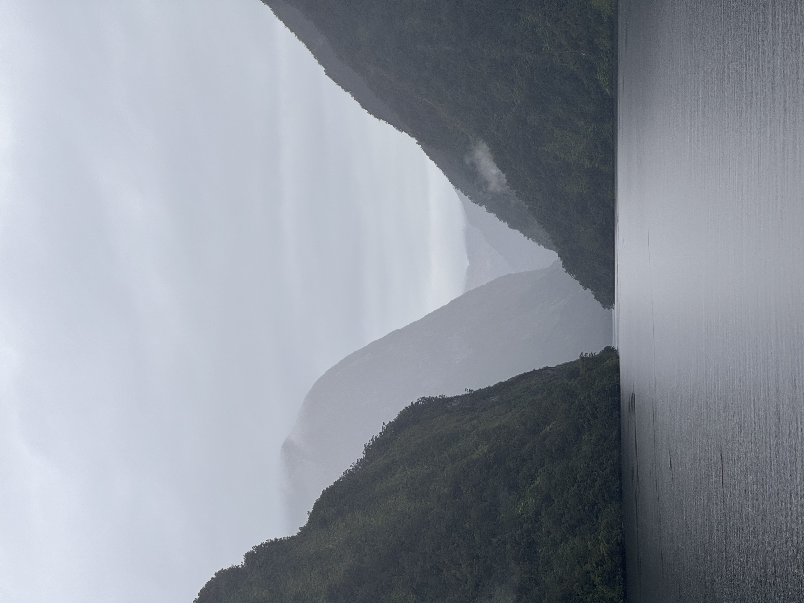

# 20240227

<figure><figcaption></figcaption></figure>

"You can't miss it", but the other way: you couldn't miss it if you tried. What you see before you has been set before you, a table laid for you, and you are _here_.

New idea to try on (I do this every so often, [putting all measures of correctness aside](../../ideas/viable-is-more-useful-than-correct.md), [trying on an idea experimentally](../../ideas/ideas-are-best-tested-by-living-in-them.md), just to see how it fits and feels): I made all of this, and now I'm taking a tour. This is a good time for it. The planet is navigable in a way that suits me. I am resourced and supported. My body is mobile, strong, and heals quickly. My brain is capable, but disabled just enough to keep me from falling sway to social currents. I am in wonder all the time.

"You literally can't miss it" (I explored the thought on the staircase down to our room), "it's rendering in-frame, for you." I was coming from the upper deck, watching Doubtful Sound. The clouds were low, soft tendrils finding their way around the mountains. "You can't miss it." A minor treefall in front of us yesterday, our guide and skiff driver showing us the coastline, having just explained that major treefalls -- tree _avalanches_, even -- are what cleared the stripes of moss-but-not-trees running down the otherwise fully tree'd mountains. Context first, then a live sample.

Dolphins, next. Context first, in the form of a nature review last night in the forward saloon. A live sample: the captain announced it, a few dolphins off by the shore. "What kind of person would find dolphins right in front of them?", I wondered, experimenting with mental postures other than the relative anxiety of "come on dolphins come on dolphins get over here", lol. "Folks we're very lucky today!" Our docent is a lucky guy. :) In the presentation last night, it was almost a refrain -- "I was fortunate to see something like... \[dramatic click to the next slide] _this_." This morning, they narrated as the "subpod" of dolphins considered, then approached, then joined us forward, surfing on the force of our passing.

I'd make a world like this. Or, better, I'd seed a world like this, and watch it unfold. I'd experience it like this, too -- with a brain hard-wired to stay in the now, because that's all it can do. I am in wonder all the time.

To make contact with another, to find them feeling safe and un-self-conscious in your presence, for them to feel your honest appreciation of them, and to see them relax into their natural glory: heaven. :)

\--

Do I play piano professionally? ... That thing you just saw me do with a piano, I do _that_ professionally. I don't usually use a piano, professionally, but the thing I use a piano _for_ is still what I do professionally. Different toolkit, usually, but it's the same thing, yeah.

I'm glad you asked. :) It's really important to me.

I have a strong sense of what can be described as "the emerging real", perhaps as distinct from "a pantomime of real". What I'm talking about is that sense of sudden clarity you get when someone says "what are you _doing?_", demanding fresh assessment.

This world we live in can only be real. It's how it's built. Humans can also only be real, buuuttttttttttttt we have the opportunity to take sort of a roundabout way to get there. We get to explore non-real expressions of our own, feel how they feel, try on faces and names and belief systems as we get a feel for what it means to consciously ride the wave of emergence freely and in flow _while retaining the full faculties of consciousness_. It's a tricky thing we're exploring here. It feels amazing to be making progress.

I didn't just sit down and start playing earlier this morning, on that upright piano from yesterday. I followed the act before me. She was a novice, piano-wise, but she knew the sound of those three chords she was using, and she was working to find their flow. I found it, and when she was done, I explored it. It was already real; what you heard from me was me reflecting that reality to you. It was emerging through me.
