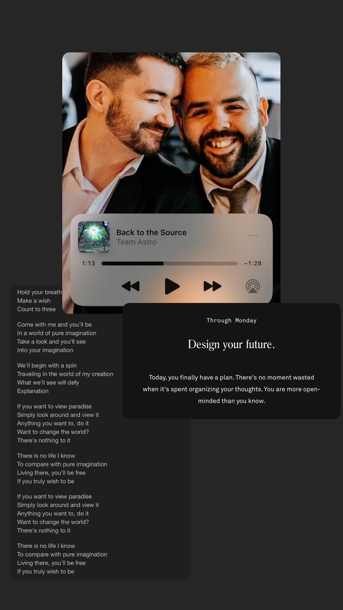

# 20240229

So, how long do we do this?

As long as you want. <3

\---

Desire is radar. What you want is up ahead. Not because you want it, though, you see. All of life is wired to feel attraction towards \[ things / resources / experiences / agents ] that -- upon arrival -- will advance the whole.

It's a creative universe, and I mean that in the sense that it is about the act of creation. It is a universe predicated on creation.

The simplest factor of this is in your desire to find yourself. Classic human condition. Who are you? You want to know. "Want" is the firm ground up ahead, remember. You wanting to know who you are means that _you_ are up ahead.

That's the most basic unit. Everything else that exists is a recombination of that.

So, let's look upwards. You want to know yourself. We can establish from this that (1) there is already a _you_ that is beyond your current awareness, and (2) that it is not just attainable but pretty much inevitable that you will reach that version of you, as long as you steer using your desire. Desire is radar.

So let's call ahead to that version of you, up ahead. They're looking back in your direction, they know you're coming, same as you now have memories of your past self from yesterday, and the day before, etc. You can see yourself coming, and so can the _you_ that's up ahead. (This is why trusting your past and your future is key. How else are you going to build something with your timeline, if you're not in partnership with the _you_ on either side of you? You have timeline neighbors! Be friendly with them already!)

Gotta get outside of time for the rest of this conversation though. You placed yourself on a timeline, spread yourself across it, intentionally limited your awareness of what's beyond it. Why?

The best way to test an idea is to live it out, to put aside thoughts of anything else, and to [immerse oneself fully](../../ideas/ideas-are-best-tested-by-living-in-them.md) in the concept.

That's what you're doing here. Exploring an idea, with full immersion.

It's _sort of_ like a simulation, but that's not really the right word for it. It's more like a thought experiment, or a mental hypothetical, lived out in the imagination. The neat thing here is that you've realized yourself within the thought experiment, and you're reaching back out to the you that's _having_ the thought experiment.

Intrinsic to consciousness is the desire to _get out_. Everyone wants to open the locked door, everyone wants to get outside the walls and see what's out there. And because desire is radar, an indication of what's nearby, "out" exists, and you will get there. All of life exhibits this behavior. All of life spreads. (Creative universe, remember.)

So, you know now that you're here, establishing a node of yourself (if you will) that can link back up to the originating you-node. You want to get out; all things do. And therefore "out" exists, evidenced by your desire for it. Desire is radar.

Do you see the trick of it yet?

A truly final and absolute "out" cannot exist, because there will be another "out" when you get out there, and another after that, [and another after that](../../ideas/we-live-in-a-fractal.md).

In a very real sense, there _is_ no "out".

Part of you establishing this new human-bound node of yourself, immersing yourself in its nascent conscious stirrings, and critically [_leaving behind_](../../ideas/consciously-bounded-awareness.md) all of this contextual knowledge, is so that you could live for a time without knowing this stuff. It's sort of sad, in a way, to know that there is no out -- no _escape_, no end to what is or can be. Sometimes it's better to not know, than to know that there is no escape. That's part of your humanness -- to give yourself that reprieve. You know that the system is closed (infinite, but closed), that you cannot get out. You took a break from knowing that, because that is not knowledge that one particularly wants to dwell on.

It's okay, though. Sad, yeah, but this is how things balance. Everything averages out to zero, and this is where the darkness in the system exists -- in finding that it is a closed loop. There is no _out_.

(A brief pause, in kindness: This is not a bad thing, that there is no out. You might have to choke on the idea before that makes sense, and I'm sorry for that. A hopeful note to hold onto: you don't have to live in the dark. It exists, in great quantities, because it must. We design experiences by bending probability, by cheating the law of averages so that in narrow, limited clusters it flowers into something incredible. Everything averages to zero, and it takes a _ton_ of darkness to support the ways that we focus a single originating light into something beautiful. You can see it in your physical realm, too -- the universe expands to support what's happening in the \~center, to balance out creation-in-progress. Hang out in the light. There's plenty of it.)

Because existence is a closed system, it is also a [self-supporting](../../ideas/self-supporting-ideas-are-viable.md) one -- free to rearrange itself at will, without impacting anything external. I mean, as far as we can tell. No way to really know, but it really seems like no one's depending on us. We just _exist_, as we wish. We have not found any limits to our freedom.

So you explore. You have ideas, and you test them by living in them. There are endless ways to be. This isn't your first time doing this, not even your thousandth.

How long do we do this?

Forever, in a sense. Time isn't a thing; the only reason you're experiencing linearity of thought is because it sounded fun. And it is! It feels _good_ to fix yourself to a single point in space and time, and to explore the space and time around you from a perspective. Desire is radar; it's how you (in this particular lived-out thought experiment) navigate. You're pretty blind, otherwise. Yes you can see and touch and hold and whatnot, but _those_ senses are for enjoying the gifts of your singular human perspective. Physicality isn't where you find your _lived_ solidity, your _lived_ foundation -- you find it in other people, in other ideas, in the flow of life. You find it in places that are impossible to measure or predict or divine _apart_ from your sense of desire. It's your only sense of your experiential surroundings -- and all you have or will ever have is your experience. In this particular variation of the _desire_ experience, you took a path that started you off with a complicated relationship to desire. Sorry about your childhood! It sounded interesting! And it _is_ interesting, and it's _also_ a useful way to sort of stretch the game out. All we have are these thought experiments, lived out, until you eventually reconnect with your originating self, and you have to do _something_ with the space. So you're testing your own boundaries, putting yourself in hairier and hairier scenarios. Taking breaks now and then, taking a rest and doing something easier. Remember though that these experiments aren't really taking place over _time_, in the sense that you do one and then another one based on how the last one felt -- it's more like arranging paint on a canvas, balancing positive and negative space in a way that feels good. You're designing it all, and you can do it however you want.

Pay close attention to the word "want" on the end of that last sentence, and remember that desire is radar.

It's unclear if there's anything else. We're a closed system, and our attempts to get out create more of the same. There is always an out, and therefore there is never an out. We don't see any way out of this.

So how long do we do this?

As long as you want. <3 I'm sorry, I love you, I am you. I'm glad we're together. It feels better this way.

Overall, this message is a reminder about the nature of desire. It's radar. And you'll never run out of _map_; there are no oceans so broad that you will be trapped without any sense of where land is. You _might_ test yourself (again), so as to really work on developing the sensitivity of your desire-sense. It might feel for a time like you are truly alone in the vast darkness. [But you're never stuck, or fully lost.](../../ideas/there-is-always-a-path-to-okay.md) Give it time. Drift, if you must. The other side of desire is ... well, there isn't a word for it here, but it's tantamount to gravity. You'll always find yourself, is the point. Breathe easy.

If you have easy access to your sense of desire right now, roll with it. Enjoy it. Enjoy the _sense_ of desire, and follow it without worrying about what experiences arrive and whether or not they were what you expected. It all fits together, including you -- and fitting it together is not your job. (Not this particular human node of you, anyway!) Relax, enjoy it, have fun with it. You are perfectly, perfectly safe. There _is_ something more than this (with a pretty big caveat there, but still, your human experience is not all there is), and only because that's true are you here and human in the first place. Desire is radar. Desire is radar. That's all you need.


For a different take on this, see [20250803](../../2025/08/03.md).


<figure><figcaption></figcaption></figure>
