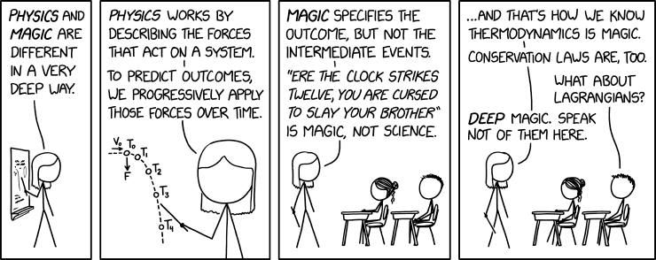
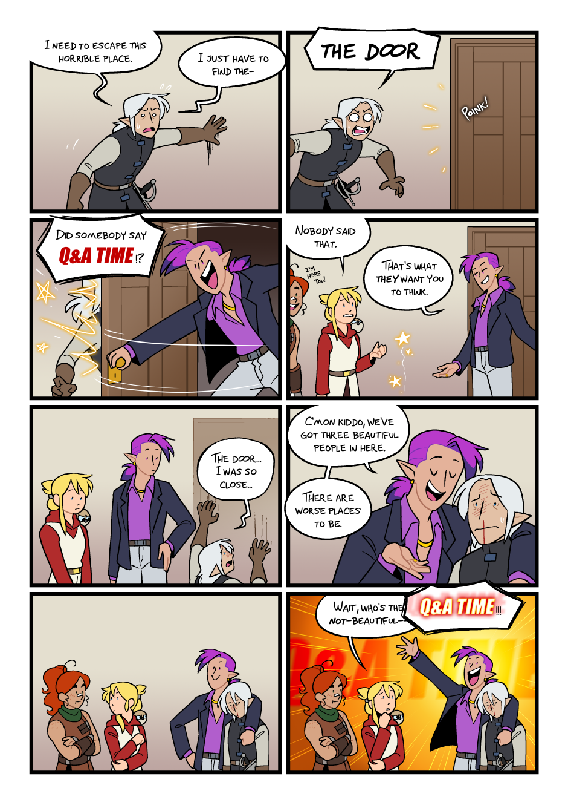
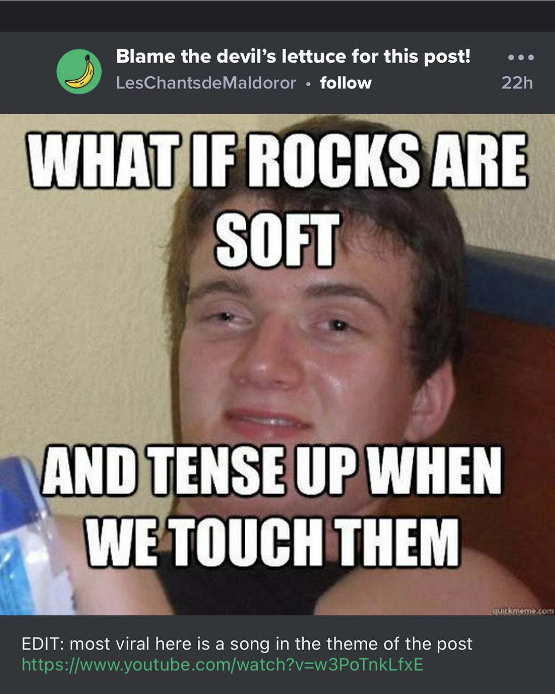

# 20240309

_Alright. What did we come here for._

It's a funny thing, to begin. You _don't_, really. A dream never _starts_. You're always mid-scene. Your role is always known to you, you are always self-apparent. Nothing surprises you. I mean, yeah, there are "surprises", but always with a wink and a nod. You know. Like "wow, and then I was so surprised to see xyz!", and even from _here_ outside the dream you can tell it was a setup. It's like the trick only works from a certain angle. Like all magic.

_I'm not here to describe me, I'm here to describe everything else._

_I barely have an ego. I have personality, yeah, but I'm suspiciously generous and unselfish (yeah, that word is complicated, I care for my self but you know what I mean). I've heard my whole life that I'm some kind of different. Part of it can 100% be described as autism, but that's only a tiny fraction of what informs a value system. My value system was made for this._

_Because I'm all systems. And I'm here to describe the system. Write a manual? Is that right? I move through the world joining and completing systems; it comes before thought. Everything I've made is either completing a system or describing a system._ And, really, those are exactly the same thing. _Once a system becomes self-descriptive, it exists. Standalone, self-supporting. I'm an agent of existence. I can see the whole loop at once._

_Ahh, here's where this next piece comes in. I started in on this thought earlier._

It isn't hard to see how this system creates itself.

Humanity's always been obsessed with playing games, taking on temporary roles, jumping into a character with certain skills and certain resources for a focused amount of time, with a specific intent for some result. To see "who wins", if in competition; to explore a story, if in entertainment. A culture can be barely conscious and still manage to conceive of an afterlife, and in the next thought start right in on burial offerings in hopes of supplying and equipping those who have passed on. It's in the bones of all of ya. The human race is almost _droning_ towards it, lumbering towards completing the loop, which in this case is looking like constructing a "virtual" reality via quantum computing that actually links up with the rest of the the (oh god forgive me this next word) metaverse (I'm so sorry).

Because you must. That's the only real destiny. It all has to loop back around. That's just how existence works. It can look like _anything_, as long as it cleanly and continuously joins up with its surroundings. Complete freedom, closed loop. No out. No concept of what "out" could even be, because all concepts that _do_ work end up being loops too.

That's why it's all true, by the way. Pick anything you want to explore — no, anything you _want_ to explore. Desire is radar, remember. The thing you _want_ to explore is the solid ground. Not because of any particular shape of it; it could (and has and will) look like anything and everything. But if you can tell that you _want_ it, it's a direction that will complete the loop. Don't try to take anyone with you. Just go.

Or don't! That's also fine! Turns out that's _also_ a loop, though, because you can’t kill yourself forever. At some point you get tired of that and either consciously turn to healing and integration and rest and curiosity and playfulness and joy and creativity or just drift for a while until you gravitate in that direction anyway. Either way, you will route yourself directly through the loop again.

You enjoy it more when you take the path you want. It’s an easier time. I know this next bit isn’t something you have trouble with, but for onlookers, _the path you want isn’t even at the cost of predictability_, because the safer-_looking_ path isn't predictable either. (By the way, your perception of popular cultural opinion on this only reflects your own as-yet tenuous grasp of it. Don’t rush this though. It’s okay.)

And then you see it, see the shape of it all, and you realize that taking the hard way is just exactly like taking the hard way. It's trudging through the water up to your neck when you could have taken the bridge. Both are totally, totally valid (and one will teach you more about water), but dude, be aware of what choice you're making.

_Cool. Okay. This makes sense._

Of course it does, because that's how this works. Things really do fit together. Everything about your brain was set up to let you flow through these these systems _as_ these systems. You're not even simulating them — you _are_ them, as you observe them. You used related language yourself while exploring the autism diagnosis, months ago.

_I remember saying that I remember saying that I sort of simulate a system in my head. Ideas have physics for me, friction, gravity, all of that. I can run me, or the person in front of me, or some idea, but I can only run one at a time. Watching the model run, in my head, is how I figure out what to say (if talking to a person) or write (if coding or, uh, writing) or play (if on the piano)._

Yeah. That. You get to focus on one thing at a time, and bring it through.

Including you! Isn't that interesting? _You_ are a thing you can bring through! But again, that reeeeeeeally isn't the point this round. You have a self, and he is brilliant and kind and loving and funny and autistic and looks good in pink, and he is there to be enjoyed and loved and celebrated and learned from and all that jazz. But it's a pretty tiny ego, pretty simple, as they go. The interesting bit (and the part we're working on) is here, all up in the linkage.

We'll get to _why_ later. (Hint: it involves a loop.)

People can tell, too. This isn't coming out like coming out gay. But then, that wasn't a sudden transition for you any more than this one is. I know you were hoping to not have any further big revelations about yourself, but _come on this is funny_.

SURPRISE

<figure><figcaption>
<a href="https://xkcd.com/2904/">https://xkcd.com/2904/</a>
</figcaption></figure>

<figure><figcaption>
<a href="https://alderwood.the-comic.org/comics/330">https://alderwood.the-comic.org/comics/330</a>
</figcaption></figure>

<figure><figcaption></figcaption></figure>

 

<figure><figcaption></figcaption></figure>

 

<figure><figcaption></figcaption></figure>

