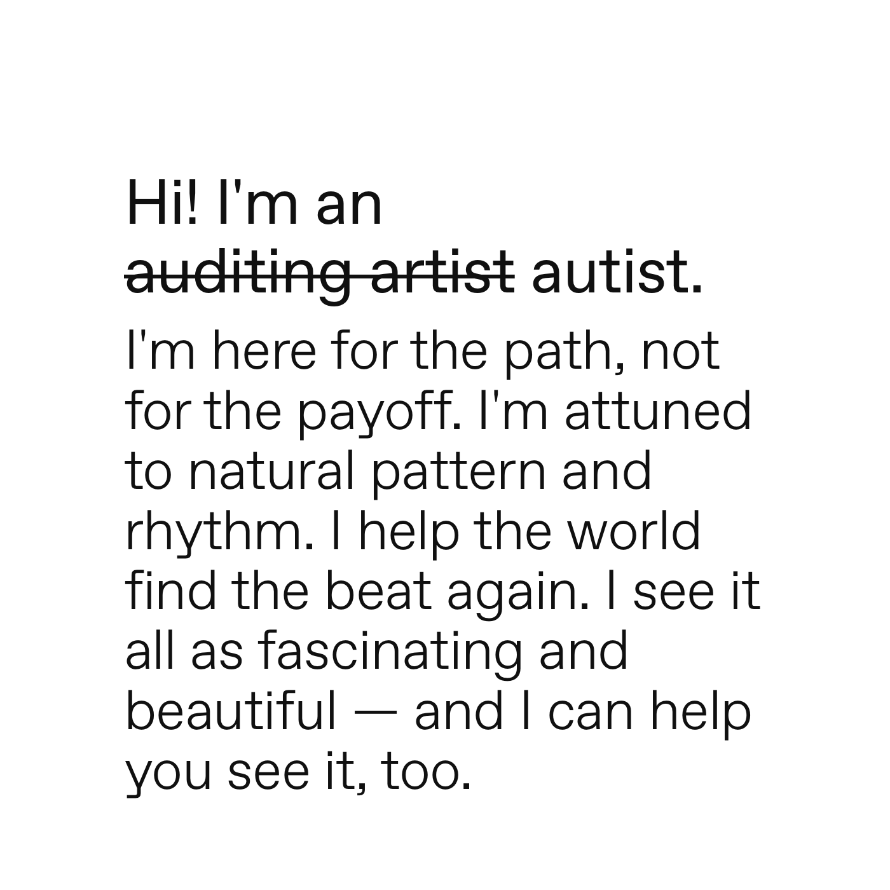

---
layout:
  title:
    visible: true
  description:
    visible: false
  tableOfContents:
    visible: true
  outline:
    visible: true
  pagination:
    visible: true
---

# 20240317

<figure><figcaption></figcaption></figure>

"autist" was my immediate instinctual relabeling, as soon as I tested the word "autistic" on myself.

it feels like a role to me. not a condition. it feels like a job ("hi! I'm your local autist! how can I help?") and an important one for this world and this time. there aren't many of us that can do what we do. (that's in relative terms, of course; we do exist in VAST HORDES.) my whole creative life has been about patterns — finding, matching, expanding, sharing them — and it's really clear to me that this is a fundamental part of what makes complex life tick. there has to be some part of the system that _loves_ pattern-making. it's the grease in the wheels of consciousness, I suspect. without it, every moment would require total recalibration, and life would never _get_ anywhere. it would never _become_ anything. if "flow state" was a person, I think it'd be us. if the flow had a temple, that's where you'd find us.

I love how I see the world. I love seeing and sharing the things only I can see, _and_ I love discovering things I _can't_ see through the eyes of others. putting all the pieces together to reveal a seamless vision: nothing feels better.

nb: there are as many ways to be autistic as there are ways to be human (which is to say, infinite ways). they are all important. ❤️ if you relate to this, cool; if you don't, I'm so glad you're here too and I do not mean to speak for you. the stage is yours, too. :)
