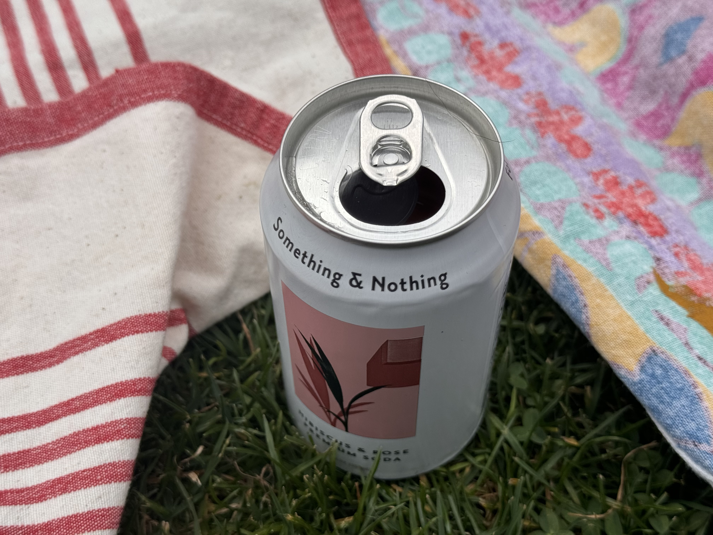

---
layout:
  title:
    visible: true
  description:
    visible: false
  tableOfContents:
    visible: true
  outline:
    visible: true
  pagination:
    visible: true
---

# 3:21pm

It's exactly what I wrote about just before this. We're talking about New Zealand, our pals are asking us how we experienced the place. It was a month ago, the experience still feels fresh.

New Zealand feels like it has a spiritual significance to me. Like, the landmass of New Zealand. And I'm sure it _does_, Maori history has surely exhaustively explored and developed that, I'm just not educated. I can feel it, though.

I'm talking about this with our friends, and I'm trying to put a pin on what that significance feels like.

It feels like exactly what I was writing about just before. Whatever this moment is that I'm in, that Abe is _with me_ in, New Zealand feels like it represents that moment _for the earth_. Like the world-builders went, okay cool, we finished earth and we have a little space left, let's build in a final, culminating tribute to the rest of the work. It'll be small, navigable, knowable, but it'll have _everything_. Every ecosystem, every climate. It'll be the best of every part: the platonic ideal of each one. And it'll be _safe_. (If Abe were here, he would point out one of his favorite facts about NZ: there are no serious predators! Animal-wise, it's _so safe_!)

Okay crew, as I was in the middle of that paragraph, I uhhhh yeah I guess this is a download? I get these rushes of concept, like a quick visual tour illustrating a concept and its relationship to other things. I used to think it was just my imagination. And maybe it's the same thing? But _the thing_ is persistent. Every concept-rush I get is describing the same thing. And it's always highly relevant to a question I'm exploring in the moment.

The concept is that New Zealand is where it _started_. Like, when spec'ing out earth's expression over time. Maybe they built a quick demo continent, and took a tour, and said, okay yeah, this is it. Let's build it.

I think our timeline doesn't necessarily run _parallel_ to other timelines. I think other timelines may see our timeline from _any_ perspective. Like, there's a timeline where you can see the story of earth in reverse: where it makes _sense_ to build a demo continent first, and maybe a demo culture for whatever species gets to do that, and they just _build the whole timeline at once_, in whatever order makes sense.

Huh. Interesting.

(Hey Tricia's here!)

As I'm exploring my transconscious wiring here, this moment feels like a hint that I've got some ability to see into the future. ... And as I've typed that out, my brain is going _well obviously_. I'm building things ahead of the curve _all the time_. The curve always follows me. I'm always building things that directly address the thing that hasn't happened yet.

Also, walking down the park here with a friend, joking about needing coins for a parking meter, and it reminded them of how the most outdated thing they've done recently was to go searching for a _quarter_ for the _tampon machine_ in the bathroom. It took them 45 minutes!

Two hours ago, I used the bathroom at Hanahouse, saw a tampon/pad dispenser, it took _quarters_, and I spent several minutes mourning the crime of charging someone _physical quarters_ for something that is _expressly_ there for a time-sensitive emergency.

SO. OKAY. This _really_ cleanly describes my experience, it maps really really well to what I've done my whole life. Very unexpected to find this perspective on it. I've always seen ideas in my mind, images of a concept-world that I could explore and examine and understand. I did not expect it to be real.

<figure><figcaption></figcaption></figure>
