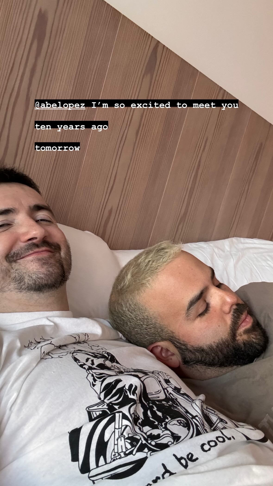

# 6pm yesterday

The thought moved through my mind:

_I'm so excited to meet you ten-years-ago-and-tomorrow_

I feel actual, real, thrilling anticipation — like I'm looking in on me ten years ago, knowing from here that _tomorrow_ Isaac-of-that-moment was going to meet Abe.

I'm excited now, writing this at 6am, re-living my recollection of yesterday's moment. :)

<figure><figcaption></figcaption></figure>

