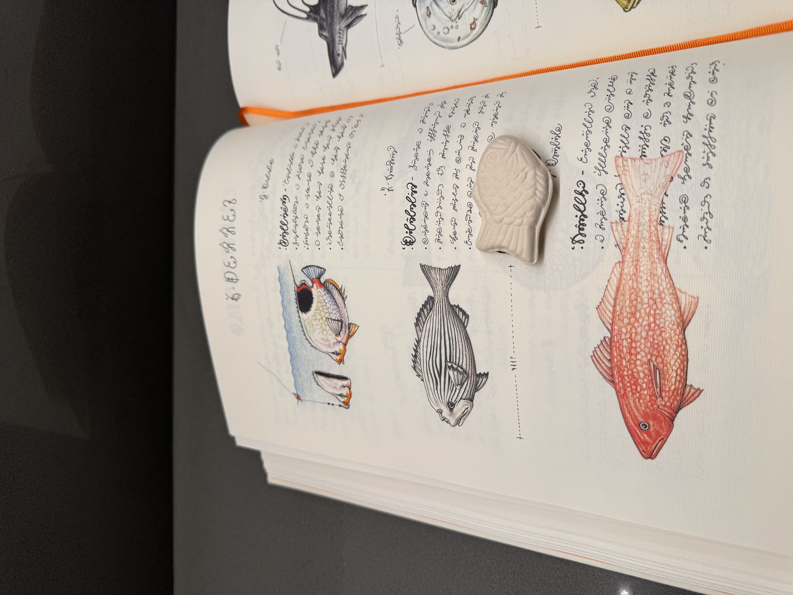

---
layout:
  title:
    visible: true
  description:
    visible: false
  tableOfContents:
    visible: true
  outline:
    visible: true
  pagination:
    visible: true
---

# 20240409

Now is the time for rest. A peaceful Saturn winter.

Profound realization is never followed by frantic, frenetic energy. It's not the time for that.

Shit is going to get weird, but _quietly_, and _restfully_. The now requires nothing of you. Breathe — because you _can_ now, in a way you could not before. Let it all happen. Let the relief unfold.

The metaphors you've been living out have taken everything from you. All the anxiety and spastic movement is _back there_, with those times.

Now is the time for rest. A peaceful Saturn winter.

:)

[(There is more.)](more.md)

<figure><figcaption></figcaption></figure>
