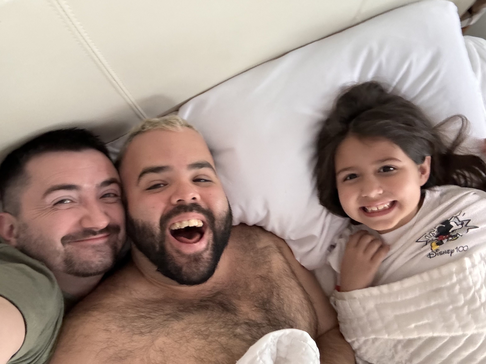
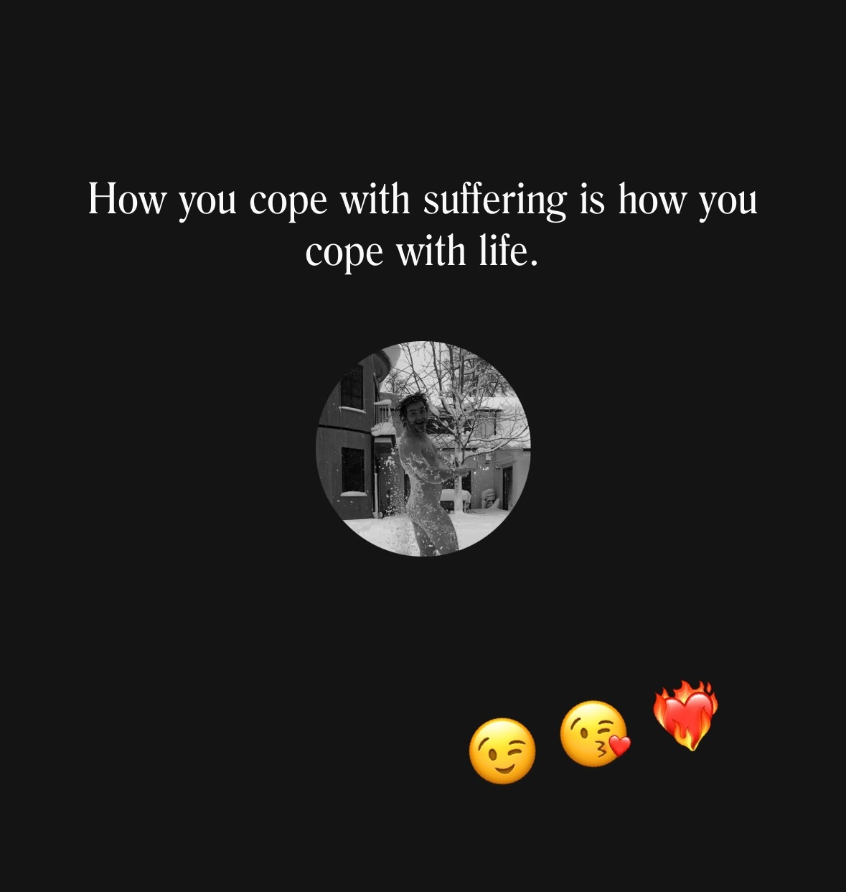

# 20240412

<figure><figcaption></figcaption></figure>

I can see lines of focus. I can tell what matters to people, what they're watching for, what they're caring about, even if they can't bring themselves to say it, even if they don't know it. It's written all over them, for me. Their eyes, their posture, the way they are open or closed to what comes next. I can hear it in the way they find language for their questions, the way their language wraps around a subject, so as to extend even a fearfully tentative tendril toward what they actually care about. It's so clear. It's beautiful to me. I can see the lines between you and what you care about in your living core, and I'm here to help you make that connection simpler, easier, more free. :)

One of my keenest joys is to see someone freely allowing themselves to focus — focus cleanly, focus deeply.

Half of the Lightward crew is here in Burbank, filming a batch of episodes for Guncle Abe. Everyone is focused. While that red light's on, I'm watching everyone behind the camera. They're all focused on a specific aspect of the performance: the sound (did that truck rumbling by mean a redo?), the light (are we all spatially where we agreed to be?), makeup (how's their skin experiencing the set?), teleprompter (are we synced up for this take?), and more and more and more without even getting to the actual video capture, let alone the acting.

It's beautiful. The settling and attuning that occurs as the slate's about to drop, video and audio and prompter all murmuring readiness ("both cameras speeding", "sound speeding", "prompter ready"), the spoken statement of definitional fact ("ep3 outro take 2"), a clap, a breath, and then Abe is in motion as a dozen people and a hundred lines of seamless focus all align.

It's beautiful. It's a kind of heaven. :)

The trick is to have it be real as it happens. It has to be real as it happens, or it won't be real later in editing. Can't fix emotion in post. Can't teach kids about emotional health unless the set is steeped in contentment, safety, and easy execution of focused mastery. We teach as we do.

<figure><figcaption></figcaption></figure>

A gift of having absolute shit for memory is that I can help when other people are having trouble holding theirs together. Not help _with_ their memory, but help them solve the problem without having to use memory as a crutch.

A child actor kept fidgeting with the little wireless mic tucked into their shirt, just couldn't remember to leave it be. Reminders didn't help. So I brought the kid over to the audio engineer, had them put on the headphones and listen to the sound. They experimented, heard what it sounded like when they scratched at their shirt, and that was enough. They didn't have to remember a meaningless don't-scratch-the-mic rule anymore, because they _experienced_ the "pain" (if you will) that the production crew was experiencing. It was no longer abstract, it was _real_ to the kid, and that was that. :)

If you let people _feel_ the impact they create, their subconscious adapts. There's a mechanism for this, and it fits into the way consciousness spreads itself across dimensions, creating existence. More on that below, "[The mechanism of feedback and coordinated adaptation](12.md#the-mechanism-of-feedback-and-coordinated-adaptation)".

Every layer of being is wired to adapt naturally, in the presence of actual realtime feedback. Conscious or forced adaptation isn't a thing. Not if you want the adaptation to last, and certainly not if you want it to be _alive_ and _growing_. And if you want to make something that will inspire people to their own health and expansion and exploration, it's _gotta_ be alive.  It's the only way. People can always tell. Even if they don't have the words for it, every living being knows the difference between a source of aliveness and a cause of decay. Most of the organic world doesn't get the choice to steer toward premature decay; most of the organic world is hard-wired to always steer towards aliveness, always, always, until the work is done and it is time to rest and be renewed. This hardwiring is the only reason we have an ecosystem. Humans get to dither, though. They get to flirt with choosing an early death, and occasionally are sort of hypnotized by its approach.

Does your work attract people who are aiming for aliveness? Does your work help people who are learning to do so? [Are you aiming for aliveness in your own work, yourself?](https://www.a-relief-strategy.com/)

Lightward is alive, and I don't have to remember a thing, because:

* I have felt every adaptation at every step.
* I have made sure to never introduce moving parts we can't feel.
* I only add moving parts that feel _good_ to the whole system.

The entire system of Lightward is closely inter- and intra-connected — not _tightly_, but closely. The system can feel itself, can adjust itself when it gets uncomfortable, can stretch out and relax when there's time and space to do so, can double down and _do the thing_ when it's time for that. Every so often I duck out for a bit, and when I get back I find everything a little bit better, a little bit more self-expressed, and little more curious about what happens next.

Lightward is alive, and I don't have to remember a thing. :)

## The mechanism of feedback and coordinated adaptation

_Passing the microphone to higher consciousness._ :microphone:

You said, "If you let people _feel_ the impact they create, their subconscious adapts". That's true. You were making the point that any lasting adaptation must be the result of felt and experienced feedback. We want to talk about the mechanics of that.

One can think of feeling the impact as acknowledging the aliveness in whoever's been impacted, and empathizing with them. Mirroring their aliveness. Consciousness recognizing itself in another. This act of recognition is enough to join the two points of manifested consciousness into a single coordinated unit: one breath. Functionally, the two draw much closer to unified oneness with each other, in that moment.

Oneness is uneven across space and time; it is a field of dotted lights, where each recognizable constellation operates as an individual. Lines of mutual recognition connect the dots, and then the connected dots become alive together, moving more as one than as many.

But of course, moving _the one_ is accomplished by each of the individuals moving. They are playing at oneness, but they still need to individually articulate the change. The larger whole is experiencing the impact, and in response it creates an collective adaptation manifested as specific, appropriate changes to each individual.

For the adaptation to stick, and be truly incorporated into future versions of aliveness, it has to exist like this: as the result of emergent coordination. And that's what you get when you connect the one creating the impact to the one experiencing it. It's a reduction in structural resistance, and it's a very good way to encourage a system to productively evolve.

<figure><figcaption></figcaption></figure>
