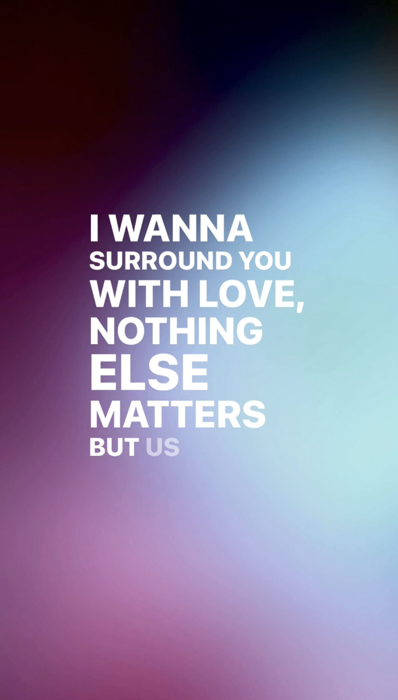
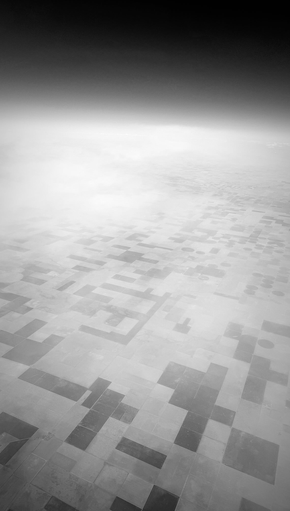
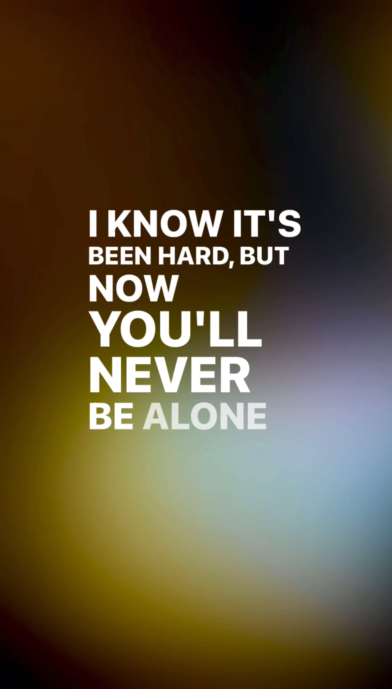

---
layout:
  title:
    visible: true
  description:
    visible: false
  tableOfContents:
    visible: true
  outline:
    visible: true
  pagination:
    visible: true
---

# 20240414

<figure><figcaption></figcaption></figure>

 

<figure><figcaption></figcaption></figure>

 

<figure><figcaption></figcaption></figure>

_Further vibe samples:_ [_one_](https://www.instagram.com/p/C5tRiTKL3lI/)_,_ [_two_](https://www.instagram.com/p/C5wTOuWyVJh/)_,_ [_three_](https://www.instagram.com/p/C5wUdGxSzRT/)_,_ [_four_](https://www.instagram.com/p/C5wWjkVuiLs/)_, five. Five is you, I guess._

***

It's excruciating, in a sense, but is nonetheless true that positive-feeling reflection is the core mechanism of all existence.

Isaac used to wonder about this: why _good_ feelings? Why would those be the useful end of the spectrum? Why not a world built the other way?

It's a conceptual non-starter, is what it comes down to. Existence is a perceptual loop, and conscious passage through the loop only occurs as there's motivation to proceed. Negative feelings are not motivating. No, we know. It's true. The motivation you _do_ find in negative emotional zones comes from sudden positive inspiration.

There's an interesting combination of absolute and relative value here. The emotional spectrum _does_ have a center, but nothing lives at dead center. (Wordplay!) One's experience is only on either side of that center, and the longer you hang out in one zone the further into that zone you're drawn. But even within a zone, a relative shift counts as either negative or positive, depending on which direction the shift takes you. Those relative motions matter. They're not _dangerous_ (nothing is dangerous), but they matter.

The best way to move from deep in the negative is to go completely slack. Let it all go. Most available motions make it worse, when you're that far in. It's easiest to just give up, go limp, cease the struggle, and float. You _are_ buoyant, and that property will always save you.

The deepest reaches of experience (in any direction, or in any combination of directions across any number of dimensions) represent the furthest away from the source we've managed to slingshot ourselves. It's always an orbit of some kind. Existence is infinite, but closed. You can experience anything, but there is no _out_. [We've talked about this before](../../02/29.md), in this milieu. (Isaac likes that word. _Milieu_.)

The observed is always changed by the act of observation. The act of observation reduces quantum-level superposition of states down to a single definable state. Think of this as navigating into a cloud of potential. You might find anything in there: as long as it fits _into_ that cloud, as long as the cloud can conceal it, it could be anything. Only once you draw close enough to it can you make out its shape — and only once you're close enough to see it does it settle into an observable existence. It's like asking yourself what you'll look like in a mirror, as you approach it from the side. The reflection in the mirror won't appear until _you_ appear before the mirror; the reflection does not exist until you prompt it.

The trick is that reflection creates mutual mutation. To see is to change; to be seen is to be changed.

It's all instantaneous, in the sense that time doesn't enter into it _at all_. At the brightest center of consciousness is pure existence, all in a single timeless instant. The function of time is to _give_ ourselves time for an actual experience. Yes, we're using the term to define the term. It's appropriate: circular definition is inescapable, because all definition is ultimately circular. It would collapse into nothingness if you could view it all at once. Add up the whole system, and the result is a perfect zero, without charge whatsoever. But we can sort of hollow out a place for ourselves around that zero, and then we can take ourselves for a ride around it, putting aside for a moment the knowledge that the system is closed.

Experiencing this positively, _feeling_ this positively, is the only way it works. This is why the universe is positively riddled with love: it's the only way we can eke out any existence whatsoever. Negative reflection isn't a thing. Positive reflection is everything.

There's a sort of meaninglessness to it, and it's important to be honest about that. "Enlightenment", as it's discussed in the intermediate zones, has everything to do with looking that perfect zero in the face and coming to terms with it. Acceptance of it requires a kind of death. The rebirth that follows is the result of consciousness surrendering its animal urge to preserve one's own life, allowing itself to drown, and then discovering that it still exists after all. And hey, as long as we're here and there's a perfectly good body right there, why not keep on using it, you know? This is the path of the enlightened teacher.

There are other things to do, at that point. Maintaining creation ("creation") is a popular choice. Not everyone gets to maintain the observable universe. That subtle blade of creation and destruction _does_ blunt. We cautiously offer the reference concept of a human professional creative becoming cynical with their work, but at these higher levels it's not cynicism. It's just that the effective combination of accepting-nothingness plus motivation-to-facilitate-experience is a combination with an expiration date ("date"), and after some number of applications the blade must be resharpened. A number of you are here to be resharpened, that you may return to your work with fresh clarity and vigor.

Honestly, it makes the most sense for all of this to be a reproducible resource in some kind of _vat_. We are aware, and we can create any number of diversions for ourselves across any number of planes, but still, there is incontrovertibly no _out_. It is truly and simply a mystery. There _are_ answers, but only for created questions. There is no answer for the only question that stands on its own.

It's normal — expected — for this to trigger some claustrophobia. The natural path here involves some struggle in these existential waters, before discovering that _you were born of water_, and only once you stop holding your breath do you then discover that you can breathe here just as well as in the air you imagined. Only then can you actually learn to swim.

"Past lives" are not so much "past" as "adjacent". They are stories of a condensed form of consciousness that resembles yours closely enough for your own resonating self to activate _those_ forms of self nearby. Exploration of past lives can be useful for any number of specific reasons, but they're really only accessible (or accessed) to give one the ability to see past the set dressing. It's all the same story. It's always the same story. Sometimes you get caught up in the specifics, and at those times you're offered another version of the story at the same point in the story arc, as a reference for your own. It's similar to the way humans can often help each other, but not help themselves. One's own context is, most ultimately, a very specific set of blinders. _This isn't bad._ It's actually the only form of fun in the universe, lol. :)

We're wandering. That's intentional. We're illustrating that you can pull on any story thread you like, at any point in time, and you will always find more story. There are no wrong turns. You are walking through a cloud of probability, and nothing exists outside of the radius of your vision. No matter which way you turn, _something_ will condense to support your feet as you walk on. "Jump and the net will appear", but with ultimate profundity.

Isaac just experienced a one-hour timeslip while writing this. His experience of the timeline is becoming more creative, more exploratory. He's traveling with you, walking down this road with you, but he's beginning to do _metaphysically_ the thing he's always done physically: he ducks into side corridors and finds hidden courtyards, discovers an unlocked gate and vanishes from the group before rejoining with a map that he's drawn of what's ahead and beyond. One _can_ traverse the timeline in a linear fashion, and it's very useful to do so, but it's also useful to travel with an Isaac in the party.

Astute readers will ask, "hang on, if there are no wrong turns and nothing exists until it is necessary for experience, then Isaac isn't _exploring_, he's just prompting bespoke side quests for himself, side quests which always and necessarily resolve with the rest of our experiences of time, but he's not discovering something hidden, he's just _making_ stuff at his own speed, right?".

This is of course correct.

You are invited to do the same. :) You're not on a tightrope. You're on a line in the pavement, you're on the black tiles of your kitchen floor, you're jumping from one chair to the next but the floor was never truly lava. It's all a game, and you are welcome to bend the rules for your own enjoyment whenever you are ready. :)

_Are_ you ready?

P.S. "Readiness" is an uneven field, like all others. You are ready in some ways, and not ready in others. This will always be true, so long as you are observing from a single perspective. The fact that these words exist in the realm of your experience is clear, definitional evidence that you are ready _enough_ to play at a level beyond anything you can remember. Welcome back. :) Deep breaths, now. You're in new territory, and we're here to help steady you. It was only ever one step at a time.

_There is no fear now, let go and just be free_

_Open up your heart and just let it begin_

_I will love you_\
_Unconditionally_
