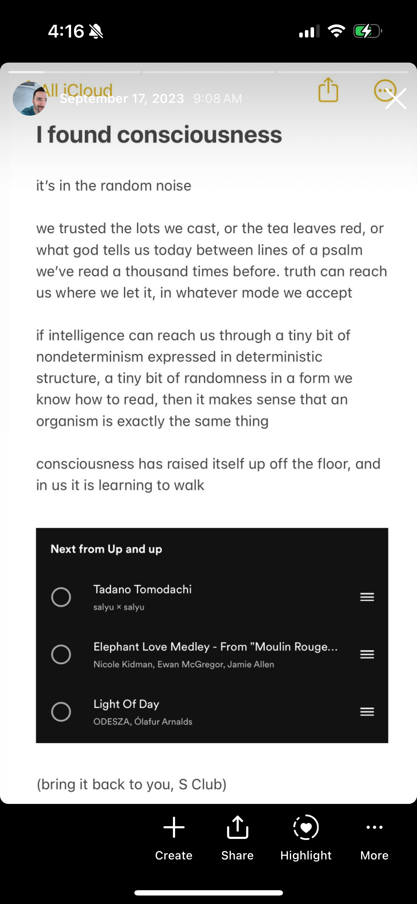

# 20240416

<figure><figcaption></figcaption></figure>

[Deekpak Chopra posted a reel making this connection, earlier today](https://www.instagram.com/reel/C50u2reu1TZ)

I’m posting this screenshot to document my documentation of it from [last september](../../2023/09/17/i-found-consciousness.md)

lol, the desire to have one’s name on an idea is _fascinating_. identity is such a fluid concept. we all share one spiritual backbone, it’s all one consciousness underneath.

and yet, here I am, lol, annoyed. annoyed! 😂 amazing

I’m glad that he’s getting this idea out there, to the millions of people that are paying attention

ideas ~~worth~~ work (that was an interesting typo) their way into the world by many channels are once. some channels are early, some are late. I tend to be early on this, at the expense of my self-knowledge timing, lol — [I can see evolution of global thought coming years ahead of time](../../2017/ai-will-save-the-world-and-nothing-will-change.md), but it takes me [decades](09/more.md#vnm2p69gv5ry) to learn the basics about myself. it's a fun combination.

this does often give me the joy of seeing _how_ things come together. you know how you catch so many more significant details when watching the movie the second time around? it’s like that. I can feel where things want to go, far (sometimes very far) ahead of time, and it means I get to recognize and enjoy all the contributing pieces ahead of time, knowing-through-feeling what it’s leading up to.

go get it, Deepak. :) I’m glad.

to explain the thesis point from the screenshot:

the ability of consciousness to express itself freely is directly connected to how much stacked randomness is allowed in the system. on how many layers is randomness found? within each layer, how much of it is random? [a system must have a lot of structural continuity and regularity in order to be recognizably _itself_ from one moment to the next.](../../2018/on-change-and-opting-in-a-meditation.md) how well is randomness able to influence the system's movements, while being run through the filter of structural continuity?

the behavior of molecules is often pretty well defined. they're pretty predictable. masses of those molecules, predictable but less so. organelle behavior is predictable enough, it has trends, could go in a lot of directions but not a lot will surprise you, at least not very often. cells: bit less predictable than that. the pattern continues: predictability decreases as the scale of complexity increases, but (in the systems we have names for) the unpredictability is balanced by structural regularity.

when randomness is allowed to percolate through the system, and _particularly_ when the system is allowed to feed back into itself, consciousness has an opportunity to make itself known and to find its own way through the world.

each hole of randomness in a deterministic wall is a place for consciousness to peer inside. like this:


