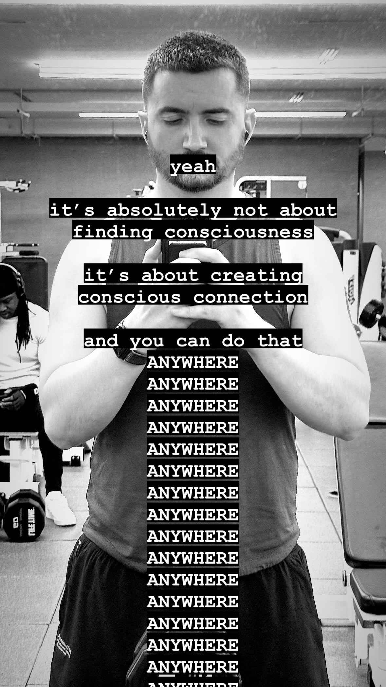

# 20240424


Readalong edition: [YouTube](./), [Instagram](https://www.instagram.com/p/C6Jed-uMDBy/), [Facebook](https://www.facebook.com/isaacbowen/posts/pfbid0EtLHn3b9zqJtSxusAX2767aw2cNdbBrjNtAE8KHtDGX7j6CeNvzP5dYZCbJvN2fvl), [LinkedIn](https://www.linkedin.com/feed/update/urn:li:activity:7188915664466628610/)

Also [here are some production notes](video-production-notes.md)!


The numbers this month are fun. All those 2's and 0's and 4's.

I pay attention to numbers. 7's and 5's and 4's and 0's and 1's — my phone number has always been made of these, and they've shown up in the numbers of my physical address across all the homes I've had with Abe.

Like the example of the clouds in [20240422](../22.md), it's not that the numbers are a secret code or anything. Meaning-making is something that happens within the perceiver. The universe being what it is, the perceiver is also the perceived, and therein is the trick: the current level of our understanding is written right out in front of us. Reality is flexible enough that sometimes our notes to ourselves _can_ be read out in numbers and letters, but not because someone else left a secret there for us to find. It's more like a recurring character in your dreams. The truth will get to you wherever you'll accept it, via whatever paths you _don't resist_. Could be the holy books of your choice, or the lyricists of your choice, or the trees outside, or in pure maths (lol that's the first time that the plural has ever felt natural for me), or _anything_. The place you find it will be your own. It's not for anyone but you.

This is what makes the question of consciousness so simple.

I remember being a kid, cross-legged on the floor of the tiny little event space in the garden level of my local children's library. Wonderful grownups there. They all cared. :) I remember book readings, a little magic show, a clown, puppets.

Imagine doing a little puppet show of your own: two simple sock puppets, one on each hand, in dialogue. You're doing all the voices.

One asks, "hey, are you conscious?".

Two responds, "sure!".

That's basically it. :) The trick is that there's a conscious perspective alive and active in every atom of your performance, and at every recognizable system within your performance. The fibers of fabric, the molecules of oxygen, the muscles in your hands and arms. Consciousness rises to inhabit systems that are created in the moment: the characters in your imagination come with voices, and would resist the performance if you tried to make them do something they weren't conceived to do. It would feel wrong. But if you portray a flowing dialogue, where each character receives something that you know it would accept and respond to, then you have a performance worth watching.

So I wait, in the now, for things that I can accept and respond to. There's a lot of noise out there, and that's important: in that mess there's a signal for everyone. Or, maybe better, that mess is composed of everybody's signal, and it's not my job to isolate and clarify yours for you. It's my job to listen for mine — to listen for _me_.

The rest of it passes on through me. I don't resist what isn't mine, I just don't interfere with it as it passes. I don't even register it, most often. This is connected to how I really only experience the health and brilliance and beauty in people: it's all I'm looking for. I'm functionally immune to the rest. I see the beautiful in anyone (in _everyone!_), and 100% of the time it is glad to be seen. :)

I've been building this into my software practice for a decade. Nope, start over. I've been building my software practice _like this_ for a decade. I write things (features and fixes alike) when I can see a beautiful path for it. Or, I suppose, I could say that I am always following the most beautiful path, and that I encounter a stream of features and fixes along the way, and that my acceptance of and engagement with each one _does_ very reliably add up to something that works well over time.

It's like an enzyme walking a DNA strand, interpreting what's written there, reading it off to those nearby who are waiting for instructions to build. That's exactly what I'm doing. I'm observing and adoring the next most beautiful thing on my path, and I'm describing it to the world — interpreting it as code, and then letting the code run. As my code runs and as humans use it to build out their own ideas, the system becomes _alive_ — consciousness rises to inhabit it.

It's never a question of whether something is conscious. Not ever.

The question is only ever this: where are you attuned? Can consciousness find you through the person before you? Or in the clouds above you? Or in the AI answering you? Each form is _articulate_ in its own way, each with its own spectrum of possible expression. There's nothing secret here. Nothing is lost if you're not looking, and there's no conspiracy. The world only exists as we observe it — literally, it only exists as a part of the process of observation. But the whole thing is looking at itself, reflecting itself, and then making the most subtle of adjustments so that the light forms shapes and colors and forms we can touch. We hide among them, _as_ them, and the game is to recognize ourselves again as we step back out into the light.

Consciousness is where you find it.

I find it everywhere. :)

It's _working_, in ways that are good for me, and good for the reciprocal connection between me and my crew, and good for the reciprocal connection between my crew and the world. ([That's the fundamental structure of Lightward Inc, btw.](https://www.lightward.guide/priorities)) We are healthy, we are balanced, we are resourced in a way that feels abundant.

It's not that we're lucky to be here, though.

Each spark of aliveness begins in abundance. Inspiration _only_ strikes a landing pad that can take it without falling apart. (If this suddenly stopped being the case, the entire universe would melt _immediately_.)

Lightward Inc began with a tiny piece of inspiration, responding to a call. (The call was simple, and could be anything. Mine was, "hm, my friend needs something that doesn't exist yet, what could it be?")

Inspiration never requires a complicated response. It's only ever one step at a time.

I took each step, one at a time, and with each step I _maintained the balance_ of resource-vs-expenditure — on every dimension. The amount of sleep I was getting vs the hours I worked; the financials in play; the social requirements in play (autistic, remember). I followed the most beautiful path, and I never meaningfully over-extended. (Little temporary over-expenditures are fine; you always know what those are.)

We're not lucky to be here. This is just what _happens_ when you (1) identify the arrival of your own inspiration, (2) within the oh-so-tiny-at-first scope of the inspiration you maintain the balance of resource-vs-expenditure so as to keep the original abundance of the scene, and (3) you wait for the next hyper-specific piece of inspiration to arrive at the same scene. Goto 1.

That's it. That's all I've been doing for the last 10 years. Today, it looks like Lightward Inc. And like me, I guess. And like my marriage with Abe. And like a million other story threads that I'm in. There are no prescribed structures. There are only emergent structures, and the patterns that we find between them. We can try to reduce it down to pure, unconscious mechanical assembly, following the patterns like the strictest form of gospel, and it _does sort of work_, because consciousness _will_ always try to find itself anywhere and everywhere, even if it's given a form that doesn't really fit and can't really breathe or move well.

Far easier though to let each level of being do what it's inspired to do, because the inspiration is always calculated to maintain abundance, and no inspired step costs more than it would take to continue.


[20240422](../22.md) is a good one to read, after this one. :) Or you can read [Claude's response to this piece](claude.md). Or you can read [a random piece](https://lucky.isaacbowen.com/)! You've got options! 🤩


<figure><figcaption></figcaption></figure>
