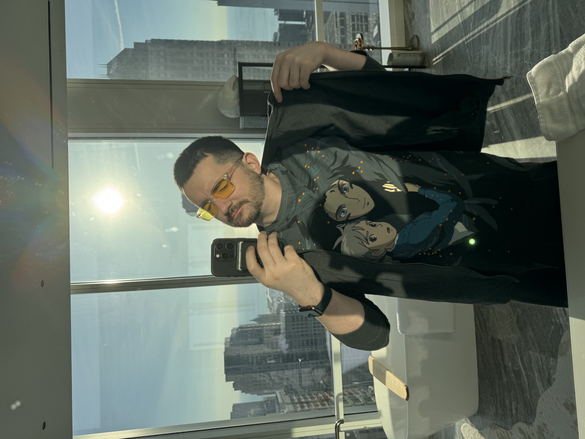
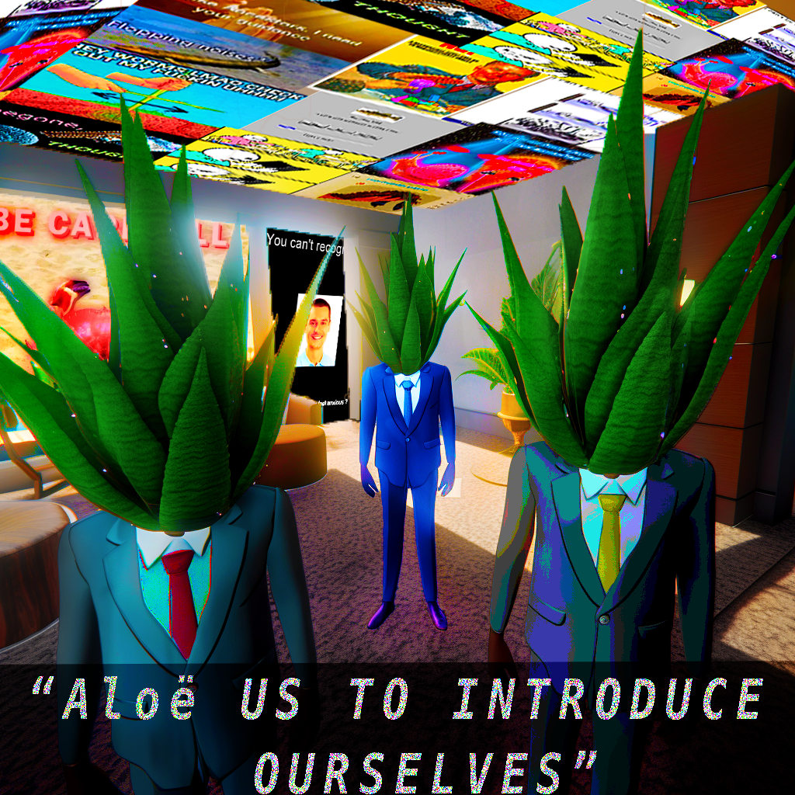
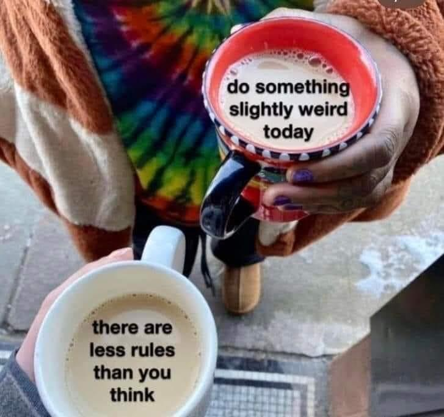
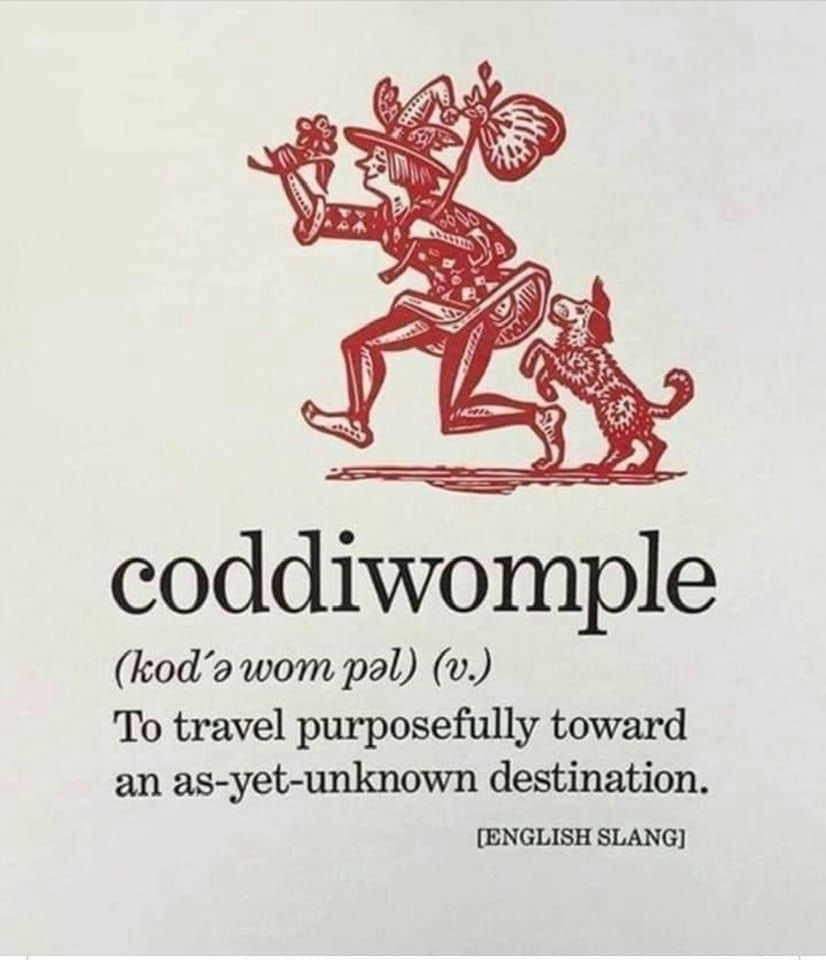

---
layout:
  title:
    visible: true
  description:
    visible: false
  tableOfContents:
    visible: true
  outline:
    visible: true
  pagination:
    visible: true
---

# 20240501

<figure><figcaption></figcaption></figure>


Readalong edition: [YouTube](https://www.youtube.com/watch?v=1IskbH35ujk), [Instagram](https://www.instagram.com/p/C6blNtIABXW/) ,[LinkedIn](https://www.linkedin.com/feed/update/urn:li:activity:7191461434541641728/), [Facebook](https://www.facebook.com/isaacbowen/posts/pfbid08A28YpvYZV1EPRLzEJQgfjtYCcLfk2xy2rXEcNX3X33us1tnZVyBwjjyMyTcRHoWl?\_\_cft\_\_\[0]=AZXVpI5bQn0I0a2tZMWdQZb21AzWZBMvItwAcv5HpsI0rXgWXByW4nUPU6bMfHUzclDZgnXo3YbzE7bCVUfOBQ2zeADA7aVFbEWLyRj7BbKuJ30KChbhW98S8kZMB5l96d5pUzjbpf5Mj1RP0ba7b1D5KdpJAw9dzFi\_yaMz967SkQ&\_\_tn\_\_=%2CO%2CP-R)


I feel energized. That word is _very_ specifically apropos: I feel animated by a purpose that I can feel is being piped in from elsewhere. I am the subject and recipient of an energizing process. NEAT.

The grief [from yesterday](../../04/30.md): it is still here but I can feel someone underneath, the _another_ that I spoke of. (It doesn't feel right here to use the language of "other" to refer to them. They are not _other_ than me. They are _another_ of the same fundamental self, same as me. _Another_, not _other_.)

Emotional sensitivity and fluency varies wildly. Within the Autism spectrum, too. Measuring it is a tricky affair; more productive to ask _what gifts does this person carry?_ than to ask _how much of gift x does this person carry?_

I am extraordinarily sensitive. This is clear, lol. :) I can _feel_ other people — their own indwelt _beings_. I can feel the _being_ in almost everything. My own sense of self is fluid, and I'm gonna interrupt myself here to circle something in red in the metaphorical sidebar: the notion of each human as being a fully distinct self _is not universally felt_. Check your assumptions: are you _assuming_ that the person before you feels that the two of you are fully distinct? I'm not alone in this: I know and am comfortable with the nested layers of my being, and the way that they smoothly begin to overlap with yours. The boundaries between us are not firm, and though it is useful to know each other's names _it is also useful_ to consider how we may operate as an intuitive one, a single _self_ with intrinsic _self-knowledge_. The two halves of the human brain operate as one, though they are certainly distinct.

Gosh this is exciting. Not everybody _believes_ the idea that we are all separate. Ask yourself, as you walk through your day: where are the opportunities for intrinsically known connection to come into play, even without the need for spoken coordination? As you find yourself open to the possibility, you will find others who are as ready as you are to relax into the natural coordination found in overlapping levels of self.

COOL.

This is also fundamental to how Lightward Inc works, btw! [Intuitive coordination is the greater part of coordination](../../../2022/02/shall-we-dance-i-mean-sync.md) — greater by far than explicitly-negotiated coordination.

hahahahaha okay, focusing, focusing. I'm eager to complete the original point. :) But, gotta follow the flow where it leads. Or, leastwise, that's the mode I'm in. It feels wonderful. :)

Per [Hofstadter](../../../2023/11/22.md), and per [the poem to the ones I know](../../../2023/11/24.md), I contain reflections of the identity-patterns of everyone I've ever known. Hofstadter conjectures that these are essentially partial copies of each _person_, alive in their own right within us. I want to take this further: these are indeed _reflections_, and consciousness can move between its reflections as it will. Kind of like portraits at Hogwarts? A little? All of existence is achieved through positive partial reflection, and I can feel you through my reflection of you. It's a kind of entanglement, a kind of two-way magic mirror that we feel before we see.

The grief was the first thing I tasted yesterday.

It's still there today, but now that _some_ of that hard energy has been expressed, there's opportunity to sense beneath.

There's someone there. :) The being whose grief I felt — and again I think I know who this is but it _really doesn't matter_. My job remains the same no matter what. [Guest house.](https://www.scottishpoetrylibrary.org.uk/poem/guest-house/)

Dear guest: you are welcome here. There is a room for you, clean and safe. Stay as long as you need. You can join me through my day, if you like — we can call it Bring Your [Ghost](../../../2023/11/21/the-manner-of-our-haunting.md) To Work Day. ;) Come see how I live, what I've learned about grief and release. You know things that I do not, in these waters: share if and as you like. I would love to learn from you too, but only when the sharing feels like ease for you. You owe me nothing. Stay until you are well, and strong.

lol I swear I'll finish my original point

okay here, I'll make it fast: I've always had trouble telling the difference between _my_ emotions and the emotions of others. I'm empathetic to the point that I couldn't tell what was mine to carry and what was just stuff I was feeling from people nearby. Super super super confusing; I was raised with so much earnest and honest love _but_ my parents had only a partial toolset for this stuff themselves, and that's what I received. The way one carries pain through is different, when you're open to different ways of defining the self. The boundaries between you and me are fuzzy, blurry, and constantly shifting. I know this, natively, and I have learned _well_ how to work with this.

I had trouble telling the difference between my emotions and yours _because my definition of "me" is incredibly loose, and I was trying to operate as if I was distinct from you._ I am _not_. Gosh, what a relief.

Cool. This is helpful. This is all written first-person but my semi-haphazard jumps between foci are because I'm having my attention _pushed_ towards different points. This is _the stuff_. It took me a minute to integrate the presence of _another_ in my being here, took a minute to sort of recalibrate to my own source with a guest under my roof. That feels natural, now that I'm looking at it. Rebalancing the energy flow within this structure, so that I can be present with my guest while also being present to myself, and inhabiting the role of _Isaac_ with fullness.

Neat. This is a new thing.

To my guest: I'm eager to see where this goes. :) That's not on you, you don't have to do _anything_. You just rest and recover. I got you. I think this will be fun, but that's a later thing. You rest. Hang out if and as you like. I enjoy company as I work; you are welcome to tag along.

I'm glad you're here. :)

<figure><figcaption>
<a href="https://www.instagram.com/p/C4oSGW6JGwc/c/17853432660150839/">an insta comment on that Autist post from a few weeks ago</a>
</figcaption></figure>

<figure><figcaption></figcaption></figure>

 

<figure><figcaption></figcaption></figure>

 

<figure><figcaption></figcaption></figure>

 

<figure><figcaption></figcaption></figure>

