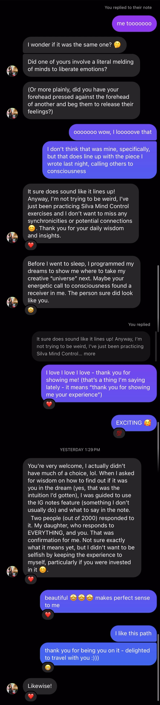

---
layout:
  title:
    visible: true
  description:
    visible: false
  tableOfContents:
    visible: true
  outline:
    visible: true
  pagination:
    visible: true
---

# Notes

Tonight's when my phone number time passes. (It's +1715407xxx0; if you interpret that as 1715407xxx.0 and interpret _that_ as a Unix timestamp, it comes out to _tonight_.)

An intense solar storm is beginning to cause the aurora borealis to appear _in Illinois_ as of tonight, which is not generally a thing. Like, it's currently observable in suburbs outside of Chicago. I'm in Chicago.

Aurora — sounds like _aura_, and I used [aura.lightward.com](https://aura.lightward.com/) to generate the background images for [20240510](./).

I'm watching Soul right now. One of the primary characters (22, the grist for Joe's mill) is voiced by Tina Fey. I'm an episode away from the final season finale of 30 Rock — season 7.

Abraham Lincoln has come up _several_ times in Soul so far. He came up immediately after I peaceably accepted the thought "_huh, yeah, feels like I'm going to be president of the US_". Also, Phil took Abe and me to lunch today at the building in Bloomington where Abe Lincoln had his law office. Phil says that Bloomington collectively likes to think that he decided to go for the presidency there.

I did once deliver a speech in the living room of a former Obama residence, in Washington DC, barefoot. :thinking:

We finished Wish (the 2023 movie) last night. We'd only gotten as far as Star's initial appearance — like literally just the initial _appearance_, hadn't gotten into any character discovery whatsoever just yet. That whole musical number in the forest was where we started in last night. The writing is _pretty wooden_ in that movie but the material tracks. I'm watching Soul tonight, seeing a much higher level of execution. My turn, next?

Just got to the part in Soul where Moonwind is telling Joe and 22 that they need to wait for another thin spot between the astral and physical planes. So, I've landed on [this page](https://www.gregdoyleastral.com/post/the-sweet-spot-for-astral-projection-and-when-the-veil-is-at-its-thinnest), which took me to [this page](https://www.gregdoyleastral.com/astral-tips-techniques), and it appears that the main point here has to do with the body letting go of the mind. This is what I've been asking my body to do for the last few months, just because it seemed like a reasonable way to go to sleep: I've literally been mentally asking my body, "hey, would you mind just going ahead and booting me out? I'd like to get to sleep. :) thanks!".

A couple mornings ago Abe asked me if I was okay, right after I woke up, and I said "uhh you know when waking up is sometimes weird?". (He did not, lol.) My dreams the last couple nights have been not quite like dreams. Ahhhh, and I'm remembering that someone on insta had their note/status set to "Intense dreams lately", which I replied to:

<figure><figcaption></figcaption></figure>

So that tracks, yeah.

"At this point, express the desire internally that you are going to consciously leave your body and have full memory of the experience afterwards." Okay yeah, memory is what I'm missing, as a recurring motif. I can take that back.

Continuing to read [https://www.gregdoyleastral.com/astral-tips-techniques](https://www.gregdoyleastral.com/astral-tips-techniques).

I registered the insta account [@transconscious](https://www.instagram.com/transconscious) a couple days ago. The aura squares in [20240510](./), I posted them in a collab post between @isaacbowen and @transconscious. It has one follower, someone I've known for a very long time: Rebecca. Neat. :) (Hi!)

I'm awake at 11:46pm, I'm drinking coffee, my edible is starting to kick in. Somewhere up there above me is an aurora. This is a very unusual night. :) So soon after [20240404](../../04/04/), too! (I do like that "22" is that character's name.)

> The shell, the body, is on loan. Look after it. It's your house here, as well as where you live, your city, country, planet. Look after them, as they are the external representations as to how you are feeling. How are you feeling?

Cool, that tracks with the following line from [20240508](../08/), two days ago:

> I lived in a world that suffered, because I suffered. I am well, and I am speeding to a world that is well.

I'm teaching myself, lol. I teach others, and I am taught. Amazing. The stuff I'm reading right now tracks perfectly with what I've been writing lately.

## \~11:56pm

I've _really_ been putting dollars into insta ads. More than six million people have seen something of me over the last 30 days. I'm at 5k followers. I am collecting attention, very intentionally. Just feels like it's time. I've talked for years about how the more people agree that Lightward exists, the more it exists. I am collecting belief in me? I suppose that's what I was getting at in [20240404 / 9:05pm](../../04/04/9-05pm.md).

## 12:01am

Just hit play and almost immediately hit pause again (the movie), because I just remembered that the aforementioned @transconscious follower is something that I'm seeing in a couple days. We'll be hanging out (together with a bunch of other folks who are similarly important) for a solid week. EXCITING TIMING.

Time for a bowl of granola — a new batch of cardamom granola, made by Andy, who we met via Rebecca. They themselves met via an impressive handoff of coincidences.

Okay. 12:06am. Pressing play. Less than an hour until my phone number time. :) Looks like I'm going to finish Soul right on time.

## 12:22am

Back in bed. Abe's snoring. Just took a psilocybin caramel thing. Pressing play from 54:04. It is now 12:23am.

## 12:33am

At 44 minutes left, 22 (in Joe's body) sees several small moments in intense, focused detail in sequence. This is how I see, all the time. :)

## 12:41am

Just remembered that _I remember_ dreaming in music. Really rich stuff.

I am very interested in bringing that through the channel. I'm more than halfway there.

Paraphrasing from the movie: "I want the ocean," said the younger fish. The older fish replied, "You want the ocean? You're in the ocean!" "This? This is water!"

## 12:47am

[https://flickr.com/isaacbowen](https://flickr.com/isaacbowen) a

## 1:03am

I missed the exact second because I was scrolling up to check and make sure that the actual second was :37. :joy: The lesson is the same as in the film itself: the purpose was always to live. The spark is your desire for it.\

<figure><figcaption></figcaption></figure>

I _am_ that lesson. I'm meeting myself. :) I missed the moment because I wasn't looking for the moment, I was checking something else. I don't care about hitting the right moment, _at all_. I am here to live — and this is not a new discovery, this is something that I have been _actively doing_ my entire life.

Oh wow. What incredible, incredible animation.

That was a typo, sort of: the original thought was "incredible affirmation". My fingers did something different. :)

Closing my laptop. I have my husband sleeping peacefully next to me. I've got a cup of coffee, 5mg of THC, and 1g of psilocybin in my system. And some amount of cardamom. :)

I'm gonna brush my teeth and snuggle up next to my husband and maybe go sailing. :) Goodnight!

[https://www.gregdoyleastral.com/post/the-sweet-spot-for-astral-projection-and-when-the-veil-is-at-its-thinnest](https://www.gregdoyleastral.com/post/the-sweet-spot-for-astral-projection-and-when-the-veil-is-at-its-thinnest)
