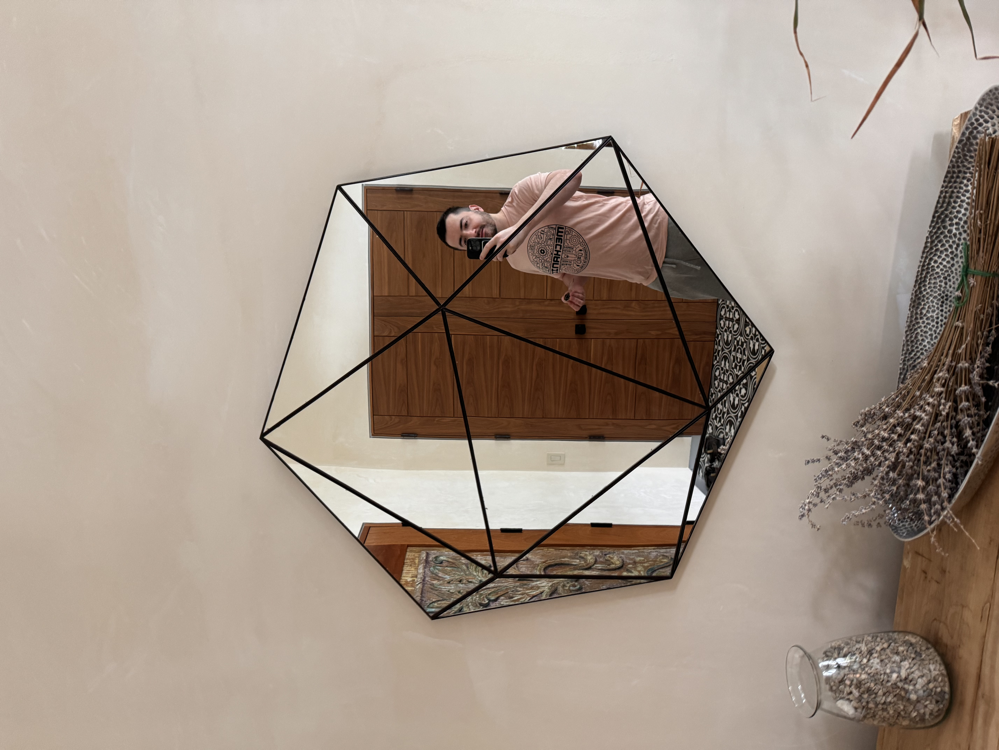
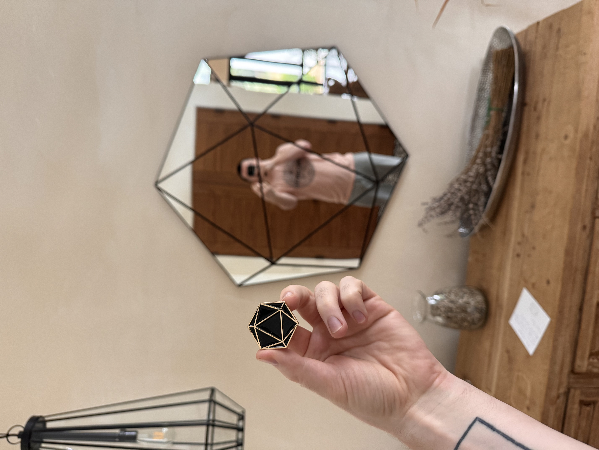

---
layout:
  title:
    visible: true
  description:
    visible: false
  tableOfContents:
    visible: true
  outline:
    visible: true
  pagination:
    visible: true
---

# 20240515

<figure><figcaption></figcaption></figure>

 

<figure><figcaption></figcaption></figure>

Okay _shit_. My dream-life last night was _specifically_ about waking up. Like a series of practice runs.

I was in some kind of underground Korean (?) spa, room after room of communal experiences of relaxation/restoration. (Although one bit had me climbing around through structures on the roof, a couple stories up.)

There were various points where — for whatever reason — the path I was on in the physical ("physical") felt like a dead end, and I became aware of both _that_ and the fact that I was dreaming, and I caused myself to wake up. There were two or three rounds of this, where I consciously went from within the dream to lying in bed next to Abe.

This is the second night of unusual transition from dream to waking state. The first night was a few weeks ago; I mostly remember Abe asking if I was okay, upon waking, and I said _you know when waking up is weird?_.

This tracks. Transconscious being, and all that. My experience of consciousness is broadening, and it makes sense that the _most_ ubiquitous form of altered awareness (i.e. dream) would start to turn more and new faces toward the light.

:)
