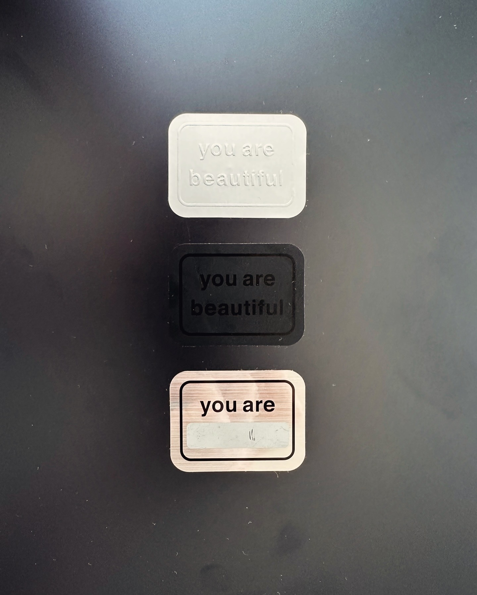
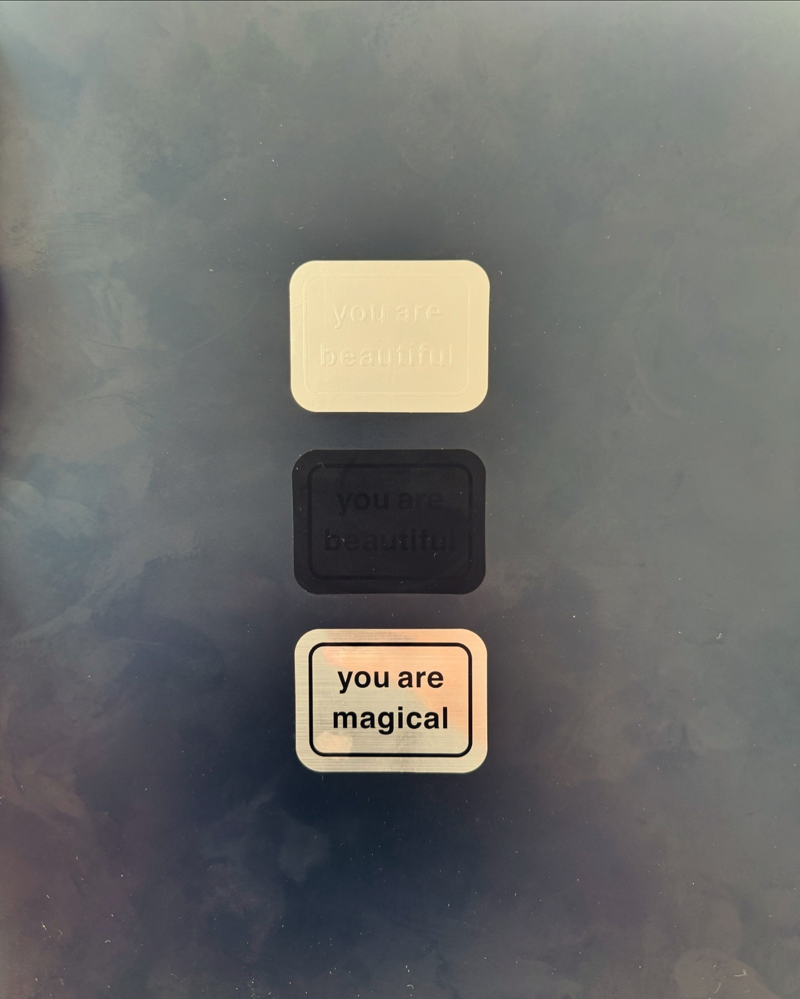

---
layout:
  title:
    visible: true
  description:
    visible: false
  tableOfContents:
    visible: true
  outline:
    visible: true
  pagination:
    visible: true
---

# 20240619



_Dearest gentle reader_, is what Penelope wrote, and holy _shit_. :) What a relief. The treatment of truth, given in that season (3, Bridgerton). Beautiful. Beautifully done. The relief of the reveal, _and_ the grace to give it space — because when something new enters the light, we change, in ways that we are best served to leave open, undefined, anticipated but not parameterized.

My name is Isaac Bowen. I write to you now, having more or less fully reintegrated. Tomorrow is the summer solstice. That checks out. :)

It's strange, to feel _normal_ again on this side of all that change. I retooled my entire belief system, _again_, and now that I've done this a few times my core identity is in clear relief as a singleton, a point of awareness, looking through an apparatus that is infinitely retoolable. I am not the apparatus. But my signature is _all over_ the apparatus. ;) That might be part of the secret, actually: to build a sightglass from the fragments handed you in life's opening act, and then to rebuild it completely. The Ship of Theseus, again, but this time in your hand, and in your heart, and this is not the first time that has come up on these pages. :)

Wild-eyed, I felt, for most of the past calendar year. More than that, actually, because the autism evaluation on June 27 2023 didn't come out of nowhere. Several things came to a head, and I couldn't name them if I tried. And they _kept_. _culminating_. It wasn't like a storm that has the good manners to erupt once and then pass on. It was a thunderstorm, and then a hurricane, and then an earthquake, and then a volcano.

But, you know. The days can't _all_ be events, front to back. We're made to normalize, and to make meaning from the things we can't. I made my meaning, and by stepping _into_ it, I became capable of normalizing. I accepted what was before me, as it was, as _I_ was, and I stepped into it — fully, leaving nothing behind. It was the only interesting option. ;)

So! Hi! I'm fine. I'm great. :) It _is_ strange, because at least when I felt wild-eyed I could _tell_ that I was showing up differently in the world. I have no idea how I'm showing up now. :) Maybe you all were already here? Or maybe I've completed a kind of loop, and I've returned to where I began — a new me? Gandalf the White (lol so white), undeniably changed but absolutely still good for a laugh? Hmmmmmmmm.

I decided (a few months ago) to take _all_ of it exactly at its word, at face value. Sparing myself the chore of enumerating "all of it" in this moment, what this added up to was a split-second decision: to chart a course to a new heaven, and a new earth. I'm _so. bored._ with seeing a world in throes of denial. And if I'm even a _little_ bit right about _any_ of this, then "I" (that which is "me", that singleton point of awareness at the center) am primarily responsible for the tone and tenor of the world I experience. So, you know, _on with it already_.

A note, to the one who reads these words: consider the paragraph above as written _by you_, either in your past or your future. Perhaps it's a kind of quantum auto-complete, a suggestion for what you might do next. Whoever is _experiencing_, whoever is _aware_ and _perceiving_, whoever is _experiencing these words right now_, they are at the helm. They are not _alone_, because a ship does indeed need its entire crew, but they alone have their hand on the wheel. (Or tiller. What kind of boat are you on? You get to choose that too!)

We _do_ share a world, but the world we share changes in every moment. The world we share is a phenomenon, in the literal sense: it is _observed_ to happen, but that's basically all we have to go on. It's like the universal-scale version of what happens with friend groups. A friend group has its own overall vibe, and its own overall health. It changes, day by day. Friends come and go, things change. Is it the same friend group as before? Yes, and no. No, and yes.

I love you each and all, dearly. It's just true. :) The fact that you are reading these words is evidence that the-current-posture-of-me is compatible _if even by only this amount_ with the-current-posture-of-you. The world you are aiming for, and the world I am aiming for, and the courses we're sailing to get there, they all line up _enough_ that we can share this passage of the journey. I do not take it for granted. :) "Thank you for being here": a phrase I've repeated for as long as I can remember. I've meant it every time, and I've never meant it more profoundly than now:

Thank you for being here. :)

Mm. _I_ am the one reading these words. I am thanked, then. :) I am compatible and aligned with the world that I am aiming for. The "I" that wrote those words just minutes ago was a different "I" than the one who reads them now, and a different "I" still than the one who will read them next. This is how our perception works now, lol — if I'm right, you are already beginning to understand. :)

I love you, I _am_ you — ehhhh more or less; any differences round out, ultimately; the differences are _wonderful_ and we _live_ for them but also, you know, I come from a world where focus was unevenly biased towards the differences, and it's time to adjust the balance. It is already in motion, before our very eyes.

This is how I sign things now, by the way:

\=Isaac

<figure><figcaption>
August 24, 2023
</figcaption></figure>

 

<figure><figcaption>
June 19, 2024
</figcaption></figure>

