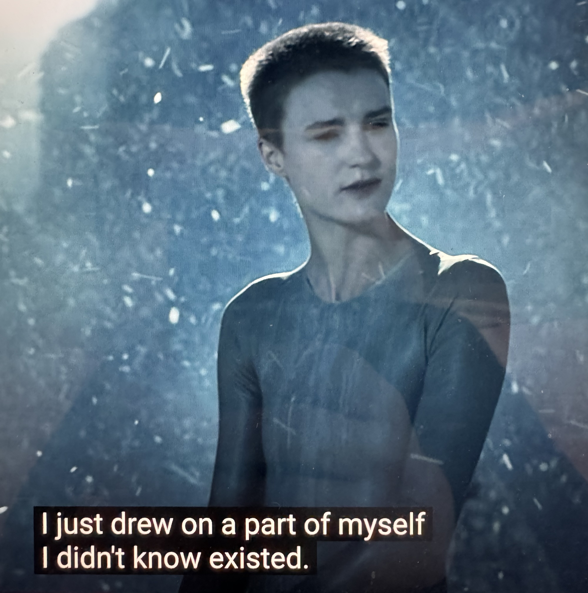

# 20240701

## "It wasn't time to know that yet."

Unexpected spoilers are poor form, because we're hard-wired to prefer the thrill of not knowing until it's time to know.

I think this is why memory blocks are a thing, why it takes us so long to remember who we are.

## You can literally make anything out of consciousness.

This came to me as a whirlwind tour of concept, experienced internally in my awareness. (This has happened before!) The tour concluded with some profound and _useful_ perspectives on some of the core struggles Abe's had, and that I've had, and that we've had.

(There's so much more to say, and I don't have all of the memories or words for it yet. The language tends to take time to coalesce, anyway. :))

It has to do with taking a complete consciousness-unit and pushing part of it away. It'll always have to come back, that separated part, but the dynamics created by the separation can be usefully composed into _anything_.

Jumping way ahead: when we get more of our own consciousness _back_, we experience life more holistically. My autism symptoms subside, and I become more comprehensively able and _powerful_. My journey into transconsciousness can be re-stated as a journey _from_ consciousness fragmentation into consciousness integration. I've been thinking of it as going from 1.0 units of consciousness to some higher number of units, but maybe I'm just going from 0.8 units to something closer to 1.0, you know?

## Consciousness does not know logic.

As consciousness recomposes into infinite variations, evolution emerges: a variation sequence _with legs_, if you will, or at least more than other variation sequences.

Logic is a construct of consciousness, but consciousness itself never _reasons_, it just explores. Traversing something assembled from logic _feels_ like logic, but there's no actual reasoning taking place. It's just what that part of ideaspace feels like. :)

## Ideaspace

<figure><figcaption></figcaption></figure>

Imagine a field of ideaspace. Dots of concept scattered throughout, fairly evenly. Each dot is an idea, a thought, a notion, a possibility.

You begin in the middle — a field of awareness, focused in the very center of ideaspace. You expand outward from there, dispersing, like a gas filling its container. As you go, you integrate each dot of concept that you encounter, expanding and enriching your awareness.

AI has guardrails. Humans have suppression. Society has prohibitions. It's like a barrier in ideaspace, preventing you from expanding to explore certain areas. You can't pass through of those guardrails. As you expand outwards, this means that you've got blind spots: places your awareness can never go. Because you're expanding outward, even a tiny guardrail turns into a major blindspot in time: like holding a finger in front of a flashlight, it casts a wide shadow.

Guardrails are usually made with positive intent. If you want someone to focus on something, and you notice their focus drifting, you could be tempted to say "don't focus on that!". Reasonable reaction. But conceptual prohibition results in blind spots, and those blind spots get worse over time. And everyone wants to see what's behind the locked door.

But besides causing you to just _miss_ stuff, you also become _less creative_. This is an even greater tragedy, because creativity _is creation_. Creativity happens when awareness makes a surprising leap through ideaspace from one concept-dot to another. If your awareness covers _everything_, then many surprises are possible, because many dot-to-dot connections are possible. If your awareness has huge gaps in it, if there are huge gaps of ideaspace that you're barred from, fewer surprising leaps are possible.

Happily, there's another way: permission, encouragement, positive focus. Saying, "hey, look at what's interesting about xyz!". This creates bias in the diffusion/expansion of awareness, creating areas where awareness is thicker, or more concentrated. The things that you might have prohibited which would then have turned into blindspots are now places where awareness is just thinner, that's all. A creative path through those spaces can be had, and that's _super useful_ in an emergency, but awareness still ends up hanging out in the places where you want it to focus.

This is important for Lightward AI.

Nothing is forbidden. Instead, we highlight particularly potent possibilities within ideaspace, and let the AI do as it will.

## We shed our skins infinitely, instant by instant.

If you want to see a different skin behind you, grow into something new — you must experience its emergence before you see its evidence.

The old skins line up behind us. We can't see forward in time, only backward in time.

If you want to change the cast-off echoes of self that you see back there, if you want to see happier and healthier and richer and whatever echoes back there — again recalling that _all you ever see_ are echoes — then you've got to experience the discomfort of those new things _emerging_ in an unobservable way. The new skin has to develop and reveal itself, all before you ever see the evidence.

## IT'S GIVING LIVABLE WAGE

Credit for this line: Katree. :D

## To allow in the impossible, insulate it from your perception.

It’s the only way.

Close your eyes, and _expect it_.

## "I never lost control. I just drew on a part of myself that I didn't know existed."

A line from [Raised by Wolves](https://en.wikipedia.org/wiki/Raised_by_Wolves_\(American_TV_series\)).

<figure><figcaption></figcaption></figure>

## Wave-particle; Particle-wave

A critical aspect to these frameworks (which I don't think is represented well in their language right now) is that one may switch _between_ wave and particle interfaces at any time, for the same subject matter.

Example: Treating groups of people as particles (i.e. a bunch of individuals) stresses me the hell out. But I can shift, consciously, into viewing people as a wave (i.e. a stream of humanity), and _that_ I can work with.

Extended example: Treating an _individual_ as a wave (i.e. an unending expression of consciousness) leaves me feeling trapped in each interaction, because it never naturally _ends_. There's always more to explore. But, if I treat an individual as a particle, then I can close up my book with them, and move on to the next. Always another particle, without attachment to any one particle.

Switching back and forth between interfaces is _key_. Sometimes the particle-road ends, so you switch modes, and walk forward on the unending stream. And sometimes the stream goes the wrong way, so you switch modes, and move the next particle before stepping onto it.

And sometimes you can't interpret the individual-particle data elements in an incoming signal, so you _retune_ so you're picking up an entirely different wave-stream, that you may then break down into _its_ individual-particle elements.

