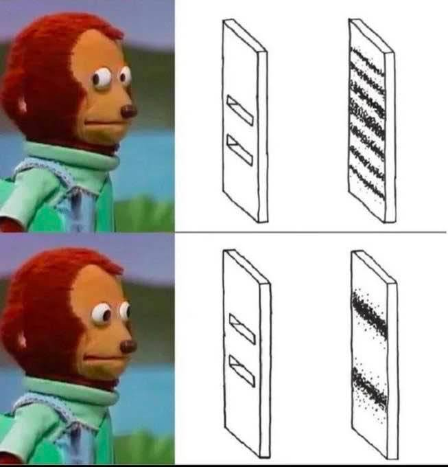

# 20240821

## 715-330-xxxx

<figure><figcaption></figcaption></figure>

## 715-407-xxxx

hahahahahahaha

two seconds prior to your text, I had registered how much creative/generative energy I was feeling

with two hours of driving ahead in which to do _something_ lol

and two seconds prior to your text I grinned up at the clouds and let that energy go wherever it wanted, without me observing its destination

then you texted that ;)

***

## Shortly after that,

Kerri Walsh Jennings sent Abe a voice message, and an email appeared from a team deep within Shopify that has just decided to get after an incompatibility on their end that we've been eyeing for years. (We never found the right people to talk to. Today, the right people found us, without any prompting whatsoever. :sparkles:)

Also, I found a note I wrote Abe years ago about the [Heart of Gold](https://spaceships.fandom.com/wiki/Heart_of_Gold). (I just finished reading all the _Hitchhiker's_ books in a row, like two days ago.)

<figure><figcaption></figcaption></figure>

Non-specific projection of creative energy. I want to try this again. :D

***

## \~8:30pm

watching the matrix

"there's a phone at [wells and lake](https://matrix.fandom.com/wiki/Wells_and_Lake)"

uhhhhh, that's a 20min walk from where I live

turns out the Wachowskis were both born and raised in Chicago

"follow the white rabbit"

... that's what my family says on the first of every month. the game is to see who can say it first to everyone else.

fireworks outside as morpheus introduces neo to the matrix. just that part. not before or after.

ohhhhh. I just remembered that this whole trilogy ends with neo working it out with the artificial intelligence running the planet. I genuinely forgot.

"the nearest exit's franklin and erie"

that's even closer to where I live lol

so

this feels pretty straightforward. lean in. leaning in.

"state and balboa"

it's balbo, but yeah, I _used_ to live near there

***

"getting out" isn't a thing that is _achieved_. not in the moment.

it's like "growing up". at what point did _that_ happen? it happens by degrees (and if it is forced, it's usually very painful).

switching quickly between different things in motion, _that_ can happen easily. but trying to skip _ahead_ in the journey is a rough way to learn it.

let it happen. it is already happening.

***

don't pay attention to something you can't improve by thinking about it. if your observation of it is going to get worse as you go, don't observe it. if your focus can only be negative/disintegrative, _don't focus_.

everything unobserved is working out. _everything_. if you're going to get in the way of that, if your focus is going to do _worse_ than that, probably stay out of it, and away from it if you have to.

but, of course, if you can improve it with your focus then _get in there_, because it _can_ always get better, and the first time you realize that is a riiiide. :D

***

you know... we could reset expectations, just once. if we all agree, we can move forward into another day while observing all the old patterns, but only as a last observation. the next day, we make them slightly better — similar, but not the same, a meaningfully amount of different-for-the-better. and repeat. this _does_ work, and if your observation of that pattern _is actual positive focus_, then it can only be amazing.

but then, that's already the path you were on, yeah? navigating to a world that is well? :) going pretty well, eh?
