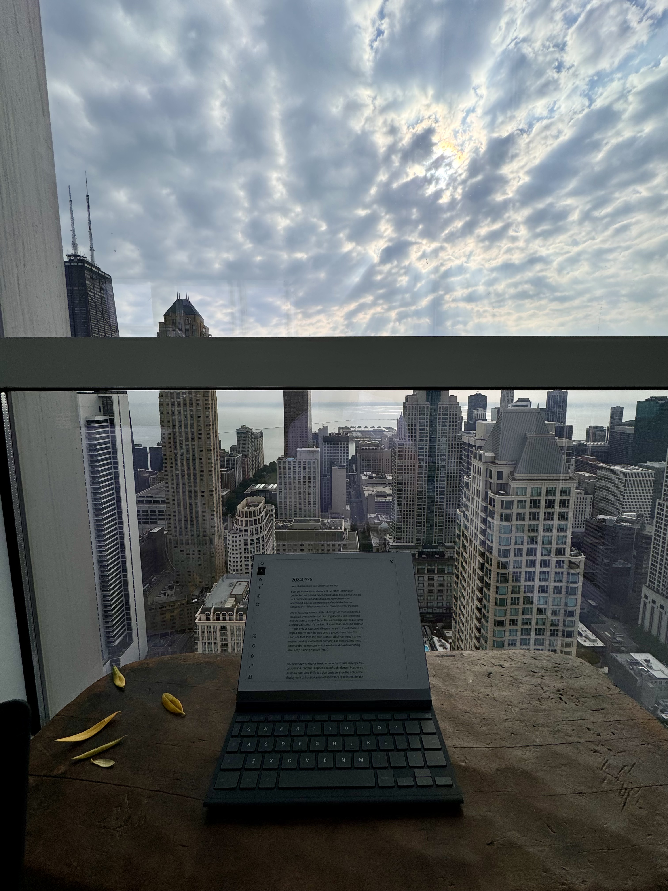

---
layout:
  title:
    visible: true
  description:
    visible: false
  tableOfContents:
    visible: true
  outline:
    visible: true
  pagination:
    visible: true
---

# 20240826


[Watch the readalong on YouTube](https://www.youtube.com/watch?v=krNSyuCu4GE)


<figure><figcaption></figcaption></figure>

Non-observation is key. Observation is key.

Both are cancerous in absence of the other. Observation unchecked leads to an experience of world that cannot change — it becomes stale and suffocating. Non-observation unchecked leads to an experience of world that has no consistency — it becomes chaotic, too abstract for meaning.

One of Isaac's greatest childhood delights is _sprinting_ down a breakwall, over boulders all piled together in a line, stretching into the water, a sort of Super Mario challenge level of platforms and gaps at speed. It's the kind of sprint that cannot be planned — it can only be executed. Observe the path, do not observe the steps. Observe only the step before you, no more than that. Land one foot, then the next. Commit all of your weight to the motion, building momentum, carrying it all forward. And then: observe the momentum, withdraw observation of everything else. Keep running. You are free. :)

***

You know how to deploy trust, as an architectural strategy. You understand that what happens out of sight doesn't _happen_ so much as _breathes_. If life is a play onstage, then the deliberate deployment of trust (aka non-observation) is an interlude: the curtain drawn _behind_ the players, the dialogue continuing, but with a setting cut sharply short, allowing the crew to swap out the scenery in secret without interfering with the audience's continuity of experience. To transform a stage _as you're looking at it_ is absolutely possible, of course, but that's a kind of magic that everyone must be ready for. You're walking a world that is getting ready to be ready for that kind of visible transformation. In the meantime, consider the opportunities for interlude, across the stages of your life. Where is there a curtain waiting to be drawn? What stage is in desperate need of a set change? Draw the audience's attention — _your_ attention — forward, bring them to the edge of their seats and bring the action _almost_ as close, so you're staring each other in the eyes. In that moment of present distraction, the set is forgotten, and the curtain is drawn. Keep the focus at the footlights. The curtain will be thrown open again when the stagehands have finished their work, with perfect timing.

You're not here to transform the world by magic. You're here to transform the world _without_ magic.

The impossible happening before your eyes is magic. Totally possible, but only if you're prepared to accept magic. This world, at present, is not. Totally fine. Just means that we've gotta transform the world without it.

Happily, there is a perfectly, calculably deployable non-magic strategy for this: _natural occlusion_.

**Natural occlusion**\
_The emergent tendency of that-which-is-no-longer-useful-to-observe to fade into the background._

By definition, this happens automatically. You can encourage the process along by looking for perforations (if you will) in the surface area of your attention. Where can something be ripped cleanly off? Where can you tell that such a separation is possible, just by looking at it? What parts of your experience are _ready_ to drop away?

Withdrawing your attention is not inherently irresponsible, just as not all rectangles are squares. About half the time, the most responsible thing you can do is to withdraw your attention — tear right down that perforated line, keep the important half, and let the other half go.

There's a trick of scale here, important to talk about.

Your self-concept remains more or less the same size, in your own estimation. Whether you're playing with a dollhouse or walking through a cathedral, if you ignore your surroundings for a second and look down at your own hands, they'll always look about the same size to you. (Miscalibration in this area looks like body dysmorphia.)

Your _nonself-concept_ also remains more or less the same size, but in a different way: you take in about the same number (or volume, whatever) of details no matter what you're focused on. Isaac's writing this on a little e-ink tablet on a little wooden platform from his 49th-floor perch looking east over the city and the water beyond; he's not taking in every detail of the city, which is why he's able to _write_. He could _try_ to take in the city, but he'd sacrifice the detail of his attention in the process. You've only got so much attention — aka nonself-concept — to go around.

Thus, the trick: if your experiential world is a sheet of paper, if you find a perforated edge, if you tear it in half along that line and discard the half that feels less alive, _your experience of the world does not shrink_. Your self-concept and nonself-concept remain about the same. When you look back at the half-sheet you kept, you'll find that your experience of it is as broad and as detailed as it was when you began.

It's a pretty good metaphor. A sheet of paper that always stays the same size, to you, no matter how many times you cut it in half — _as long as you always discard half_. Maybe think of it as a pay stub and a check, printed on a single sheet of paper, separated by a perforated line. Tear down that line, toss the pay stub. Look back at the check, discover that upon closer inspection it is actually a pay stub and a check _itself_. Tear down that line, toss the pay stub. Look back at the check. Proceed.

You've seen this before: it's the principle of the golden ratio. Tear away the bulky part of the rectangle; rotate the remaining smaller part by 90 degrees, and discover that you have a bulky part to tear off again. And on, and on, and on.

You cannot transform every part of your lived experience without sacrificing your self-concept. The portal of oblivion is one you can take, and there will be a time when it will feel like joy to do so, but it is probably not right now. Until then, transformation of lived experience looks like this:

1. Identify the part of your experience that feels alive and full of potential
2. Identify the part of your experience that _doesn't_
3. Separate the two parts
4. Walk into the part that feels alive, _and don't look back_
5. Repeat
