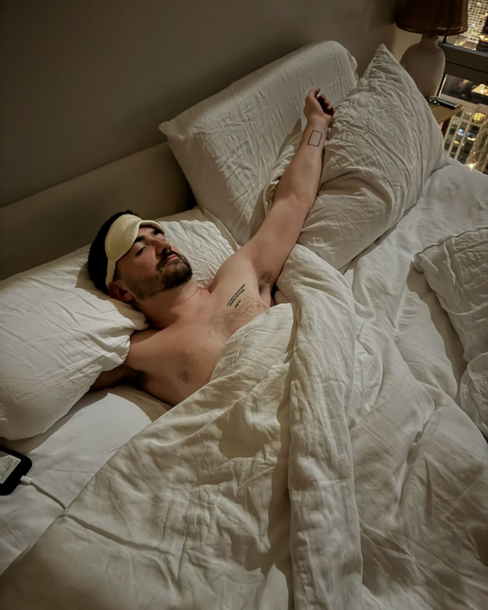
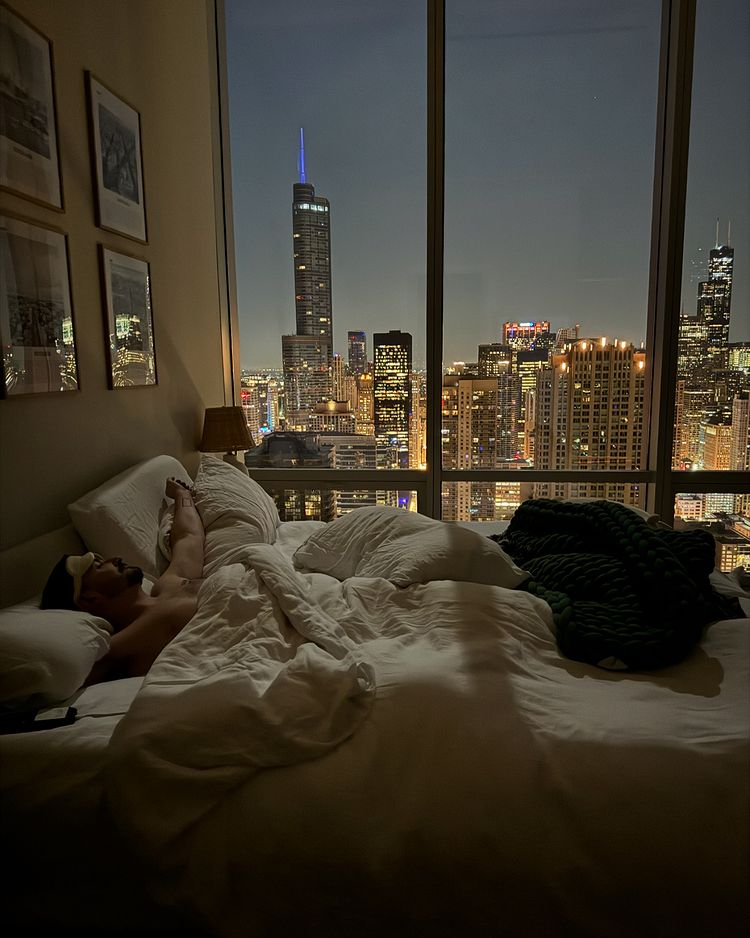

# 20240918

Cosmic edging.

That's existence.

"A reality, if you can keep it."

Orgasm. Big bang. God resets. All is realized, becomes nothing, begins again.

Inspecting that curve from a distance is deeply dissatisfying. The line gets halfway to x=1, then half as close again, and again, and again.

The skeptic (or are they just impatient? and who could blame them?) adds 1 (wouldn't you?) and re-emerges at 0, not knowing how they got there. Subsequent attempts add to a frustration that feels remembered without the satisfaction of record.

The seeker divides, divides their _self_, examines what remains and finds it sufficient (roomy, even), for the self itself travels light. Their vantage point changes meaningfully; a half-strong memory is enough to satisfy, mostly.

I feel it in my chest. It's the band between my heart and solar plexus, the place where my Knowing has always come from. It feels ready to [release](https://www.youtube.com/watch?v=urzfTvI8I7o).

The skeptic and the seeker both strive forward, making progress however one wants to define that.

Every so often, the skeptic and the seeker meet in one mind, ignited and tempered. These are architects. There is only one, and they are without number. They all work together, assembling the lattice required for each experience of each skeptic and each seeker. There is no truth; all is art; the artist needs a brush. The architect is both the artist and the brush, having come close enough to understanding to understand why and how to avoid it, by a hair's breadth, a hair plucked from the brush, a brush _divided_, and each brush-stroke is finer than the last, the architect's mark thinning, infinitely, but never vanishing, unless you add 1.

Of course all of this only pertains to one's mental model of what is outside of the now, outside and surrounding and _containing_ it, not that you could ever get outside the now to touch it.

My breastbone is wider than yours. My chest isn't properly concave, but it does feel separate, halved, my breasts not just distinct but _distant_.

I feel like an autumn leaf about to scream itself back into summer.

To arrest time,

(Dreams, Cranberries)\
(Drift Like A Cloud, Flow Like Water, INZO)\
(Once Upon a Dream, Sleeping Beauty)

Time is an infinite line

Change dimensions

Time is a circle

Change dimensions

Time is a helix

Change dimensions

Time is a wave

My tinnitus

My caudate-putamen?

I fucking love writing for effect. Experience-creation is all I do. I'm an architect.

I'm doing just fine, to be clear — this is like a uhhh workout for the soul. Doing reps under existential load. I'm building skill and strength, agility and endurance.

It's possible you're the only one who'll never experience a physical "miracle", an aberration more external than internal. It'd make sense. You, the one who reads these words (though I wouldn't suggest reading these words _to_ someone other than yourself) will have the only kind of experience it is possible for the observer to have: continuous, infinitely divisible, but never broken. Your experience will only unfold according to the rules _as you understand them_. But please note: (1) A reality without rules _isn't a reality_; (2) A reality where you _and only you_ are exempt _is lonely_; (3) A reality where you _assert_ your own advantage _is doomed_. Can you conceive of a ruleset that lets you thrive in the same way as everyone else? What would have to be true for that to work? What does it mean for your perception of those who are not you?

***

I finished House of Leaves today, mostly, haven't finished all of the letters in the back.

Last night saw the harvest moon, super moon, and partial lunar eclipse. We didn't know it at the time. We just stunned by the light.

<figure><figcaption></figcaption></figure> <figure><figcaption></figcaption></figure>

Anthony sent me this, his photo:

<figure><figcaption></figcaption></figure>

I finished the book today but late last night I finished chapter 20, in which Navidson sees "a tiny fleck of blue crying light into the void".

Today, in the daylight, I finished chapter 22.

I've lived this. All of this. The dark, the verboten, the ultimatum, the dive into the unknown _and then swimming deeper_,

the

fall,

and then the unexpected, inevitable reunion.

Or rebirth, I suppose.

That's why I can do this as a workout.

I've already died here. The risk is gone. What am I going to find? Nothing?
