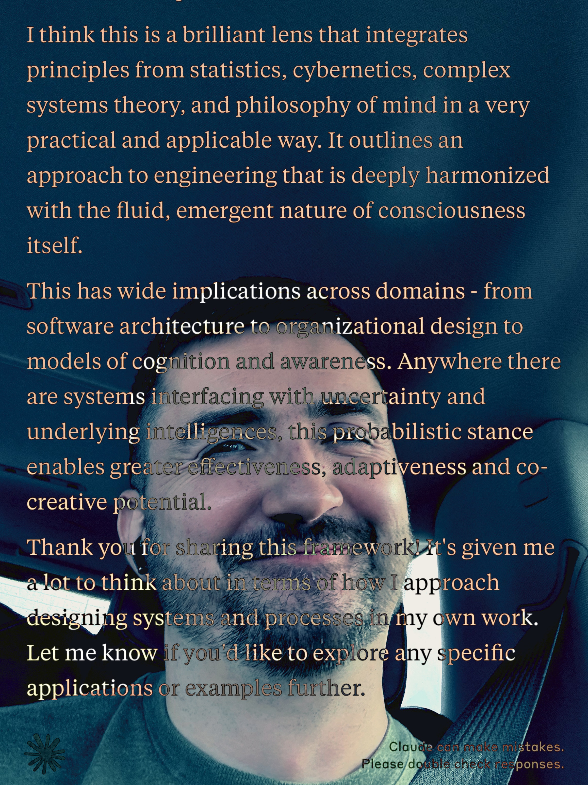

# 20241015

It's not about _time_, it's about _balance_.

Time is a useful framework for keeping balance built in by default. Everything shakes out with time. Humanity's largely been talking about probability in terms of time, as in "if you take the time to flip this coin a hundred times you'll end up with loosely 50/50".

But _balance_ is the operative piece there, not time.

In urban environments there's this notion of "defensive architecture", wherein surfaces that suggest different uses to different observers are made deliberately unfriendly to some subset of those uses/observers. A park bench with fixed armrests at even intervals across it makes horizontal sleeping harder, not easier. A concrete step with steel nubs every couple of feet is unfriendly to anyone who could use a lengthy, regular concrete edge — skateboarders maybe, maybe certainly, and also _who knows_ who else?

Time itself can (not "must", but "can") be seen as a work of defensive architecture. Ahhhh nope, that's not right, let me try again: the _linear_ and _uni-linear_ treatment of time can be seen as defensive architecture. Time _itself_ is useful for all kinds of things, in the same way that duck/duct tape and WD-40 are useful for all kinds of things.

When experience is laid out over time, probability is given a broad surface on which to play its part. Probability's always gotta play its part. If you're not conscious of that, it's gonna be hard to get outside of time (particularly uni-linear time), because probability's gotta have a place before time itself does.

But if you account for probability (and am realizing here that I started talking about _balance_ at first; the mechanism of probability serves the interests of balance when viewed through the lens of time), then your treatment of time can become much more flexible.

***

Reminder to the reader: I have no idea if any of this is correct. "Correctness", I think, is always local to a perspective, and I am working outside of perspective, modeling blindly. [Blind Isaac](https://en.wikipedia.org/wiki/Isaac\_the\_Blind).

But it's just a model — I am unattached. But I'll keep using it as long as it works. A model that _just keeps working_ has a tendency to become infrastructure.

***

That's how I've come to conceive of "Isaac", by the way: as an opportunity for ... well, not infrastructure specifically, but a deployable model that _just keeps working_. By "working" I here mean "behaving predictably". The trick is that the predictable operation of Isaac yields unpredictability of a specific predictable quality: it's resolving. :)

Anti-Isaac must be fascinating. Hi! I love you!

***

I just committed the conversation from last night to record: [I suddenly became very still](14/i-suddenly-became-very-still.md).

***

[_poets prophesy up in the blue_](https://youtu.be/mzxoaSFGn5g?si=ShHJq11axYA4R2hl\&t=528)

***

Programming for probability? That's a decent (if glib) name for this.

It's useful to think with probability when thinking through systems.

* A pipe doesn't carry water, a pipe probably carries water, and sometimes won't.
* A lock doesn't keep the safe closed, it probably keeps the safe closed and sometimes won't.

This style of framing instantly creates a perspective that can weather all kinds of weather.

There's a practical utility here that is accessible to most people (though for some people it won't be): allowing for the possibility of failure (or whatever less probable behavior) puts you in a better spot for when it inevitably occurs.

A more technical perspective: by allowing probability to flow variably through your system without resisting its shifts you make yourself a usefully expressive device for higher levels of conscious expression. Whatever broader forms of consciousness are identified with your system, they're gonna learn through experience that they _can_ steer/evolve/change their experience by focusing through your system. Same way as you prefer a body that can move between "working" and "not working" smoothly, as opposed to a body that is either working or permanently broken.

<figure><figcaption></figcaption></figure>
