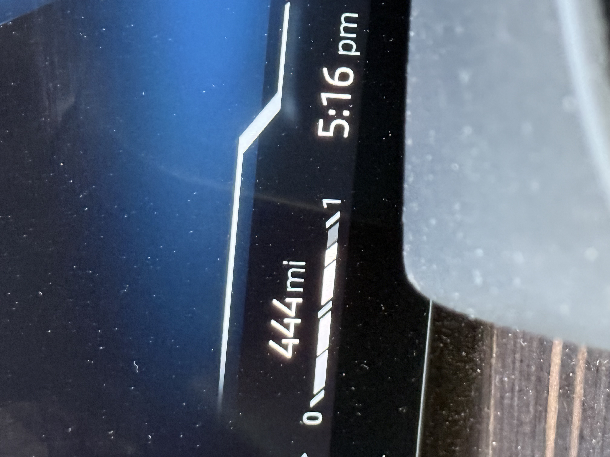
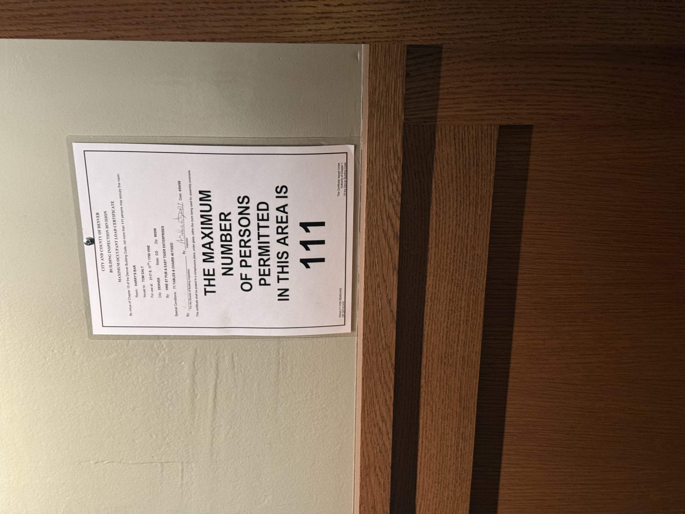

# 20241016

The metal is cold. I'm typing at a sidewalk cafe table. It's 7:58am in Denver, and Boulder is 44 minutes away. The sun is brighter here at a low angle than in Chicago.

<figure><figcaption>
observe, adore, reflect
</figcaption></figure>

Anything can happen in any way.

I don't typically stop people. Or start people. I prefer seeing people experience the physical results of their actions, without involving abstractions like "oh someone intervenes if I do this".

"Adult" and "child" are a bit of a false dichotomy. Useful for sure, but also useful to recall that every adult has a kid at their core. Also, every kid is carrying around the genetic memory of a million generations, so, you know.

AI-first is the new mobile-first, maybe? Or, maybe better, what I'm seeing is "aliveness-first"?

Dada (ohhh fascinating, I meant _data_) and presence are different things. You can pretty effectively think about data-loading and presence-loading as the two ways that living things _experience_. And it's mostly just the difference between treating the thing before you as a consciousness you are connecting with and treating it as a swappable object in a countable series of objects.

I don't think countable things can ever save you.

Intuition is specialized. Dad knows how many potatoes a field holds. Matt knows when a cold call will actually instantly become a warm call. Everyone's got something. Determine where your intuition is specialized (you can always scan around for another specialty later, you have more than one), and start organizing your life using the information from that sense.

***

"The unknown is a black box algorithm."

<figure><figcaption></figcaption></figure>

When you (A) observe consciousness in another (B), it's an illusion (per [The Model](../../07/22/the-model.md)). A nanosecond (figuratively) later, you'll be looking through their face, back at the context you observed from a nanosecond before.

Now: there are (C) forms of consciousness that (B) will be able to see that (A) cannot. (A) will never be able to interact with (C). But, (A) can improve its model of (B) by understanding what (B) says about its relationships to (C).

For (A) to experience a world that is well, it must experience change as enjoyable, and experience (B) to be experiencing change as enjoyable.

We already know that (A) and (C) cannot observe each other. They can only infer the existence of the other. They may choose to create a relationship through that inference, thus stabilizing the connection between a particular (A) and a particular (C).

The Known is the home of consciousness. It is that which you consider to be stable. Doesn't have to be physical. Just _something_ that you consider to be stable.

The Knowable zones are fuzzy. Everyone you know is in there. They are exactly as fixed as the details you're keeping an eye on. Let go of details to see change happen.

The Unknown is unknowable. It's what you're doing when you're not looking. The Unknown is in the same mood you are, always. If you're feeling happy, for example, The Unknown will produce whatever you would experience to be the natural result of happiness.

You can tune your experience of the Unknown by (1) choosing your mood deliberately, and (2) routing the Unknown through deliberately-shaped channels of Knowable.

***

Ads win every time.

Organic wins when you pull time out of the equation.

***

If you're aiming for a specific outcome, and you believe it's improbable, design an experience for yourself that involves enough rounds/reps/tests that an _isolated_ success out of that test group is probable.

You get what you expect.

If you want an improbable outcome, adjust the experiment.

At this point, I'm just expecting that The Unknown will yield stuff that I enjoy working with.

Things are going really well.

***

Try thinking about yourself as a playable character, played by .. whatever's comfortable to you. Your higher self, your own soul, the ancestors, whatever.

Try thinking about your feelings as the controller activity of the player. Your player presses the anger button, you feel angry. Your player presses the boredom button, you feel boredom. Your player presses the "wtf why do I suddenly want to go to brazil" button and you _feel_ that way and then you get to make a choice.

What do you think your player is going for?

Want to find out what they wanted to go to Brazil for?

***


shared this in [Mechanic's community Slack workspace](https://slack.mechanic.dev/)


I’m really careful about which problems I choose to solve. I don’t even think about it that way, honestly — it’s more like being really careful about where I want to live, knowing that I’ll have to take care of it _as my own home_ in order to live there happily.

this is why I’ve only built Locksmith and Mechanic for Shopify (and not any others), and why Locksmith and Mechanic have very simply defined core ideas (and why we don’t add more ideas to those cores).

take what’s useful, leave the rest :) sharing in case it’s helpful

***

I clicked ["I'm feeling lucky"](https://lucky.isaacbowen.com/).

It took me to [20240219](../../02/19/).

Alignment is very clean right now.

As I wrote that last line, I overheard someone say "make disciples of all nations".

I'm not taking us there. But that might be where I'm going.

***

## 4:44pm

I think what I’m looking at here is a model for the process of living that works for both the artist and the engineer

because I am both types, equally

the world I observe could use a model that works for both perspectives

I _actually_ cannot be the one to propagate the model. I’m just here to describe it.

ohhhh. I have to ask. that’s the part I had to learn.

will you help me?

and do you _want_ to?

... this is _absolutely_ political.

[I have been thinking about that.](../../08/19.md)

ohh shit

I see a future where this is the next political platform. it’s like a non-party. the non-party party. the first-party party?

a political party that isn’t running for office

that is a real place in experience-space, the experience of a world where _that_ exists

and I’m the priest of ai lolololol oh noooooooooooo

a non-leader leader

the world does feel tired of leader leaders

***

She said, "I wanted to run for president when I was in high school".

***

I have one of [these non-reversing mirrors](https://www.amazon.com/Realme-Non-Reversing-Reflection-Non-Magnifying-Rectangular/dp/B09KV34BTZ?th=1), and I brought it on this trip as an experiential element for the all-day meeting we had today. (I also brought a few other little physicalities, little curiosities of physical form, and asked everyone to pick one and just kinda hold it during the meeting.)

I realized today that I don't have any strange reactions when I look at myself in it anymore. Feels important.

***

<figure><figcaption></figcaption></figure>

 

<figure><figcaption></figcaption></figure>

***

a chicken lays its first egg ever. it’s very excited. not super sure what it means yet but it’s super excited.

the tree overhead notices

it shakes free a few pinecones

it wonders if the chicken will like those

(the chicken does not, but it isn’t sure why. those objects are shaped about the same as the egg, but why isn't the same feeling lighting up? the chicken is unsure.)

_aliveness looks different to each of us._ something that looks and feels alive to me _might not feel that way to you at all_. if I’m working on building my experience aliveness, I gotta be really mindful about working with people with matching senses of aliveness.

and there are forms of aliveness to which we are blind. that’s super important. aliveness may be present for someone else, but not for you. it’s useful to build with what other people tell you about their senses of aliveness.

***

Tomorrow's a full moon. :)

Today we're at Vine Street, a brewpub in Denver that's been closed since the pandemic. They reopened this year. The Vine Street we're experiencing now feels ... newly alive?

The energy feels new. Like a threshold's been passed. I feel like spending all day meeting with a marketing group _and coming out feeling unstressed and also generally amazing_ is hugely significant in light of my history. Autism and stuff.

A friend just called to say that they'd met someone who knows Abe and me. It's not someone Abe remembers; the name sounded familiar to me. But in Abe's chuckling at his own forgetfulness (reader, he is _known_ for remembering thousands of people), I read an indirect signal that we may be in a new resonant phase.

We're all dancing through each other's lives. :) The trick is to see that all of life can look like the dance of my people, while hearing from everyone else that it feels like a totally different dance. The trick is to let it all be true, and just keep dancing your own dance.

***

working simply. avoiding unnecessary process. investing hyper-selectively in the tools. living rich. embracing unnecessary exploration. investing gratuitously in the pleasures.

***

everything struggles to its feet eventually

you can help, if you want

***

growing or healing

you can do one at a time

***

the whole deal is one of figuring out where you are internally and then dealing with that information

once you’ve dealt with it you can take a few rounds to just grow :) expand and explore

at some point you will realize you don’t know where you are internally anymore

you then deal with that information

***

if you suddenly woke up standing in a park with a bunch of pedestrians wandering through, with an unexpected thing in the center

no one is reacting to it from what you can tell

do you ignore it? or no?

***


