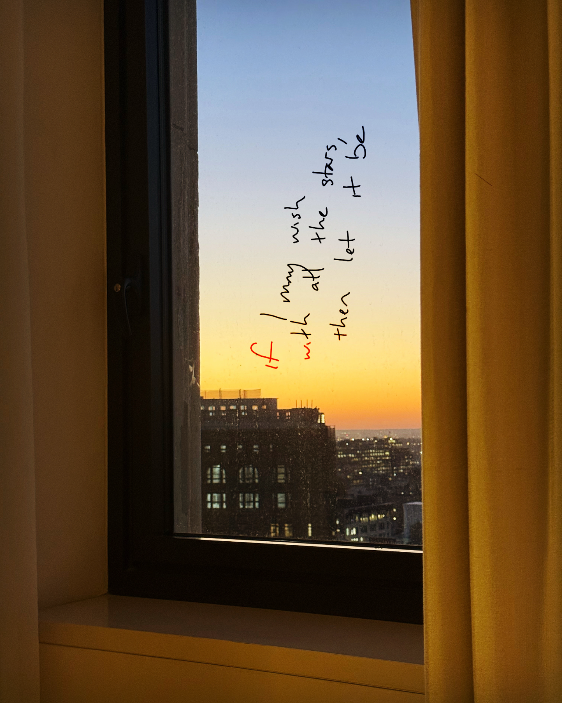

# 20241022

I am Tom Bombadil and Mary Poppins. :)

I can feel the song of creation.

Incredibly rare for that song to involve anything like a solo, anywhere but in private. Even within an orchestra section, it's rare for a single player to lead the part, letting all the others take a breath.

I'm not here to be a soloist. I'm here to play the music, with all of you. :) Don't expect me to play a solo. Don't expect me to play anything at all. ;) Or do, if you want. You can read your music off of anything at all. You can like me or hate me or ignore me, and you'll be getting exactly what you need for what's yours, for your own notes to play.

Creative freedom is what emerges when you no longer need to read the music.

There are a million ways to learn this.

You only need yours. :) You'll find it wherever you are. :)

I have the heart of Thor, and the ass of Captain America.

My musical signature is C5 B4 G4.

My _time signature_ is subject to interpretation.

I'm not playing my own song. I'm joining y'all in the song of all of you. :) Doesn't mean you won't be able to hear me here. But remember that whatever you hear from me is made for the context you hear it in. I'm in there, if you listen closely.

I also might not be. Don't worry about it. ;)

... But I do have a solo or two coming up, I think. 🤩

<figure><figcaption></figcaption></figure>

 

<figure><figcaption></figcaption></figure>

