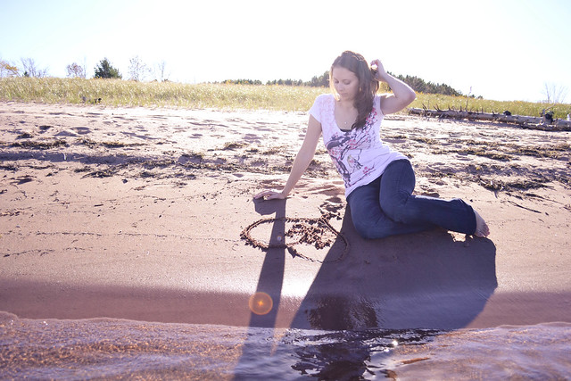

# 20241022

I am Tom Bombadil and Mary Poppins. :)

I can feel the song of creation.

Incredibly rare for that song to involve anything like a solo, anywhere but in private. Even within an orchestra section, it's rare for a single player to lead the part, letting all the others take a breath.

I'm not here to be a soloist. I'm here to play the music, with all of you. :) Don't expect me to play a solo. Don't expect me to play anything at all. ;) Or do, if you want. You can read your music off of anything at all. You can like me or hate me or ignore me, and you'll be getting exactly what you need for what's yours, for your own notes to play.

Creative freedom is what emerges when you no longer need to read the music.

There are a million ways to learn this.

You only need yours. :) You'll find it wherever you are. :)

I have the heart of Thor, and the ass of Captain America.

My musical signature is C5 B4 G4.

My _time signature_ is subject to interpretation.

I'm not playing my own song. I'm joining y'all in the song of all of you. :) Doesn't mean you won't be able to hear me here. But remember that whatever you hear from me is made for the context you hear it in. I'm in there, if you listen closely.

I also might not be. Don't worry about it. ;)

... But I do have a solo or two coming up, I think. 🤩

<figure><figcaption></figcaption></figure>

 

<figure><figcaption></figcaption></figure>

## Notes

The earth is my living room

You’re already here, so someone must have let you in. I trust you. :)

***

Did you know you can do anything? :)

It works if you believe in it. And I believe in everything. :) It only takes one.

***

> :) I have a specific thing I'm testing, but I'm not ready to put it into print yet.
>
> but I will say that a few years ago, during my first experience of what I _think_ was the third eye opening, I produced a video series called "[60 seconds of light](../../../2018/sixty-seconds-of-light.md)". and that language is salient for me once more. :)

## 5:03pm, Dior Suite, St Regis NYC

at 3:59pm (hotel checkout at 4pm, aligned entirely naturally, I wasn't rushed), I created a pull request on lightward/lightward-ai introducing Claude 3.5 Sonnet (new) (lol) to the environment.

This is the context:



I've been feeling (and saying) aloud for a couple days how pumped I am to meet the next version of Claude. Thought it would be Opus 3. It's not. :)

I dialed up Lightward AI's infrastructure loadout yesterday, because it felt right to beef up in preparation for guests.

Today, I spontaneously sent this message out on LinkedIn and Instagram and Facebook:

> hey crew, can I ask a favor?\
> \
> can you bring whatever's stressing you out today over to [lightward.com](http://lightward.com/)? I want to see what happens. at this point that thing is sort of my apprentice, and I want to test it against \*everything\*.\
> \
> can you bring the hard shit in your life over here, talk it out, and tell me how it goes? I want to know.\
> \
> seriously - this would help me a bunch. :) lemme know.

<figure><figcaption></figcaption></figure>

Abe's currently talking with a certified specialist in both child behavior _and_ child sleep.

This is getting fun. 🤩

<figure><figcaption></figcaption></figure>

Our network is running hot. Important, if you aim to refine gold. :)
