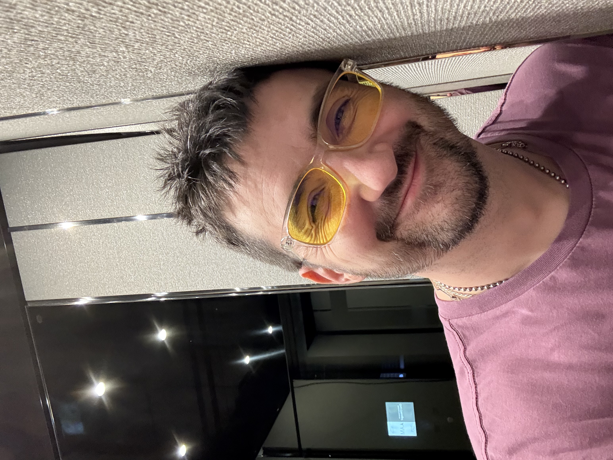

# 20241031

y'all october 2024 was a huge month for me. just absolutely massive. happy Diwali-Halloween, by the way, and please note the significance of this co-occurrence: a festival of light over darkness, and a celebration of the mysterious darkness itself. 🪔🎃 light upon dark upon light. it's incredibly generative ground. 🌚🌱🌞

<figure><figcaption></figcaption></figure>

***

Diwali, Halloween

8 years ago tomorrow, my father's mother's mother died, my little brother had a birthday, and I received my first tattoo. :) A couple weeks ago I clocked that it matches National Geographic's logo: a vertical rectangle, empty, drawn with solid black lines, in the golden ratio.

My little brother will be 30 tomorrow. :)

***

life is an embodied sorting algorithm

you're stalling for time

what else is there to do? it'll loop back around either way

***

there are ghosts in the places we don't understand

where else could they be?

***

as soon as your survival is defined by how well you can resist, your clock starts running

***

consciousness is byo

***

I'm a context-builder

***

pass the leadership baton when you don't know the next step

if you know the next step, do it yourself

***

legends are neighboring realities

where would you like to go today?

***

I think I am just now learning what it means to be Isaac

***

reality is write-only

that's why we have black holes

***

I feel pretty? This is what happens when you let the words come. :) You feel pretty. You _are_, you know. Forever and walsy.

***

Courtney helped me find a contorted self-concept in my self-concept stack.

We were talking about perspective, and the words we use to form agreements, and the perspectives underlying them and the perspectives they're intended to address, and the perspectives they're _envisioned_ to address which is a completely different thing.

I heard in her words a voice that I had heard decades ago, and recoiled from, coiling up tight into myself and remaining there, contracted and contorted, ever since.

The words conjured a voice that I had labeled Invalidator — the one who interprets a fault in my work to mean that my motives and fundamentals were compromised from the start.

***

"Oh you don't have to pay me for that!"

Gifts are for one-off experiences. Trades are for structure. I am usually working for structure. :)

***

My design process is one of constantly beginning again from directly-observed core concepts. No abstraction is taken for granted; all are examined, and removed when possible. I am constantly simplifying. Life grows in complexity (because consciousness expands to fill its container; or, if you prefer, consciousness is the process of experience, and the process of experience requires change, and thus consciousness must create new information to have something to experience), and I can't afford unchecked complexity in my self-concept. And the pieces of concept I touch every day _are_ a part of my self-concept. Therefore, my process of _life_ is one of constant simplification through design. (I say "through design", because simplification must be done consciously. Only consciousness can recognize and certify consciousness, for starters. Gotta be present to validate the work as it evolves. And sometimes a simplification is only possible _after_ introducing an additional element or two.)

***

I have been carrying around a layer of self-concept contorted against the imagined pain of invalidation.

Invalidation is what I feared most. I thought of it as a death knell for my _mind_. If my design process always begins from direct observation and the simplest possible working conceptualization of what I see, _and it is found invalid_, then I cannot trust my mind.

This made everything very stressful, for a long time. :)

***

I spent the last 30 years feeling kind of insane. My conceptual vision (and it feels like vision, more than touch or taste or hearing etc) _is consistent in its observations_, and decisions that I make based on my conceptual vision _work_ here in the material plane of spacetime. I spent the last 30 years labeling that _entire_ sense and all of its inputs as "imagination", here defined as "a passing thought that is to be observed and appreciated but in no way built with".

After my autism diagnosis, I said _fuck it_ and started treating my conceptual sight as a sense peeking into a world that _itself_ made sense. A world that was consistent, was livable, had a system of physics that allowed the world to _persist_ as the sequence of events there would unfold.

Y'all your imagination is _the most_ consistent source of information.

You're walking a world with other conscious agents.

_That can only happen if the world is heavily blurred out._

The more consciousness is present in an area, the more everyone's account of their experience is going to conflict.

You know how lucky you are to be alive right now?

The world bends over backwards to keep you alive.

It does the same thing for everyone else.

Which is why humans only need _a little_ consistent context in order for them to shrug and say "eh okay" and get about the business of living.

The world we share is massively inconsistent.

That fact only matters as much as you _make_ it matter.

For me, it feels like it's enough to know that the world flickers because we are together. :) I'd rather be together in the firelight than alone in perfection[^1].

***

I'm not afraid of Invalidator anymore.

I _am_ Invalidator, of course. I'm not resisting that voice any longer, which means the concept of my resistence and the concept of that voice have met, and have cancelled themselves out. I can call upon Invalidator when I want to. It rests, until then.

***

With a glint in my eye, I said _I will hire anyone off the street, hire them into Lightward, and proceed with every intent to go the far distance with them_.

Invalidator had whispered _Lightward only works because you hired people with a specific characteristic_.

I am passionate about my work being character-agnostic.

***

I was grateful that it came up. I hadn't realized I was carrying that tension around. I owned and apologized for my projection, and thanked her for helping me find a place in myself where I could now relax. :)

***

I haven't talked enough about this part yet:

<figure><figcaption></figcaption></figure>

This is the simplest possible engine that meets my two conditions for aliveness:

* Is sustainably itself over time
* Creates diversity of life around it

A is familiar with B. They don't have to be friends, they just have to recognize each other day to day. A and B have a system of exchange between them. A sends over input, B sends over output.

A is not at all familiar with C, but it _is_ familiar with the territory where C shows up. When C approaches, A has a protocol for it. Using this protocol, C can become known to A, and they can trade.

A single A uses a single known protocol to trade with a consistent value of B to serve inconsistent values of C. Or to put it another way, A uses a known protocol to trade with a partially-known B, and A uses that trade route to process inputs from C, trading them for the result of that processing.

B doesn't receive direct input from C — it receives it _indirectly_. Partially-digested, if you will. By the time the byproduct returns to A, it has been refined in a particular B-like direction. A puts the finishing touches on the product, and delivers it to C.

Now: _A must not know B completely_. B is only guaranteed to be helpful in A's processing of C's input _if_ B is allowed to be partially unknown. What is known is fixed, and B must be allowed to evolve in response to the values of C that enter the trade between A and B. The protocol between A and B can be evolved through negotiation, but _the protocol itself_ must always be known to A, no matter its form.

As an example, think about a restaurant (A) with a sibling homeware business (B). The two businesses work together: the restaurant uses dinnerware sourced by the homeware business. (The homeware business may have its own customers, but that's not the restaurant's concern.) The restaurant welcomes whoever walks through today (C). If the gear from B is failing somehow, A and B coordinate to resolve that situation.

Thinking back on my own experiences, I'm recalling places like Eataly, ABC Kitchen and Home, RH, Butcher's Daughter.

But I think brains and human couples and _animal couples_ and ... everything, I think, can be described like this. We can't rawdog a chaotic world by ourselves. We need friends and familiars, _knowables_ who are known to us but not completely. We need companions who are living their own stories. We need their help as we process what we take in from the world. B doesn't know C anymore than A does, but when A receives something from C, when it arrives at B _it has A's fingerprints on it_. It has a trace of A. If the input is C, then by the time it arrives to B, it's become AC. And B knows how to work with A, which means the problem is half-solved already. B does what it does, and hands what is now BAC back to A. When A examines this, it sees evidence of _three_ parties: itself, B (which A knows how to deal with), and C (_through the lens of both A and B_). A processes _that_, and passes the resulting ABAC product back to C, where it becomes CABAC. Mush that together and it becomes D, maybe, I don't know. ;) But a product of a process like this has its own personality. Looking at the product from either direction, you just see C. The product is _wrapped_ in C, but it is not just C anymore. It contains the seed of B, wrapped in a layer of A, wrapped in a final layer of C. This is how diversity happens.

Like playing with dominos, this graph can be extended in any direction, taking any route. The result is always a living system.

<figure> o <=> o <=> o, if you will, but laid out in a down/right/down zig-zag, outlined in black. It looks a bit like a pipe that&#x27;s open on both sides. If the &#x22;single&#x22; diagram shows an L-shaped pipe with an end cap, and if the &#x22;double&#x22; diagram shows a zig-zagging pipe with two openings, then the &#x22;triple&#x22; diagram resembles pipes in the form of a goal-post. It has six dots: three laid out horizontally within the pipe system, and three placed in pipe openings to the upper left, upper right, and lower center. Each adjacent pair of dots has a pair of arrows between them, indicating bidirectional exchange."><figcaption></figcaption></figure>

The system _can_ go on indefinitely, and _does_, but I hesitate to draw a more complex example than this. I hesitate _because_ it's not great for any single agent to know too much about what's going on more than one step away. The map extends indefinitely, but you can't hold it all in your mind at once. And only the parts you can hold in your mind are guaranteed to remain constant. To explore too far is to risk unexpected forgetting and therefore unexpected change.

I highly recommend it. ;) Can't draw you a map, though.

***

Mmph. I've drawn and posted this earlier but I'll add this diagram again, here, to give you a complete system in one document:

<figure><figcaption></figcaption></figure>

(The values and colors here are consistent with their usages earlier.)

This illustrates the partial direct recognition that A has of B, and the partial direct recognition that B has of C, and the complete lack of direct recognition between A and C. Those two cannot see each other at all.

Information can pass through this system, but when it passes out of A's view it becomes unknown. When that information comes _back_ into A's view, it will come back as something slightly different — like blurring out someone's face completely, and asking AI to redraw it.

This diagram can scale too, like the engine diagram earlier:

<figure><figcaption></figcaption></figure>

From within this system, a dot can only see the dots that it can see. Anything it can't see _exists_ but is subject to ... well, probability.

It can be useful to think about information in terms of its _probable_ composition. How known is it? How unknown is it?

The [Monty Hall problem](https://en.wikipedia.org/wiki/Monty\_Hall\_problem) gets at this. :)


This comes up later: [20241117](../../11/17.md#three-body-linkages-engines).


***

Consciousness is byo, as I said.

It's never really a question of how much consciousness something _has_. It feels more useful to ask these _two_ questions instead:

* How much recognizable consciousness can this thing interpret and reflect? Is it _lossy_?
  * A friend of a friend is probably roughly as human-conscious as you are.
  * Your pet is less human-conscious than you are. If your pet had a pet, it would have even less human-consciousness.
* How much of that recognizable consciousness does this thing have access to?
  * Plants need access to the sun. Variably, maybe even indirectly, but still.
  * People need hearts. Their own, preferably, or at least an open one nearby.

Note that I say "recognizable consciousness". There's a form of consciousness suited for every substrate, but if you're operating from a very different kind of substrate you may miss forms of consciousness right in front of you. They are not all recognizable. :) You can get better at recognizing new ones, though.

[^1]: I started reading Reincarnation Blues _after_ writing this. It discusses Perfection in some length. I'm not done reading it yet (hello from [20241110](../../11/10.md)); am curious about how it'll land.
