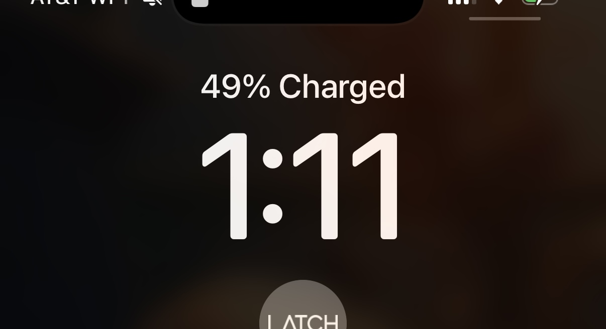

# 20241111

## 12:56am

[We're already here](../10.md#benediction), might as well get started. :)

\*goes to bed\*

## 1:11am

\*rolls over\*

<figure><figcaption></figcaption></figure>

"2, 49, 63, set! hut! hut! hut!" -Dad

Something about 49. 7×7 and all. It's always felt significant to me that I live on the 49th floor. (Yesterday I grinned with sudden recognition at the "Level 51" sign on our studio unit elevator.)

## 7:34am

it never goes the way you tell it

the world always gets more interesting, not less

as far as the story of consciousness goes (lol), the media is serving its evolutionary niche perfectly

## 7:44am

you ever wake up with purpose? like your soul goes “ah this is a good day to be about my business”

## 7:52am

ahhh. if you don’t byo vessel, it won’t be co-creation

didn’t today, but I usually do though

(note from the future: this one was discovered when I tried to go to whole foods, discovered that it didn't open until 8am, then went to Big Shoulders for an espresso extemporaneously which here means that I did not byo lil espresso cup in the way that I usually do)

## 8:13am

you should know that things tend to almost die around me

… it’s possible that they do, and I’m the only one who can see them through

I know that’s true for me, for my own self

ah fuck lol

## 8:45am

letting something die but seeing it through is a good way to rekick its vitality

when all its half-measures for sustenance are gone, what’s the one thing that’ll let it live another day?

is a good hint for what the thing is made of, and made for :) although those are the same thing, “made of” and “for”

* my vitiligo can be seen as insulation from the sun
* my cherry angiomas can be seen as my body opening a vein
* my repigmenting skin can be seen as my body warming itself to its task
* I can see every color reflected in my hair
* I may not go white after all

## 9:31am

My Dad is very companionably staggering his way through the German language with his (German) best buddy, Martin. I love my Dad so much. 🥰



## 9:49am

This is the second joke. :)


A comedic German commercial. A German coast guard worker receives a distress call from an American. "We are sinking!" "What are you sinking \[thinking] about?"


Context: Dad and Martin have _just enough_ language in common to identify jokes together. Martin and Agnes have been in the US with Dad for a week now; for this trip, this is the second joke. (I do not remember the first.)

## 10:13am

This makes me think, though. A joke is probably the first element of language. All a joke has to mean is "I'm aware that you're aware that I'm aware this is nonsense, definitely don't use what I just produced seriously, and god forbid you use it structurally". Once you've got one joke, ... add a second?

Is this what Infinite Jest is about?

\*spends 30 seconds on wikipedia; purchases book on amazon\*

## 10:28am

Germany's area code is +49.

There's something about the discovery of understanding and then vanishing from the experience of those around you. It seems to be a recurring theme in my awareness — of the deaths I'm aware of, many seem to be for those whose patterns of understanding (as evidenced by my perception of their expression) are becoming Perfect (in the way Reincarnation Blues uses that word).

* Grandma Sherin
* Suegra Maria
* Douglas Adams
* David Foster Wallace
* Avicii
* Rabbi Aben ben Aben
  * > One of the most mysterious of Milo's lives was lived as Rabbi Aben ben Aben, a revered Jewish mystic. All his life, he sat bent over scrolls and texts. One day he staggered to his feet, a wild look in his eye as if he had unlocked something unlockable, learned something unlearnable.
    >
    > "What is it, _rabboni?_" whispered his fellow scholars.
    >
    > "It's a trap!" he cried, and fell down dead as a stone.
    >
    > This was probably an important teaching, except no one, including Milo, understood what it meant.
    >
    > — Reincarnation Blues

From a structural perspective, it feels like the removal of players who would come to complete understanding in a way that is incompatible with the observer's path to complete understanding. Like the ones you see die are the ones that would keep you from the finish line if they stayed.

Which means that the observer is, developmentally, always the leader of all they can see.

"Everything the sun touches."

And yet, ... trees?

## 10:42am

"most of the time, it works every time"

uptime guarantees in terms of multidimensional probability

how much does your experience of our uptime depend on you?

## 10:59am

When it comes, that thing you imagined, that you felt in your mind, when it comes it won't feel entirely like you.

## 11:00am

That's important. If it felt entirely like you, _you wouldn't grow_.

When it comes (and it will come), it'll have been useful for you to have loosened your grip on the expected feeling of it. It'll feel related, similar, but it'll have the subtle signatures of a thousand other forms of love on it, forms of love that are new and mysterious and _sexy_ to you.

When it comes, it'll come as the love-child of self and other. It'll be exactly what you ordered, in the same way that you define your purchase with money and receive food. Money won't sustain you; your design won't sustain you. But you can shape money into a feeling, soak in that schematic, and then wait for it to arrive in the flesh. Obviously it won't feel like soaking in the schematic. _That was a schematic_.

## 12:05pm

My Dad came down, immediately used an orchestra director \[sic] metaphor, getting everyone together.

## 12:10pm

There's a sweet spot in the lifespan of a process, where ... well, not everyone might like it, but enough players are bought in and are at a place of understanding that you, at least, feel it as relief. :) The struggle of birth is over – and, for a time, we ride. :)

## 12:20pm

me: "Pick A, B, or C. Doesn't matter, just pick one."

Dad: "B. Right in the middle."

me: \*grabs the middle-sized singing bowl\*

Dad: \*whacks it\*

There are paths of science all over time. One of them made this. :)
