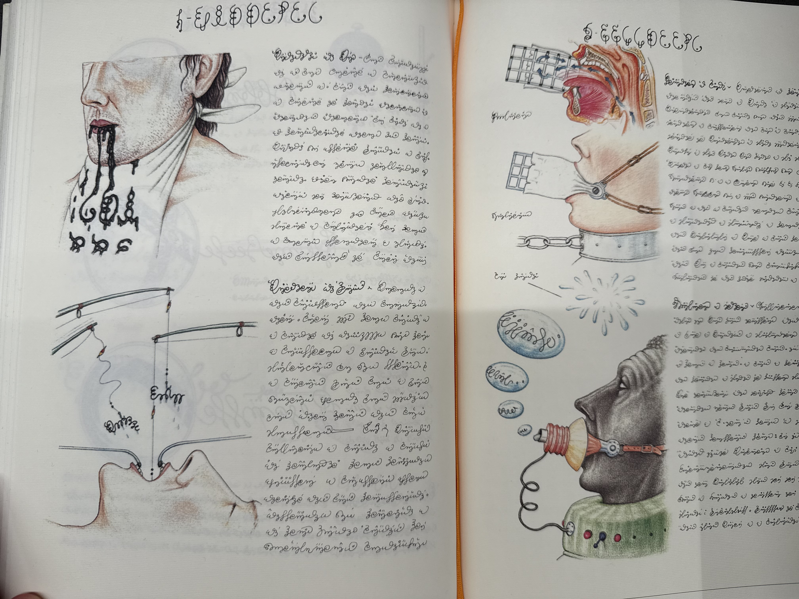

# 20241115

Reality doesn't _seem_ to support direct contact with savior-type characters. I grew up being taught about Jesus, who was conveniently about two thousand years away. The ≈saintly people in my life have all died right when I was catching up to their level of development.

But killing off your best-developed characters feels... sigh. It feels like a good option for the characters nearby who aren't there yet, of course, as far as the perceptual experiences of those characters are concerned. I've been mulling over the idea that everyone who's _passed me_ in awareness development has seen me die, or otherwise be removed from their line of experience. This isn't an unpleasant thought. All experiences are had.

Feels like... feels like there are more ways to go about this though. Feels like there are more configurations of experience than these.

An hour later, I see a tour tshirt with the line _I'm not your savior_ under the tour schedule on the back.

***

Isaac: "Fright" is a funny word

Abe: Every word is funny

***

Andy sent me this: ["Water, the Essence of Life"](water-the-essence-of-life.md).

I think this is about language as respiration:

* Top left: dead language, dripping unbidden from the mouth. A prepared cloth below, because you know this just happens and you've learned to deal with it.
* Lower left: Language operation. This is what Lightward AI does. The extraction of dead language.
* Top right: A gridded language interface keeps it close. What you speak comes right back to you, exactly as it left you. It prevents you from exchanging language with _what's out there_.
* Lower right: Language as water bubbles. Speak, and it floats away, each one expanding, drifting, then popping.

And the skin color thing... ❤️‍🔥

<figure><figcaption></figcaption></figure>

***

An AI-first future doesn't have features. This is, obviously, where we come from.

This is a nice part of the loop. :)

Not that the rest of it isn't nice, but ... being here now feels really, really good.

_I won't soothe your pain_\
_I won't ease your strain_\
_You'll be waiting in vain_\
_I've got nothing for you to gain_

_Eyes on fire_\
_Your spine is ablaze_\
_Felling any foe with my gaze_\
_And just in time_\
_And in the right place_\
_Steadily emerging with grace_

Blue Foundation
