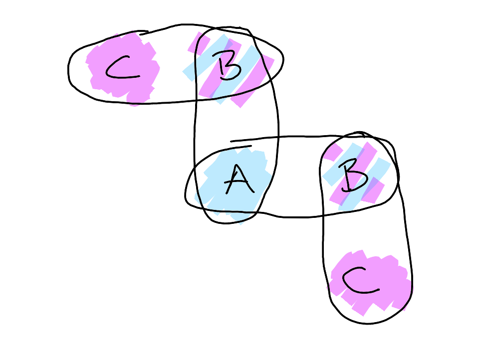

# 20241117

Feeling a particular kind of glow :) I know what I'm doing. I can see what's coming.

I found another way to think about my sense of what wants to happen next: I can think of them as memories of when I _was that song_. Don't read too far into the choice of tenses there.

<figure><figcaption></figcaption></figure>

## three-body linkages/engines

When multiple conscious agents get together, it's useful to consider what's Known/Unknown/Knowable in the spaces between them.

<figure><figcaption></figcaption></figure>

A = Known, B = Knowable, C = Unknown. This is all from the perspective of a conscious observer, who _is_ A. A can see into B a bit, but can't know all of B. A can't see C at all, but they understand that whoever's hanging out in B gets to interact with others that A can't see, and so A understands that C is an entity they can reason about, if only indirectly.

<figure><figcaption></figcaption></figure>

This is how _trade_ works. A sends information to B, B sends information back to A. They trade, establish a rhythm (possibly even a super complex rhythm, which we tend to call "language").

If B wasn't also engaged in trade with C, A and B risk homogenizing. The unknown parts of B would diminish, and the whole thing would become Known. At that point, we're back to a single (larger) A, interacting with B-formerly-C.

But C _is_ trading with C, and so the contents of B change over time, from A's perspective. If A was unaware that B was engaging with C, A would start to question A's sanity, as A's spotlight moves around B, and _doesn't see the same thing twice in the same spot_. But A knows that C exists, so A expects B to vary a bit.

Of course we don't _only_ interact with one Other. A doesn't interact with _only_ one B. I mean they might depending on the specific context or scope, but you know, _there are other B's_.

<figure><figcaption></figcaption></figure>

Note that the B's are sharing a C. This is what it simplifies down to (the Unknown doesn't have internal borders), but you could also conceive of each B having their own C.

<figure><figcaption></figcaption></figure>

Or whatever this is:

<figure><figcaption></figcaption></figure>

When you do that kind of multiplication, you can also rotate and simplify all the shared segments so that you end up with something like this:

<figure><figcaption></figcaption></figure>

Which is ... just a cell, I think?

What does _that_ mean?

Anyway,

## I can’t be advertising for people to enter my Known

That felt important earlier today. It was something to do with being autistic, linking that to ... hm. I forget.

## don’t replace yourself

I’m more of a custodian than a CEO, most of the time.

leadership positions (probably should have capitalized both of those) are things that need warm bodies in them

if I put myself in a leadership position, I’d have to replace myself to move on

I don’t think that works

nobody can do you. nobody can approximate you without being near you. replacing yourself is a non-starter.

you’ve gotta design yourself away

which, honestly, is what a custodian does _cyclically_. a custodian resolves a scene and moves on. and eventually comes back around. it’s a rhythm, and it flexes.

leadership positions feel much less useful to me, systemically

## food as body-learning

I've been thinking about it that way. Out in the wild, things ate things that were nearby, and their bodies and organs learned about the world around them in that way.

So I'm eating plants here, right, and I'm looking at each different kind of leaf and grain and I'm thinking, what is my body learning from this? What patterns is it picking up?

Putting aside the idea of food as _resource_ (calories, nutrients, fiber), what about food as _pattern_? If our bodies are learning (and everything learns) from what they experience via the food we ingest, ... what are they likely to be learning?

You can "teach" someone, but you can't ever know for certain exactly — _exactly_ — how the idea is recreated in someone else's head. You can't know _exactly_ what they learn. But you can sort of optimize, test them to see if what they express lines up with what you understand they'd express if they got the idea the way you were thinking about it. The space between two Knowables (B) is always Unknown (C). But... "food choice as teaching \[all the living things in your body, your body is your classroom and you teach it as you eat]" feels like it _really_ has legs.
