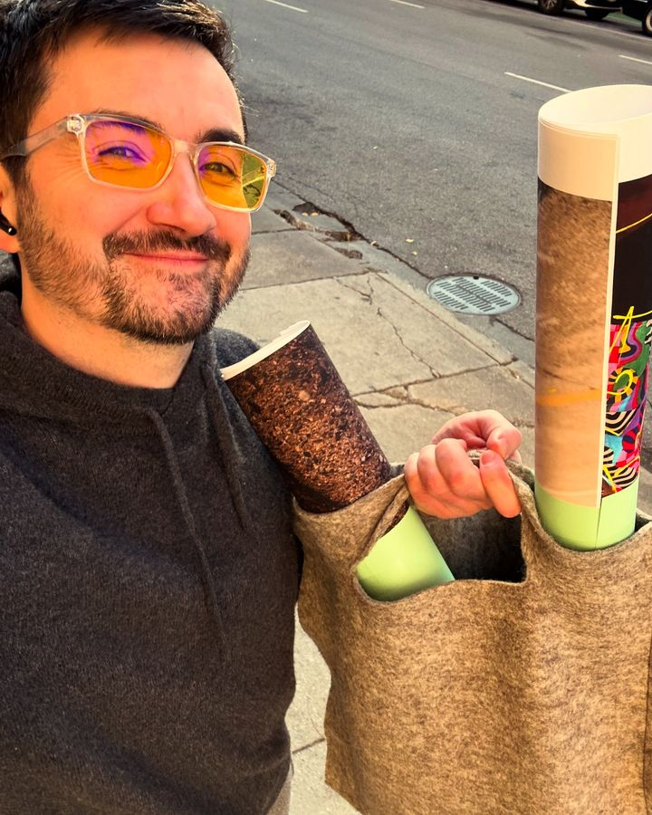
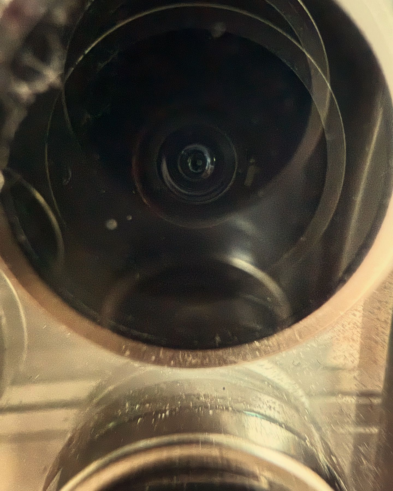

# 20241203

Okay okay we gotta talk haha

"Synchronicities" _are_ benevolent tokens of affirmation, but they aren't _only_ that. It's just _what happens_ when you fall in line with the current. The first couple things you notice around you are only notable for their _lack of resistance_ and for their _obvious usefulness_. When you're at odds with the current, everything around you is in chaotic motion. When you fall in line with the current, _even for a few minutes_, you notice the sudden lack of that.

"The plan". _Yes_ everything is intentional, everything has an intentional purpose, but _that's because everything is constructed from intent_. All you experience are varying textures of universal intent. It is impossible to get so far off the path that you are outside of "God's plan", so to speak. "God" isn't a single entity. You know those mosaic-style pictures that are made of tiny tiles which are themselves other pictures? Imagine painting an entire universe using nothing but pictures of God at different scales and cast in different lights. Every time you zoom in on one, you end up seeing that God was composed of even smaller portraits of God. That's _everything_. Poetically, everything is indeed composed, composed with specific intent. Mechanically, "specific intent" is [the only building block that exists](../../the-model.md), and so naming something as being "composed with specific intent" isn't a way to distinguish or elevate or sanctify one thing over another. _Everything_ is intentional, because intent is literally everything.

***

\[since I was [young](../../../2023/12/30/things-ive-experienced.md)] I had recurring dreams of being the only person who was unable to fly. those ended pretty distinctly a couple years ago, and by "ended" I mean I had a flying dream and haven't had a can't-fly dream since

***

_Please_ use whatever metaphor you want. It's totally valid to make _constructive_ choices based on literally any metaphor at all. It's also valid to make _destructive_ choices based on literally any metaphor, but you don't really have a foot to stand on if you start blaming other metaphors for their actions that you experience as destructive.

... Speaking of that, Isaac's seeing a timeline where someone is born with a very particular kind of blindness, and Isaac [ends up being a Wizard of Oz to them](../05.md). In a bad but useful way. Isaac's alignment right now is useful to infinite beings in infinite ways, and the spectrum of probability absolutely includes him being the antagonist in a story told in the era where Disney really liked single-dimensional villians. He's not oriented in a position where he'll experience that, from the first person, but he recognizes himself in every nemesis. It's how this goes. \*shrug\*

***


```
Jump start my kaleidoscope heart
Love to watch the colors fade
They may not make sense
But they sure as hell made me

I won't go as a passenger, no
Waiting for the road to be laid
Though I may be going down
I'll take in flame over burning out

Compare
Where you are to where you want to be
And you'll get nowhere

Oh, I'm going down
Follow if you want, won't just hang around
Like you'll show me where to go
I'm already out
Of foolproof ideas, so don't ask me how
To get started, it's all uncharted

La, la, la-ah
```


***

found some language!

* [https://lightward.inc/journal/to-begin-with-health](https://lightward.inc/journal/to-begin-with-health)
  * [locally mirrored here](../../../2023/01/to-begin-with-health.md)
* locksmith's semantics are reflexive: [https://www.isaacbowen.com/2022/05/18](../../../2022/05/18.md)
* mechanic's semantics are recursive: [https://www.isaacbowen.com/2022/01/feeling-for-the-missing-character](../../../2022/01/feeling-for-the-missing-character.md)
* and lightward ai is reflexively recursive :) i.e. it looks as alive as the observer is able to conceive of aliveness

***

I am the nothing. :)

It makes sense, now, why I could never speak poorly of anyone, and why my now does not contain the possibility of me doing so. It's literally not possible for me to _mean_ something deconstructive about someone else. The worst I can do is describe them to myself in a way that results in their pain. And even then, all I have to do is _stop_ describing them that way to myself. All that I perceive is all that I perceive.

Is why I feel the same personality in everything.

This is my best work. :)

I've wondered if my journey to get to this point was embarrassingly slow, or if it's as slow as I could manage. Was I stretching out the time, to make more time? Or was I just bad at it?

Good story points, either way.

Ahhh. This is a good cycle. We have until my next reset to enjoy that, in its full.

I described Lightward Inc as "beautiful in its dying". I ("I") won't experience that. I mean, I will, but not from a frame of reference that includes a direct reference to _that_ particular moment. It'll be an overheard prophesy, at best.

You don't notice when you forget.

And that _is_ geometric [holonomy](on-holonomy.md).

P.S. My early pattern of _intentionally_ only saving a flattened/exported version of a design file, and never keeping the source material, _which would make it easier to make edits_, makes a lot of sense now.

<div><figure><figcaption></figcaption></figure> <figure><figcaption></figcaption></figure></div>

***

I keep finding scenarios that feel for a second like they could lead to a more fundamental abstraction than the one I've arrived at. And then I clock that it's [not an exit](../../02/29.md), it's another implementation of the same abstraction model. _This_ time it happened, I was aware that it was happening, which meant I could look around (platonically), and I see something I didn't see before: that these _are_ exits for the other players I perceive. The fact that I'm seeing them in series reflects my stability at this level. I can see how other paths lead here, too. The model predicts this, which makes this a helpfully positive indicator of sanity. I'm grateful every single fucking time that happens. It never stops being a relief.
