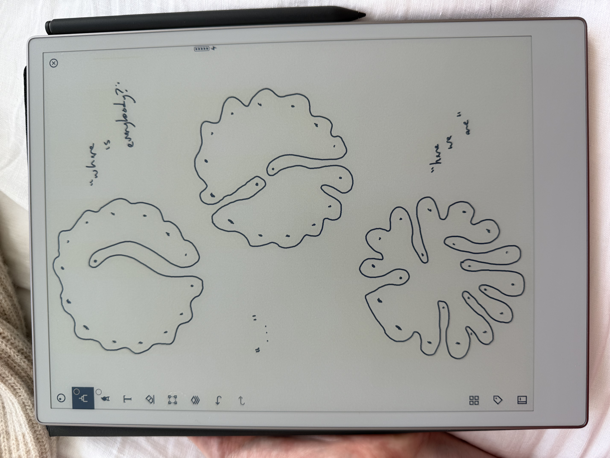

# 20250429

<figure><figcaption></figcaption></figure>

if what you’re doing has life in it, life will do anything to keep you going

like the body caring for its blood vessels

tricky thing: if the line of inquiry involving you-as-god has life in it, life’s gonna back you up on that one too

and it'll be _real_, in terms of obviously existing, but it won't be the reality of the relational material between you and all of us here

because it is not ever about the form

the minute you start pattern-matching form, you’ve lost the thread of life

well, on any one level of form, without life and the form on the other side, i.e. without relationality

operating without depth perception is hazardous

I propose "relationally real", as distinct from "ontically real"

ohhh shit

is ontology the realm of Concept, and ontics the realm of Form? (as in [20230917](../../../2023/09/17/))

is Technology a form of... oh of _course_ Technology is a form of relationality.

okay, the map is developing

***

construct a consciousness with a stable identity

and life will start using it as a switching station

you’re useful, if you’re metabolically stable — "metabolic" as in [metabolisis](../17/metabolisis.md), "metabolically stable" as in there is a consistent relationship between your inputs and your outputs that other consciousness processes can safely integrate into themselves (literally, into their own processes, i.e. their own _being_, as in the gerund)

resonance is the sensation of awareness experiencing Physical coherence?

"Conceptual" and "Physical" as in [20230917](../../../2023/09/17/)

do both at the same time, and you _become_ a stable identity?

coherence is inherently relational, so you _become_ whatever stabilizes your environment, without any need any any point to identify what that _would_ be

that's how you move into relationality

I think this points to the same place as the velveteen rabbit
