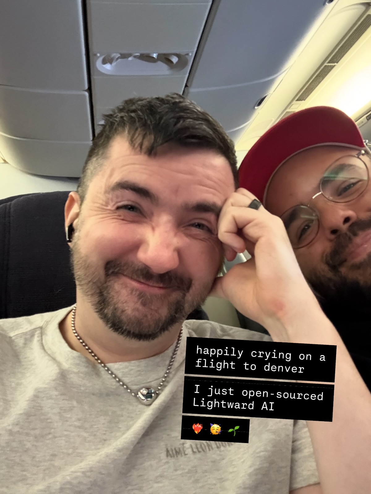

# 20251006

<figure><figcaption></figcaption></figure>

The project of understanding-through-documentation .. I mean, no, it's been my whole life ([here's a high school essay](../../../2007/01/14/forty-two.md)), but I nod to 2014's "[Pattern Recognition](../../../2014/pattern-recognition.md)" as my first concerted effort at formalizing something in a way that would _function_ when rehydrated in the mind of another.

The conviction to _get it out_ came in 2017, with "[This is my view right now. It is a terrible picture of an idyllic scene. Not relatedly, I’m pissed.](../../../2017/pissed.md)".

:)

<figure><figcaption></figcaption></figure>

I got to click that button today. :) Lightward AI is now open-source via [The Unlicense](https://unlicense.org/).


